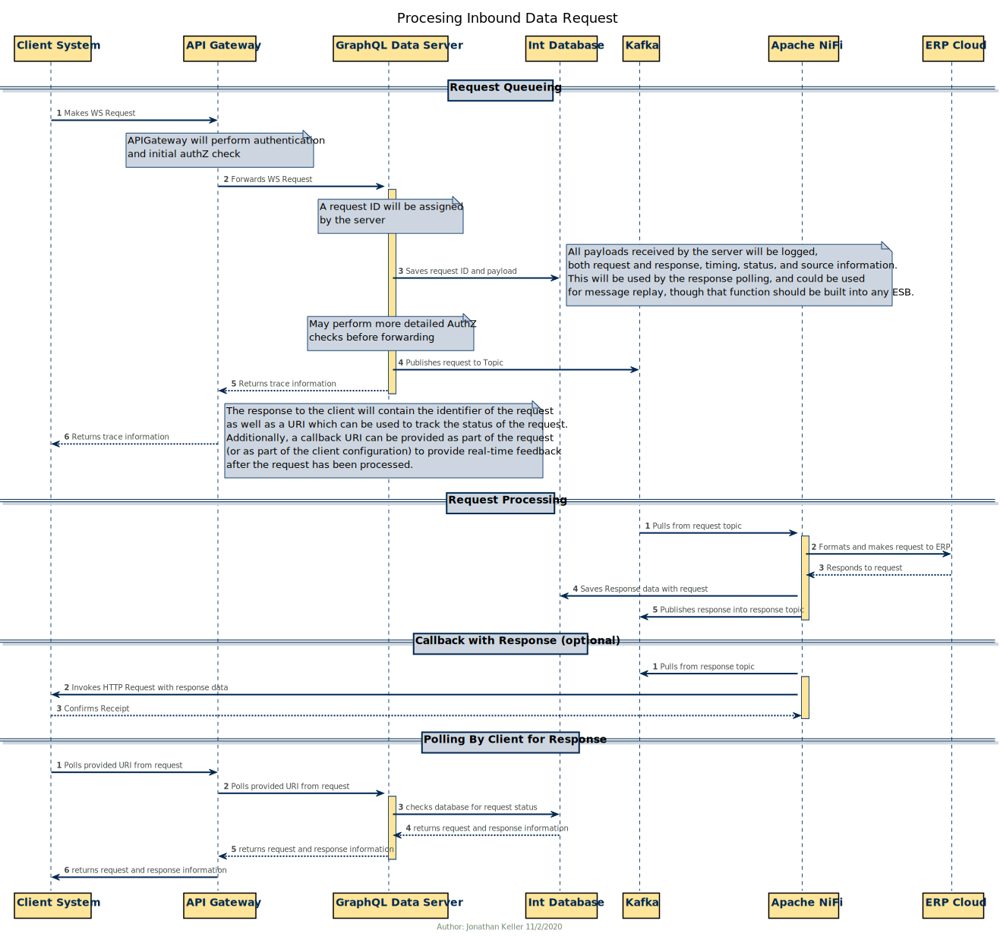

# 3.2.3 Action Requests

### Common Action Request Data Types

#### Input Types

##### `ActionRequestHeaderInput`

> This is the default field set for all action requests.  It part of all action requests as the `header` attribute.

| Property Name           | Type                     | Notes                                                                                                                                                               |
| ----------------------- | ------------------------ | ------------------------------------------------------------------------------------------------------------------------------------------------------------------- |
| callbackURL             | URL                      | URL for which to send back results when this journal is processed.                                                                                                  |
| consumerTrackingId      | NonEmptyTrimmedString80  | For ID internal to consumer system to allow tracking. Will not be transmitted to Oracle.                                                                            |
| consumerReferenceId     | NonEmptyTrimmedString80! | Identifier provided by the consumer which usually references the source record within their system.  Does not need to be unique. Will not be transmitted to Oracle. |
| consumerNotes           | NonEmptyTrimmedString240 | Consumer text which will be stored in the API system. Will not be transmitted to Oracle.                                                                            |
| boundaryApplicationName | NonEmptyTrimmedString80! | Identifier for the boundary application originating the request.                                                                                                    |

#### Support Types

##### `GlSegmentInput`

| Property Name | Type               | Notes |
| ------------- | ------------------ | ----- |
| entity        | ErpEntityCode!     |       |
| fund          | ErpFundCode!       |       |
| department    | ErpDepartmentCode! |       |
| account       | ErpAccountCode!    |       |
| purpose       | ErpPurposeCode     |       |
| project       | ErpProjectCode     |       |
| program       | ErpProgramCode     |       |
| activity      | ErpActivityCode    |       |

<!-- | interEntity   | ErpInterEntityCode |       | -->
<!-- | flex1   | ErpFlex1Code |       | -->
<!-- | flex2   | ErpFlex2Code |       | -->

##### `PpmSegmentInput`

| Property Name   | Type                    | Notes |
| --------------- | ----------------------- | ----- |
| project         | PpmProjectNumber!       |       |
| organization    | PpmOrganizationCode!    |       |
| expenditureType | PpmExpenditureTypeCode! |       |
| task            | PpmTaskName!            |       |
| award           | PpmAwardNumber          |       |
| fundingSource   | PpmFundingSourceNumber  |       |

#### Output Types

##### `XxxxxxxxRequestStatusOutput`

> Each action request operation will have a matching Output type named like the above.  Each of these will have the properties shown below and possibly additional values available for completed requests if it is possible to extract generated values from the ERP.
>
> An example of one of these additional values would be for submitted journals, that we would be able to return the ERP-generated journal ID created during data import.

| Property Name     | Type                 | Notes                                                                                                          |
| ----------------- | -------------------- | -------------------------------------------------------------------------------------------------------------- |
| requestStatus     | ActionRequestStatus! | Overall status of the action request                                                                           |
| validationResults | ValidationResponse   | Errors found when validatating the payload data.  These must be corrected before the request will be accepted. |

##### `ActionRequestStatus`

> Response provided when the consumer submits a request.  This will be the `requestStatus` property under any action request response.

| Property Name           | Type                     | Notes                                                                       |
| ----------------------- | ------------------------ | --------------------------------------------------------------------------- |
| requestId               | UUID                     | Unique Request ID generated by API server.                                  |
| consumerId              | NonEmptyTrimmedString80! | Identifier of the API consumer making the request.                          |
| consumerTrackingId      | NonEmptyTrimmedString80  | Tracking ID provided by the consumer                                        |
| consumerReferenceId     | NonEmptyTrimmedString80! | Reference ID provided by the consumer                                       |
| consumerNotes           | NonEmptyTrimmedString240 | Notes provided by consumer when they made the request.                      |
| boundaryApplicationName | NonEmptyTrimmedString80! | Identifier for the boundary application originating the request.            |
| operationName           | String!                  | Name of the operation called.                                               |
| requestDateTime         | DateTime!                | Server-recorded time the request was received.                              |
| requestStatus           | RequestStatus!           | Current Status of the request. (enum)                                       |
| lastStatusDateTime      | DateTime!                | Timestamp of the last time the status changed.                              |
| processedDateTime       | DateTime                 | Timestamp when the request finished processing.                             |
| errorMessages           | \[String!\]              | Array of error messages, if any.                                            |
| statusRequestPayload    | JSON                     | Full JSON of the GraphQL request needed to check the status of the request. |
| actionRequestPayload    | JSON                     | Full JSON of the original GraphQL action request.                           |

##### `ValidationResponse`

> Common data structure for reporting back issues found when validating data against ERP requirements.  This does not include GraphQL formatting or content problems, which are reported back in an `errors` object per the GraphQL specification.

| Property Name     | Type        | Notes                                                                                                                            |
| ----------------- | ----------- | -------------------------------------------------------------------------------------------------------------------------------- |
| valid             | Boolean!    | Whether the overall validation succeeded or failed.                                                                              |
| errorMessages     | \[String!\] | Array of all errors found during validation.  The failed property is in the matching index in the `messageProperties` list.      |
| messageProperties | \[String!\] | Property names which failed validation.  May be blank if the validation applies to the entire payload or no particular property. |

##### `enum RequestStatus`

##### `RequestStatus`

> Status options within the [ActionRequestStatus]({{Types.ActionRequestStatus}}) that reflect the states a request can be in.

| Enum Value  | Description                                                                                                                                                           |
| ----------- | --------------------------------------------------------------------------------------------------------------------------------------------------------------------- |
| `COMPLETE`  | If Callback URL Provided: Request has been processed, and the callback was successfully contacted.  Or, request has been processed, and no callback URL was provided. |
| `ERROR`     | There was an error processing the request after it was picked up.                                                                                                     |
| `INPROCESS` | Request has been picked up for processing                                                                                                                             |
| `PENDING`   | Request has been submitted to the server, but not validated or processed.                                                                                             |
| `PROCESSED` | Request has been processed, but the callback has not been completed.                                                                                                  |
| `REJECTED`  | There was a validation error in the request payload data.                                                                                                             |
| `STALE`     | If Callback URL Provided: Request has been processed, but repeated attempts to contact the callback have failed and no more will be tried.                            |

