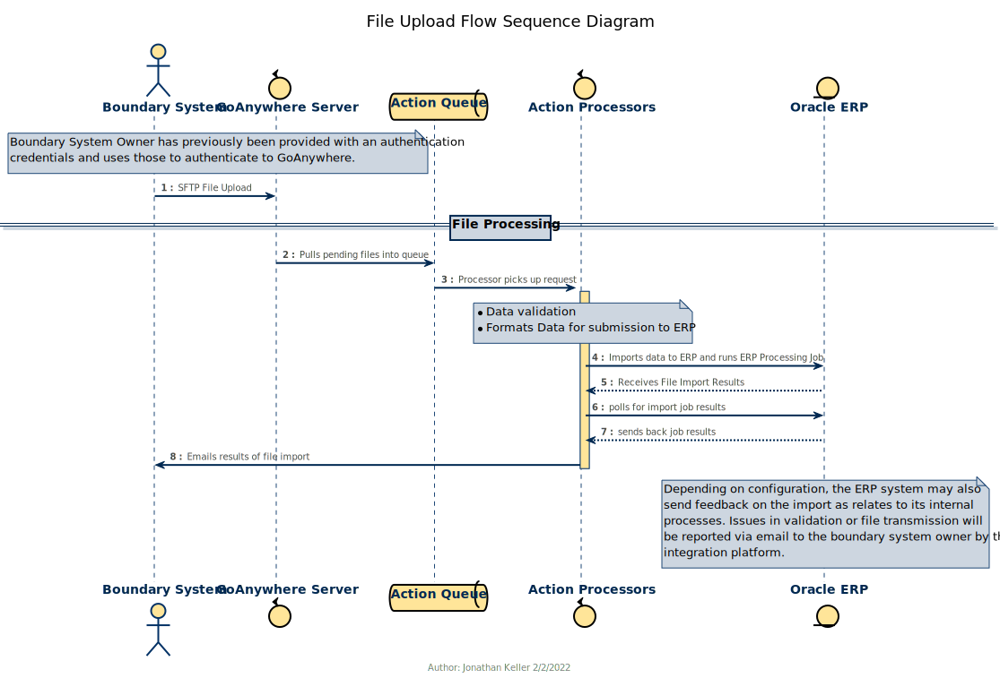

# 3.2.5 File Based Action Requests

### File Upload Access

Some Action Request types may allow data submission by SFTP file as an alternate form of upload provided on an exception basis.  This will be noted in the API documentation.  When submitting files in this manner, the contents of the file will be a JSON object with the same data model as the `data` component of the payload sent to the matching API.

There may be differences in required fields when submitting files.  Certain features are implemented within the API, and not available to file uploads.  These will be noted in the API documentation.

Validation of submitted files will be not as comprehensive as API submissions prior to being processed by Oracle.  The API attempts to replicate many of the same rules that will be checked by Oracle when the data is received so as to provide immediate feedback if there will be a rejection.  Validation failures within a file will result in the file's data being rejected, and feedback provided via email.

In either case, files are processed as soon as possible after receipt, subject only to integration processing resources and system availability.

#### APIs Supporting SFTP Uploads

At present, only the action request type below will be configured for file-upload access.

* `glJournalVoucher`

<!-- * `scmInvoicePayment` -->

#### Obtaining Access

After onboarding your boundary system and obtaining authorization to utilize the SFTP file uploads, you will be provided credentials by the GoAnywhere system administrators.  It utilizes a standard SFTP connection on port 2222.  (This should be the same as any existing file uploads for KFS.)

#### File Naming Convention

Files must be named with a convention that indicates the data type, source and time of the file.  This will prevent any collision between files or duplicate import of any data.  The file name will be used as a unique identifier of that file.  A file with the exact same name will not be processed, even if the contents are different.

The source name is the assigned journal source from Oracle with any spaces changed to underscores.  Each boundary system will be assigned one as they are onboarded into Oracle.

The file naming pattern is:

`<data type>.<Source Name>.<timestamp>.json`

| Data Type                    | Prefix        | File Submission Supported | Operation Name               | Sample Name                                       |
| ---------------------------- | ------------- | :-----------------------: | ---------------------------- | ------------------------------------------------- |
| Journal                      | `journal`     |            Yes            | glJournalRequest             | `journal.UCD_Boundary_System.20220701110325.json` |
| Invoice Payment              | `invoice`     |            No             | scmInvoicePaymentCreate      | `invoice.UCD_Concur.20220701110325.json`          |
| Payment Request              | `payment`     |           Only            | apPaymentRequest             | `payment.UCD_Banner.20220701110325.json`          |
| Purchasing Requisition       | `requisition` |            No             | scmPurchaseRequisitionCreate | `requisition.UCD_CAES.20220701110325.json`        |
| Receivables Invoice          | `receivable`  |            No             |                              | `receivable.UCD_Stratocore.20220701110325.json`   |
| Award                        | `award`       |           Only            | ppmAwardCreate               | `award.UCD_Cayuse.20220701110325.zip`             |
| Sponsored Project            | `project`     |           Only            | ppmProjectCreate             | `project.UCD_Cayuse.20220701110325.zip`           |
| US Bank Credit Card Expenses | `usbank`      |           Only            |                              | `usbank.UCD_USBank.20220701110325.dat`            |
| Payment Plus Expenses        | `paymentplus` |           Only            |                              | `paymentplus.UCD_Payment_Plus.20220701110325.dat` |
| Concur SAE                   | `sae`         |           Only            |                              | `sae.UCD_Concur.20220701110325.dat`               |
| UCPath I-303                 | `i303`        |           Only            |                              | `i303.UCD_UCPath.20220701110325.dat`              |
| AggieShip FBAP               | `fbap`        |           Only            |                              | `fbap.UCD_Aggieship.20220701110325.dat`           |

#### S3 File Location Conventions

Files transferred to S3 will be stored with file names that imply a directory structure that reflects the direction of the data transfer, the environment which the file should be integrated with, the format of the data in the file, and the pipeline which should process the file.

This path is used to submit the file to the appropriate integration pipeline intake topic.

1. Environment code (test/dev2/dev4/prod)
2. Data Direction (in/out)
3. Data Type (json/csv/xml/zip/dat/etc)
4. Operation Name (glJournalCreate, ppmAwardCreate, etc)  This would be mapped from the file name prefix.
5. File Name (including extension)

##### Examples

* JSON journal file which should be processed into the TEST environment:
  * `test/in/json/glJournalRequest/journal.UCD_Boundary_System.20220701110325.json`
  * Destination pipeline: `in.test.sftp.json.glJournalRequest`
* Banner payment file:
  * `test/in/csv/apPaymentRequest/payment.UCD_Banner.20220701110325.dat`
  * Destination pipeline: `in.test.sftp.csv.apPaymentRequest`
* AggieShip FBAP file:
  * `test/in/xml/aggieshipFbap/fbap.UCD_Aggieship.20220701110325.dat`
  * Destination pipeline: `in.test.sftp.xml.aggieshipFbap`
* Cayuse Award File:
  * `test/in/zip/ppmAwardCreate/award.UCD_Cayuse.20220701110325.zip`
  * Destination pipeline: `in.test.sftp.zip.ppmAwardCreate`

#### File Format

The format of the file is JSON, in the same structure as the API call payloads.  By way of example, if you would have sent the following GraphQL JSON in an HTTP payload.

It is recommended that you utilize the API documentation and API server playgrounds to help in structuring your initial payloads.  They are strongly typed, and the documentation specifies the max lengths, formats, and expected content for each property in the data structure.

##### GraphQL HTTP JSON

```json
{
    "operationName": "glJournalRequest",
    "variables": {
        "data": {
          "header": {
            "consumerId": "Boundary_System_Identifier",
            "consumerTrackingId": "5A314F00-C308-48FF-BF85-C8AF7FD43199",
            "consumerReferenceId": "ORDER_12345",
            "consumerNotes": "July Order from Xxxxxxx",
            "boundaryApplicationName": "My Boundary App"
          },
          "payload": {
            "journalSourceName": "UCD Your Boundary App",
            "journalCategoryName": "UCD Recharge",
            "journalName": "MySystem Recharges for July 2023",
            "journalReference": "ORDER_12345",
            "accountingDate": "2023-07-31",
            "accountingPeriodName": "Jul-23",
            "journalLines": [
              {
                "glSegmentString": "1311-13U00-9300479-390000-68-000-0000000000-000000-0000-000000-000000",
                "debitAmount": 100.00,
                "externalSystemIdentifier": "ITEMX"
              },
              {
                "glSegmentString": "1311-13U00-9300531-770000-68-000-0000000000-000000-0000-000000-000000",
                "creditAmount": 100.00,
                "externalSystemIdentifier": "ITEMX"
              },
              {
                "glSegments": {
                  "entity": "1311",
                  "fund": "13U00",
                  "department": "9300531",
                  "account": "770000"
                },
                "creditAmount": 500.00,
                "externalSystemIdentifier": "ITEMY"
              },
              {
                "ppmSegments": {
                  "project": "GP12345678",
                  "task": "Task 1",
                  "organization": "9300479",
                  "expenditureType": "Lab Equipment"
                },
                "debitAmount": 500.00,
                "externalSystemIdentifier": "ITEMY",
                "ppmComment": "Something meaningful here"
              }
            ]
          }
        }
    },
    "query": "mutation glJournalRequest($data: GlJournalRequestInput!) {  glJournalRequest(data: $data) {    requestStatus {      requestId      consumerId      requestDateTime      requestStatus      operationName    }   }}"
}
```

Then the contents of the file would be:

##### SFTP File JSON

```json
{
  "header": {
    "consumerId": "Boundary_System_Identifier",
    "consumerTrackingId": "5A314F00-C308-48FF-BF85-C8AF7FD43199",
    "consumerReferenceId": "ORDER_12345",
    "consumerNotes": "July Order from Xxxxxxx",
    "boundaryApplicationName": "My Boundary App"
  },
  "payload": {
    "journalSourceName": "UCD Your Boundary App",
    "journalCategoryName": "UCD Recharge",
    "journalName": "MySystem Recharges for July 2023",
    "journalReference": "ORDER_12345",
    "accountingDate": "2023-07-31",
    "accountingPeriodName": "Jul-23",
    "journalLines": [
      {
        "glSegmentString": "1311-13U00-9300479-390000-68-000-0000000000-000000-0000-000000-000000",
        "debitAmount": 100.00,
        "externalSystemIdentifier": "ITEMX"
      },
      {
        "glSegmentString": "1311-13U00-9300531-770000-68-000-0000000000-000000-0000-000000-000000",
        "creditAmount": 100.00,
        "externalSystemIdentifier": "ITEMX"
      },
      {
        "glSegments": {
          "entity": "1311",
          "fund": "13U00",
          "department": "9300531",
          "account": "770000"
        },
        "creditAmount": 500.00,
        "externalSystemIdentifier": "ITEMY"
      },
      {
        "ppmSegments": {
          "project": "K30APSD227",
          "task": "TASK01",
          "organization": "ADNO003",
          "expenditureType": "770000",
          "award": "K381C99",
          "fundingSource": "27666"
        },
        "debitAmount": 500.00,
        "externalSystemIdentifier": "ITEMY",
        "ppmComment": "Something meaningful here"
      }
    ]
  }
}
```

#### Process Flow

##### 1. File Upload

Once the file is uploaded, it will be pushed up into the integration platform for processing.  The file on GoAnywhere will be moved into an archive directory within your account's directory.  Files there will only be retained for 30 days.  (Files will be retained for longer within the integration platform for audit purposes.)

##### 2. File Ingestion

There is no specific time for file processing.  In general, files will be ingested within minutes of being uploaded.  DO NOT count on being able to remove an uploaded file to prevent it from being processed.  Any uploaded file may be picked up immediately.  If you want to upload a file, but not have it processed, upload it with an different extension or into a temporary directory within your home directory.  (If GoAnywhere configuration allows this.)

##### 3. File Validation

After ingestion, the file will be parsed and validated.  If either of these steps fail, the platform will generate a response to the email address configured for the boundary system ID.

##### 4. Data Formatting

If the file passes validation, it will be queued for formatting and transmission to Oracle.  Failures at this point are not likely to be a result of the data sent, and will be handled internally by the integrations team.

##### 5. Data Submission

Finally, the data gets submitted to Oracle.  This is a multi-stage process.  If there are failures related to the data (according to Oracle), those will be reported back to the configured email address by Oracle.


