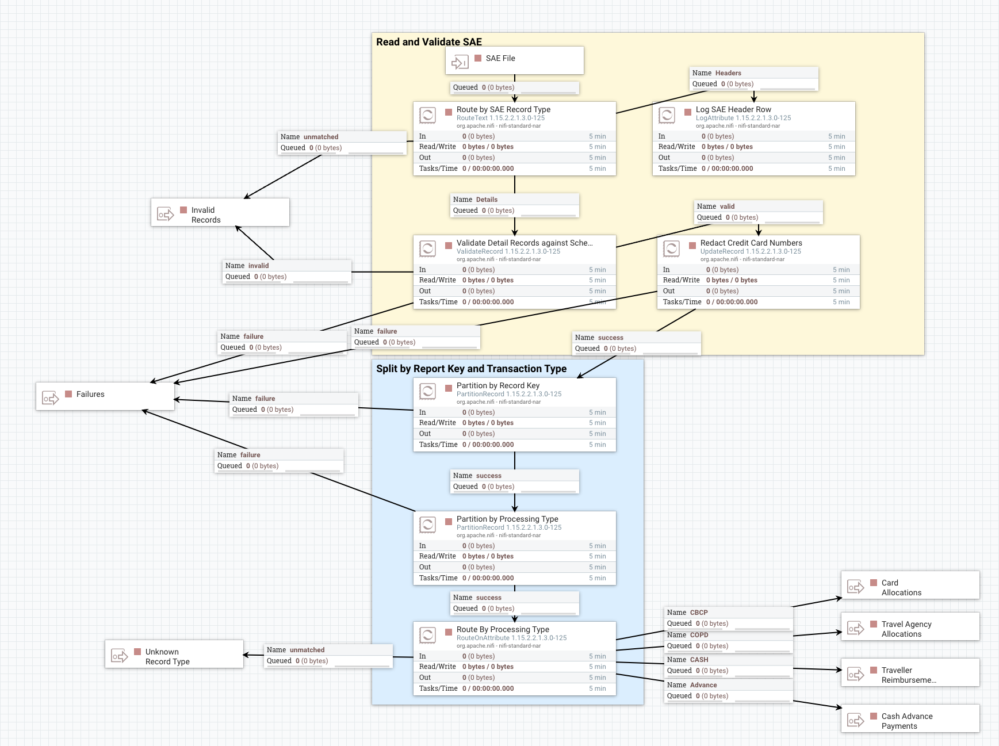

# Concur Pipelines

### Allocate Card Expenses To Departments

#### Summary

Generates the GL and PPM costing documents to allocate expenses per data entered on the expense report.  Offsets the expense using the default location per the card account data in concur.  Where the allocation is to a PPM Project, a PPM cost will be generated and an offsetting GL transaction will be included.


#### Flow Summary

1. Read flowfile containing a report's set of records to allocate card expenses from the input topic.
2.


### Concur Card Reimbursements

#### Summary

Sub-pipeline to handle the generation of the GL and PPM FBDI files needed to reallocate the expenses on the travel card and the purchasing card to the accounts listed in the expense report.  This will offset the entry in the SAE using the clearing account noted on the concur card account table extracts.

#### Input

This flow accepts flowfiles containing a single report's entries which are allocating expenses made on the travel or purchasing cards.  These flowfiles may have multiple records which match this criteria.

#### Additional Requirements

This flow requires a lookup table of the concur card account data.  This must be a specialized key-value pair table which combines the employee ID, card type (PCard/TCard), and last 4 of the card number into a single key field.  This must be linked through a lookup service for use by NiFi processors.

#### High-Level Flow Summary

1. Read in the flow file with the records
2. Run a lookup on each record to obtain the clearing account and store into the record.
   1. If account number is missing, flow into a retry queue with a 24 hour delay (waiting for card data to get loaded from concur)
3. Update each record in the file to mark as a PPM or GL entry.
4. For each PPM string set in the file:
   1. Duplicate the line
   2. On duplicate: flag as PPM Offset
   3. On duplicate: set the GL segments to the PPM offset
   4. On duplicate: clear any PPM segments
5. Partition the flowfile based on the GL/PPM flag:
   1. GL Flow:
      1. Duplicate each GL record, making the follwing changes to the duplicate:
         1. Mark as an offset record.
         2. Flip the sign on the amount.
         3. Set the account to the proper account for the offset
         4. Copy the clearing account into the account record
         5. Blank out any other allocation fields.  (GL and PPM)
      2. Summarize records by chart of accounts and card type
      3. Reformat flowfile into GL Journal Lines JSON (sub-format of API format)
   2. PPM Flow:
      1. Reformat flowfile into GL Journal Lines JSON (sub-format of API format) filling in the PPM segments and other attributes.

**TBD: Do we want to go straight to FBDI here?**

#### Flow Summary

> Input: CSV Flow File with records for single report and CBCP entries for a single card number.

1. Strip record down to just fields needed for processing, summarizing the amounts.
   * `ReportKey_20` AS report_key
   * `EmployeeID_5` AS emplid
   * `UPPER(EmployeeLastName_6+'/'+SUBSTRING(EmployeeFirstName_7, 1))` AS empl_name
   * `CASE ReportPolicyName_33 WHEN '*PCard' THEN 'PC'+'-'+ReportName_27 ELSE 'TC'+'-'+ReportName_27 END` AS report_name
   * `SUBSTRING(BilledCreditCardAccountNumber_130 FROM 13)` AS CC_LAST_4
   * `EmployeeID_5||'_'||SUBSTRING(BilledCreditCardAccountNumber_130 FROM 13)` AS card_lookup_key
   * JournalAccountCode_167 AS erp_account
   * `AllocationCustom1_191` - `AllocationCustom20_210` (as needed)
     * `AllocationCustom10_200` as erp_entity
     * `AllocationCustom11_201` as erp_fund
     * `AllocationCustom12_202` as erp_department
     * `AllocationCustom13_203` as erp_purpose
     * `COALESCE(AllocationCustom14_204,'0000000000')` as erp_project
     * `COALESCE(AllocationCustom15_205, '000' )` as program
     * `COALESCE(AllocationCustom16_206, '000000' )` as activity
     * `AllocationCustom17_207` as ppm_project_task
   * `CASE WHEN AllocationCustom17_207 IS NULL THEN 'GL' ELSE 'PPM' END` AS segment_type
   * `'SAE'` AS record_type
   * '' AS credit_card_offset_chartstring
   * ROUND(SUM(JournalAmount_169),2) AS alloc_amount
2. Process the file, creating offset lines for each `/segment_type` = 'PPM' record.  Leave all GL lines alone. (`QueryRecord`)
   1. Clone the record. (UNION ALL)  All changes below are only to the cloned record.
   2. Update record field: `/record_type` = 'PPMOffset'
   3. Update record field: `/segment_type` = 'GL'
   4. Clear values from all GL and PPM segments.
   5. Set GL segments to the established PPM offset chartstring values.
3. `PartitionRecord` based on the `/segment_type` field.
   1. `/segment_type` = PPM
      1. Restructure records into property names needed for GL Journal Line inputs using the ppmSegments sub-object.
         1. `/erp_department`, `/erp_account`, `/ppm_project_task` into ppmSegments
         2. `/alloc_amount` into debitAmount (if positive) or creditAmount (if negative)
         3. **TODO on PPM FIELDS**
         4. `/report_key` into the externalSystemIdentifier
         5. `/report_name` into externalSystemReference
         6. ???? into ppmComment
         7. `/emplid` into ????
   2. `/segment_type` = GL
      1. Perform `LookupRecord` call using record path `/card_lookup_key`
         1. Route failures to a `RetryFlowFile` processor which re-runs every 24 hours.
         2. On Success, save the offset account to a new record field: `/credit_card_offset_chartstring`
      2. Clone each record to generate the balancing offsets: (`QueryRecord`)  The below is the change to the cloned records.
         1. Add record field: `/record_type` = 'GLOffset'
         2. Change the sign on the journal amount.
         3. Clear values from all GL and PPM segments.
         4. Parse the offset account in `/credit_card_offset_chartstring` into the GL fields: `/erp_entity`, `/erp_fund`, `/erp_department`, `/erp_purpose`
         5. Set the `/erp_account` segment from the established account per configuration.
      3. Restructure records into property names needed for GL Journal Line inputs using the glSegments sub-object.
         1. `/erp_xxxx` into glSegments
         2. `/report_key` into the externalSystemIdentifier
         3. `/report_name` into externalSystemReference
         4. `/alloc_amount` into debitAmount (if positive) or creditAmount (if negative)

> **At this point we have transactions which are ready to include in files.  The header information is missing.  However, at this point, we probably want the transactions to be blended back together so that we are not sending through hundreds of documents for a day's feed.  It _would_ be OK if the feed were split up into multiple journals due to streaming latency.**

#### Notes

> Experimental QueryRecord SQL

```sql
SELECT
  ReportKey_20
, EmployeeID_5
, EmployeeLastName_6
, EmployeeFirstName_7
, ReportName_27
, ReportPolicyName_33
, SUBSTRING(BilledCreditCardAccountNumber_130 FROM 13) AS CC_LAST_4
, JournalPayeePaymentTypeName_165
, CAST(JournalAccountCode_167 AS VARCHAR) AS JournalAccountCode_167
, AllocationCustom1_191
, ReportEntryPaymentTypeName_250
, ROUND(SUM(JournalAmount_169),2) AS JournalAmount_169
FROM FLOWFILE
GROUP BY
  ReportKey_20
, EmployeeID_5
, EmployeeLastName_6
, EmployeeFirstName_7
, ReportName_27
, ReportPolicyName_33
, SUBSTRING(BilledCreditCardAccountNumber_130 FROM 13)
, JournalPayeePaymentTypeName_165
, CAST(JournalAccountCode_167 AS VARCHAR)
, AllocationCustom1_191
, ReportEntryPaymentTypeName_250
UNION ALL
SELECT
  ReportKey_20
, EmployeeID_5
, EmployeeLastName_6
, EmployeeFirstName_7
, ReportName_27
, ReportPolicyName_33
, SUBSTRING(BilledCreditCardAccountNumber_130 FROM 13) AS CC_LAST_4
, JournalPayeePaymentTypeName_165
, CAST('0000' AS VARCHAR) AS JournalAccountCode_167
, '${offset.chartstring}' AS AllocationCustom1_191
, ReportEntryPaymentTypeName_250
, -ROUND(SUM(JournalAmount_169),2) AS JournalAmount_169
FROM FLOWFILE
GROUP BY
  ReportKey_20
, EmployeeID_5
, EmployeeLastName_6
, EmployeeFirstName_7
, ReportName_27
, ReportPolicyName_33
, SUBSTRING(BilledCreditCardAccountNumber_130 FROM 13)
, JournalPayeePaymentTypeName_165
, ReportEntryPaymentTypeName_250
```


### Concur SAE Ingestion

#### Summary

Imports the SAE file from a file source, splits it into records, and sends those records down to queues based on their type for further processing.

#### Flow Summary and Principles

We are taking a batch-provided file and submitting it into a streaming data processing flow.  As such, some aspects of batch processing do not apply.  In a streaming architecture, it is necessary break down projects into atomic units of work if it is _absolutely required_ that activities not be separated.  (An example of this would be offsetting transactions.  Transaction debit and credit entries must be processed together.)  As such, any records which MUST be processed as a unit should be contained within single flow files/queue entries.  However, they must also be kept small enough to take advantage of streaming flows.

With that in mind, the units of work we can define for Concur will be the expense report.  All entries for a given report (of a type - that later) must be processed together or not at all.  Once the entries for a report have been partitioned into a flowfile for each report, those will be further segmented by their disposition type.  (e.g., GL Journal, Payment to Traveller)

1. Import SAE as single flow file
2. Extract the report header and detail records into separate flows
3. Map the CSV to a schema to allow for property access
4. Extract the report key from the records in the SAE detail flow
5. Partition into flowfiles by report key
   * These flowfiles should only have 2-200 records each
6. Extract attributes needed to determine proper flow
7. Partition records into flows for processing based on contents
   * At this point, each flowfile should could be smaller, as payments, allocations, and cash advances have all been separated.
8. Perform data conversions, aggregations, and validations as needed by the data type.
9. Reformat the payloads on each stream as expected for the common pipelines.
10. Feed into the queues (GL/PPM/One-Time Payment) for processing and submission to Oracle.

#### Flow Walkthrough

1. Processor reads file as records and splits by newline.
2. Records are tested as strings to determine if header or detail lines. (`RouteText`)
3. Header record is extracted and routed separately. (and used to gate the processing of all records?) (number of records in file is part of that record.) (Feed count to `Wait` processor of so.)
4. Detail records are linked to a schema and run through Validation.  (`CSVReader`, `ValidateRecord`)
5. Travel card numbers are redacted except for last 4 digits. (`UpdateRecord`)
6. Records are partitioned by the report key. (`PartitionRecord`)
7. Record-key records are partitioned by the nature of the transaction. (`PartitionRecord`)
8. Write records to queues for each type of further processing required.
   1. Cash Advance Payments
   2. Payments to Traveller
   3. Allocations for Travel Card and Purchasing Card
   4. Allocations for Travel Agency Items
   5. Other (unprocessed)
      1. Cash Advance Clearing Only
      2. Personal expenses
      3. Anything Else

<!-- 5. Detail records are counted, incrementing a value in a distributed map. (`UpdateCounter`)
   1. Records have multiple types.  Header record (first in file) can be used to ensure that the entire file is processed at once. -->
<!-- 5. After Wait processor releases (meaning all detail lines passed validations), write all items to a persistent topic. -->

> Each line is tokenized on the pipe character to extract the columns as referenceable attributes.  (The SAE has no headers, so all fields will have to be referenced by index.)
> Partition based on export type and record key: PartitionRecord (DONE)
> Will need schema definition for the SAE to get record attributes (DONE)

TODO: Split by report key also needs to split by /CashAdvanceKey_187 since the report key is blank

#### Grouping Attributes (in development)

> This is after separating by report key.

* `/EmployeeID_5`
  * for reference
* `/EmployeeLastName_6`
  * for reference
* Policy Name: `/ReportPolicyName_33`
  * Tells whether pcard
* Payment Type: `/PaymentTypeCode_126`
  * Type of card - Pcard and travel card share the same
* Report Entry Payment Type Name: `/ReportEntryPaymentTypeName_250`
  * Can differentiate between Pcard and travel card
* `/CashAdvanceTransactionType_185`
  * Tells about issuance of a cash advance

#### NiFi Process Flow



#### Generation Notes

##### CBCP

For Company Billed/Company Paid transactions, these are one-sided entries to be offset by the default account recorded on the matching card account record.

If POET, then PPM cost generation plus generation of static debit side to the GL in the PPM balancing chartstring.  Credit is same.

On personal expenses, Concur generates a transaction User -> University (on a debit) to reflect that UCD paid the card and now the traveller owes UCD those funds.  Need to determine whether to ignore or process those lines.

Offset chartstring will be on the concur card account table.  This will need to be loaded and made available to the integration servers so that the offset for these transactions may be generated.  A special lookup view keyed by the employee ID, card type, and last 4 digits will need to be created from the concur card account table.

##### CASH

For payments to travellers, the credit is to a static chartstring which will be expensed during the payment generation.  These entries also need to be sent through (as a summary) to generate the payment.

Same rules on the GL side if the allocation is to ppm.


##### COPD

Mainly the same - but still need to determine what the offset would be.  This is entered in the travel approver application.  We might need to reach out to it or a cache to generate the offset.

##### Cash Advance

Most accounting information is missing from these records.  Only the object code and the cash advance information provide details.  Will expense to a central account.  Need credit offset.  No PPM considerations here.

#### KFS Integration Reference

##### Processing Exclusion Filter

> The below was used to extract records matching the rule from any processing.  Except for the personal entries, this may not be accurate for the future state.

```js
{
  'syncInfo.destinations.#{jobExecutionContext['job.destination']}.needsExtract': true,
  'error' : false,
  '$nor': [
    {'$and' : [
      {'journal.payerPaymentType' : { $eq: 'University'}},
      {'journal.payeePaymentType': { $eq: 'User'}},
      {'expenseTypeName' : { $eq: 'Personal or Non Reimbursable'}},
      {'paymentTypeCode' : { $eq: 'CBCP'}}
    ]}
  ]
}
```

##### Extract Type Filters

> These are the types of feeds we send into KFS today as separate items.  Filters are listed below for reference.

###### PCard Reconciliation

* Must have an allocation
* have the CBCP payment type
* Be on the Pcard policy

```js
{
  'syncInfo.destinations.${ReconciledPCardPaymentJob.export.destination}.needsExtract': true,
  'error' : false,
  'journals.allocation.allocationId' : { $exists : true },
  'paymentTypeCode' : '${sae.pcard.paymentTypeCode}',
  'batchReport.reportPolicyName' : '${pcard.batchReport.reportPolicyName}'
}
```

###### Travel Card Reconciliation

* have the CBCP payment type
* Not be on the pcard policy
* have an allocation or be a personal expense

```js
{
  'syncInfo.destinations.${ReconciledCorpCardPaymentJob.export.destination}.needsExtract': true,
  'error' : false,
  'paymentTypeCode' : '${sae.corpcard.paymentTypeCode}',
  'batchReport.reportPolicyName' : {'$ne' : '${pcard.batchReport.reportPolicyName}' },
  '$or' : [ { 'journals.allocation.allocationId' : { $exists : true } }, { 'expenseTypeName' : '${sae.personal.expenseTypeName}' } ]
}
```

###### Travel Agency Reconciliation

* Must have an allocation
* have the COPD payment type

```js
{
  'syncInfo.destinations.${ReconciledCTSPaymentJob.export.destination}.needsExtract': true,
  'error' : false,
  'journals.allocation.allocationId' : { $exists : true },
  'paymentTypeCode' : '${sae.cts.paymentTypeCode}',
  'batchReport.reportPolicyName' : {'$ne' : '${pcard.batchReport.reportPolicyName}' }
}
```

###### Traveller Reimbursement Payment

* User must be recipient (filters out credits)
* Must have an allocation
* have the CASH payment type

```js
{
  'syncInfo.destinations.${TravelerReimbursementPaymentJob.export.destination}.needsExtract': true,
  'error' : false,
  'journals.payeePaymentType' : 'User',
  'journals.allocation.allocationId' : { $exists : true },
  'paymentTypeCode' :  '${sae.travelerReimbursement.paymentTypeCode}'
}
```

###### Cash Advance Payments

```js
{
  'syncInfo.destinations.${CashAdvancePaymentJob.export.destination}.needsExtract': true,
  'error' : false,
  'journals.cashAdvance.cashAdvanceTransactionCode' : '1'
}
```

##### SAE Extracted Fields

> Current fields extracted from the SAE (by index number) and the property they were loaded into during integrations.

```xml
<bean parent="indexPropertyMapping" p:index="2"           p:name="batchReport.batchId" />
<bean parent="indexPropertyMapping" p:index="3"   p:type="DATE"   p:name="batchReport.batchDate" />
<bean parent="indexPropertyMapping" p:index="4"            p:name="journal.batchSequenceNumber" />
<bean parent="indexPropertyMapping" p:index="5"            p:name="employee.employeeId" />
<bean parent="indexPropertyMapping" p:index="6"           p:name="employee.lastName" />
<bean parent="indexPropertyMapping" p:index="7"            p:name="employee.firstName" />
<bean parent="indexPropertyMapping" p:index="8"            p:name="employee.middleName" />
<bean parent="indexPropertyMapping" p:index="9"            p:name="employee.groupCode" />
<bean parent="indexPropertyMapping" p:index="10"          p:name="employee.divisionCode" />
<bean parent="indexPropertyMapping" p:index="11"          p:name="employee.departmentCode" />
<bean parent="indexPropertyMapping" p:index="20"          p:name="batchReport.reportId" />
<bean parent="indexPropertyMapping" p:index="24"  p:type="DATE"   p:name="batchReport.submitDate" />
<bean parent="indexPropertyMapping" p:index="27"          p:name="batchReport.reportName" />
<bean parent="indexPropertyMapping" p:index="33"          p:name="batchReport.reportPolicyName" />
<bean parent="indexPropertyMapping" p:index="42"          p:name="tripType" />
<bean parent="indexPropertyMapping" p:index="45"          p:name="batchReport.checkHandling" />
<bean parent="indexPropertyMapping" p:index="59"          p:name="batchReport.destinationType" />
<bean parent="indexPropertyMapping" p:index="61"          p:name="entryId" />
<bean parent="indexPropertyMapping" p:index="63"          p:name="expenseTypeName" />

<bean parent="indexPropertyMapping" p:index="64" p:type="DATE"      p:name="transactionDate" />

<bean parent="indexPropertyMapping" p:index="71"          p:name="vendorDescription" />

<!-- Custom fields for pCard-->
<bean parent="indexPropertyMapping" p:index="${delivery.postal.code.index}"     p:name="deliveryPostalCode" />
<bean parent="indexPropertyMapping" p:index="${sales.tax.amount.index}"         p:name="salesTaxAmount" />
<bean parent="indexPropertyMapping" p:index="${tax.exempt.purchase.index}"      p:name="taxExemptPurchase" />
<bean parent="indexPropertyMapping" p:index="${taxable.index}"                  p:name="taxable" />
<bean parent="indexPropertyMapping" p:index="${agreement.number.index}"         p:name="agreementNumber" />


<bean parent="indexPropertyMapping" p:index="124" p:type="DOUBLE"  p:name="postedAmount" />
<bean parent="indexPropertyMapping" p:index="126"          p:name="paymentTypeCode" />
<bean parent="indexPropertyMapping" p:index="130"          p:name="creditCard.accountNumber" />
<bean parent="indexPropertyMapping" p:index="131"          p:name="creditCard.accountName" />
<bean parent="indexPropertyMapping" p:index="133"          p:name="creditCard.transactionReference" />

<bean parent="indexPropertyMapping" p:index="142" p:type="DATE"     p:name="creditCard.transactionDate" />
        <bean parent="indexPropertyMapping" p:index="143" p:type="DATE"     p:name="creditCard.postedDate" />
<bean parent="indexPropertyMapping" p:index="148"                   p:name="creditCard.merchantState" />
        <bean parent="indexPropertyMapping" p:index="149"                   p:name="creditCard.merchantCountryCode" />

<bean parent="indexPropertyMapping" p:index="163"          p:name="journal.payerPaymentType" />
<bean parent="indexPropertyMapping" p:index="165"          p:name="journal.payeePaymentType" />
<bean parent="indexPropertyMapping" p:index="167"          p:name="journal.allocation.financialObjectCode" />
<bean parent="indexPropertyMapping" p:index="168"          p:name="debitCreditCode" />
<bean parent="indexPropertyMapping" p:index="169" p:type="DECIMAL"  p:name="journal.journalAmountForParsing" />
<bean parent="indexPropertyMapping" p:index="170"          p:name="journal.journalId" />
<bean parent="indexPropertyMapping" p:index="177" p:type="DOUBLE"  p:name="journal.cashAdvance.cashAdvanceRequestAmount" />
<bean parent="indexPropertyMapping" p:index="183" p:type="DATE"   p:name="journal.cashAdvance.cashAdvanceIssuedDate" />
<bean parent="indexPropertyMapping" p:index="185"          p:name="journal.cashAdvance.cashAdvanceTransactionCode" />
<bean parent="indexPropertyMapping" p:index="187"          p:name="journal.cashAdvance.cashAdvanceId" />
<bean parent="indexPropertyMapping" p:index="189"          p:name="journal.allocation.allocationId" />
<bean parent="indexPropertyMapping" p:index="190" p:type="DOUBLE"  p:name="journal.allocation.allocationPercentage" />
<bean parent="indexPropertyMapping" p:index="191"          p:name="journal.allocation.chartAccount" />
<bean parent="indexPropertyMapping" p:index="192"          p:name="journal.allocation.subAccountNumber" />
<bean parent="indexPropertyMapping" p:index="193"          p:name="journal.allocation.projectCode" />
<bean parent="indexPropertyMapping" p:index="194"          p:name="journal.allocation.organizationReferenceId" />
<bean parent="indexPropertyMapping" p:index="259"          p:name="journal.cashAdvance.cashAdvanceName" />
<bean parent="indexPropertyMapping" p:index="270"          p:name="employee.mailingAddressLine1" />
<bean parent="indexPropertyMapping" p:index="271"          p:name="employee.mailingAddressLine2" />
<bean parent="indexPropertyMapping" p:index="272"          p:name="employee.mailingAddressLine3" />
<bean parent="indexPropertyMapping" p:index="273"          p:name="employee.mailingAddressCity" />
<bean parent="indexPropertyMapping" p:index="274"          p:name="employee.mailingAddressState" />
<bean parent="indexPropertyMapping" p:index="275"          p:name="employee.mailingAddressZip" />
<bean parent="indexPropertyMapping" p:index="276"          p:name="employee.mailingAddressCountry" />
<bean parent="indexPropertyMapping" p:index="283"          p:name="employee.defaultCheckHandling" />
<bean parent="indexPropertyMapping" p:index="327" p:type="DOUBLE"  p:name="batchReport.cashAdvanceReturnAmount" />
<bean parent="indexPropertyMapping" p:index="329" p:type="DOUBLE"  p:name="batchReport.cashAdvanceUtilizedAmount" />
```


### GL Segment Import to Concur

#### Stats

|                  |                                       |
| ---------------- | ------------------------------------- |
| **Direction:**   | **Outbound**                          |
| **Source:**      | Integration Database, changed records |
| **Destination:** | Concur, via flat file, vendor format  |

#### Summary

Extracts changed GL segment data from Oracle and imports into concur using their List Item upload format.

#### Flow Summary

1. Consume records from the BICC Extract topic for data from the Value Set Values table.
2. Filter to just value sets for the GL segments
3. Restructure records into Concur list item format.
4. Merge records into single file.
5. Save file to output S5 bucket.
6. (GoAnywhere) Pick up file and send to Concur.


### PPM Segment Import to Concur

#### Stats

|                  |                                       |
| ---------------- | ------------------------------------- |
| **Direction:**   | **Outbound**                          |
| **Source:**      | Integration Database, changed records |
| **Destination:** | Concur, via flat file, vendor format  |

#### Summary

Extracts changed GL segment data from Oracle and imports into concur using their List Item upload format.

