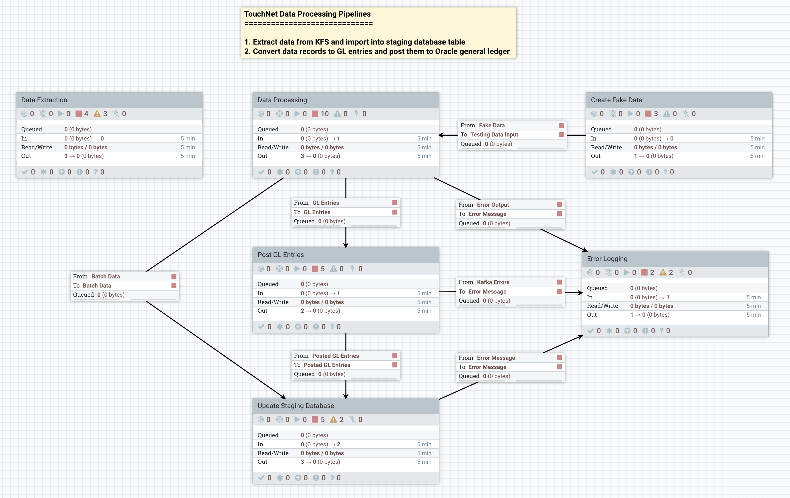

# 6.3.5 TouchNet


#### Summary

Touchnet provides data extracts of transactions processed.  New transactions for each day need to be extracted, converted into GL entries and uploaded to Oracle.  The extraction of the data from Touchnet to a UCD database is outside the current scope of this pipeline.  It will use that previously extracted data source.

As part of the transformation, the merchant ID and a chartstring alias code must be used to convert the incoming data into the FBDI ledger format.  The Alias data is extracted from Oracle via BI Publisher reports and stored to the integration database for this purpose.

Touchnet data is loaded into the KFS database (FP schema) from files provided by TouchNet.  An existing PL/SQL package reads the data from the tables and generates a list of transactions which need to be converted into GL entries.  This process utilizes a set of tables which map the FID and merchant numbers into KFS FAU values.

We will use the existing SQL to extract the data from these tables and obtain the FID values.  This result will then be processed by the integration platform to perform the needed lookups against the GL alias table to get the Oracle GL Segment values.

Unlike the original process, TouchNet no-longer handles gift transactions.  As such, any references in the code to gifts can be ignored.  The existing code and supporting view (which extracts the FID values from the TouchNet data) are in this folder as [cc_touchnet_interface_pk.sql](cc_touchnet_interface_pk.sql) and [cc_touchnet_data_v.sql](cc_touchnet_data_v.sql).  See the `TOUCHNET_IMPORT_USER` schema in FIS_TP_xxx.

Use of the `cc_trans_ref_t` table will likely be still needed as it is the method of preventing duplicate transaction import.

In the package, review the code under the main data_cur loop on around line 775 for the main logic.  This package generated the fixed-format GL scrubber file for DaFIS and KFS directly on the oracle database server.

We will not have any split FAU logic support in the new system.  Much of the logic can be simplified and reduced to creating a single GL line for each of the input lines from the original query.

### Overall Process

1. Pull data from the touchnet tables using something very like the current query.
2. Partition the records based on the extracted merchant ID and FID values.
   1. This will break the feed into a number of different files, each of which can be sent through independently from this point on.
3. Perform lookups using the FID and merchant against the alias table to get the GL segment strings.
4. Reformat the records using the lookup data and provided natural accounts for the debits and credits.  (The natural account will not come from the alias lookup.)
5. Generate an offset for the transactions to balance the file to zero.
6. Publish the journal to the gl-ppm-flattened topic for further processing.

### Alias Lookup Notes

1. Alias Names will need to be predefined, but for now, the plan is to use the prefix `TN_`.
2. There will be one alias for each merchant ID.  (`touchnet_merchant_id`) in the query below.  E.g., `TN_15`.  This will serve as the default if no FID is found for a transaction on that merchant.
3. Each FID for a merchant will have an alias looking like: `TN_15_001`.
4. If no alias can be found by merchant/FID or merchant alone, a default chartstring will be used instead.

### References

* `cc_charge_translation_t` was the old FID translation table.  It is replaced by aliases.
* `cc_merchant_t` has control information we may no longer need as well as the default FAU for a merchant.  This latter function is also replaced by aliases.
* The call to `write_feed_line` would be equivalent to the transform of the record data into the gl-ppm-flattened format.  It generated two lines for every transaction.  One for the debit to the credit clearing and one which was dependent on the merchant type.  All remaining merchants fall into the commerce category.

#### Possible Data Extract SQL

```sql
SELECT
  m.sub_trans_cd AS touchnet_merchant_id
, merch.merchant_id
, CASE
    WHEN INSTR( s.ancil_data, 'FID=' ) > 0 THEN
      SUBSTR( s.ancil_data, INSTR( s.ancil_data, 'FID=' ) + 4, 3 )
    ELSE
      '---'
  END AS fid
, TO_DATE( TO_CHAR( s.trans_date, 'MMDDYYYY' )||s.trans_time, 'MMDDYYYYHH24:MI:SS' ) AS settlement_date
, SUBSTR( s.trans_id, 1, 8 )||TO_CHAR( NVL( SUBSTR( s.trans_id, 9 ), '0' ), 'FM000000' ) AS reference_id
, s.trans_type
, CASE
    WHEN INSTR( s.ancil_data, 'EXT_TRANS_ID=' ) > 0   THEN
        SUBSTR( s.ancil_data, INSTR( s.ancil_data, 'EXT_TRANS_ID=' ) + 13 )
    ELSE
        s.ancil_data
  END AS ancillary_data
, s.ancil_data AS raw_ancillary_data
, s.card_type AS card_type_code
, s.amount   AS trans_amt
, TO_DATE( TO_CHAR( a.trans_date, 'MMDDYYYY' )||a.trans_time, 'MMDDYYYYHH24:MI:SS' ) AS trans_date
, a.amount AS authorized_amt
                -- Main log of settled card transactions
FROM            fp.tpg_set_det_log                     s
                -- Integration merchant support table with the true merchant ID
           JOIN touchnet_import_user.cc_merchant_t merch  ON merch.touchnet_merchant_id = s.mrch_id
                                                         AND merch.active_flag          = 'Y'
                -- Touchnet extract of merchant table held internally
           JOIN fp.tpg_merchant                        m  ON m.sub_trans_cd             = s.mrch_id
                                                         AND m.merchant_type_id         = 0 -- (credit card merchants only)
                -- extract of authorization transactions - needed to get amount and original transaction date
LEFT OUTER JOIN fp.tpg_auth_log                        a  ON a.mrch_id                  = s.mrch_id
                                                         AND a.rec_type                 = 'CA'
                                                         AND a.trans_type               = s.trans_type
                                                         AND a.trans_id                 = s.trans_id
                                                         AND a.return_code              = 0
WHERE s.rec_type     = 'CD'
  AND s.trans_type   IN ( 'PUR', 'CR' ) -- purchases, credits only
  -- Get all purchases, and credits which share the same date as the debit authorization
  -- Needed because there is no direct link between credit settlements and the original transaction.
  AND (s.trans_type  = 'PUR'
    OR (s.trans_type = 'CR'
      AND a.trans_date >= s.trans_date - 1
      AND a.trans_date <= s.trans_date + 1
    )
  )
  -- Pull transactions settled in the last 7 days (should be a context parameter)
  AND s.trans_date >= TRUNC( SYSDATE ) - 7
  -- Exclude imported transactions
  AND NOT EXISTS
    ( SELECT 'x'
        FROM touchnet_import_user.cc_trans_ref_t tr
        WHERE tr.touchnet_merchant_id = m.sub_trans_cd
          AND tr.settlement_date      = TO_DATE( TO_CHAR( s.trans_date, 'MMDDYYYY' )||s.trans_time, 'MMDDYYYYHH24:MI:SS' )
          AND tr.reference_id         = SUBSTR( s.trans_id, 1, 8 )||TO_CHAR( NVL( SUBSTR( s.trans_id, 9 ), '0' ), 'FM000000' )
          AND tr.deleted_flag         = 'N'
    )
ORDER BY m.SUB_TRANS_CD, s.TRANS_ID
```

#### Original Data Extract SQL

```sql
SELECT
        m.merchant_id
      , m.merchant_name
      , tn.touchnet_merchant_id
      , tn.raw_secondary_id as raw_fid
      , tn.secondary_id AS fid
      , tn.reference_id
      , tn.trans_amt
      , tn.trans_date
      , tn.card_type_code
      , tn.settlement_date
      , tn.ancillary_data
      , tn.raw_ancillary_data
      , ct.card_type_object_num
      , tn.chart_num
      , tn.acct_num
      , tn.sub_acct_num
      , tn.project_num
  FROM
        cc_charge_translation_t mt
      , cc_card_type_t          ct
      , cc_merchant_t           m
      , cc_touchnet_data_v      tn
  WHERE
        m.merchant_id = tn.merchant_id
    AND mt.merchant_id        = tn.merchant_id
    AND mt.secondary_id      = tn.secondary_id
    AND ct.card_type_code (+)= tn.card_type_code
    AND mt.active_flag       = 'Y'
    AND m.active_flag        = 'Y'
    AND tn.settlement_date   >= TRUNC( SYSDATE ) - priorDays
    AND NOT EXISTS
      ( SELECT 'x'
          FROM cc_trans_ref_t
          WHERE touchnet_merchant_id = tn.touchnet_merchant_id
            AND settlement_date      = tn.settlement_date
            AND reference_id         = tn.reference_id
            AND deleted_flag         = 'N'
      )
  ORDER BY tn.touchnet_merchant_id, tn.reference_id;      --SR14536 added order by
```


### TouchNet Data Processing Pipeline


#### Nifi Pipelines Overview



1. Data Extraction

   `Extract Data from KFS` -> `SplitRecord` -> `Import into Staging DB`

2. Data Processing and GL Posting

   `Data Retrieval` -> `Data Partitioning` -> `Consumer Mapping Lookup` -> `GL Account Alias Lookup` -> `GL/PPM Flattened Format Conversion` -> `Publish to Kafka Topic` -> `Updating Staging Table`

#### Type Definition of TouchNet Transaction Record

Avro Schema:

```json
{
  "type": "record",
  "namespace": "edu.ucdavis.ait",
  "name": "Touchnet",
  "fields": [
    { "name": "TOUCHNET_MERCHANT_ID", "type": "string" },
    { "name": "MERCHANT_ID",          "type": "string" },
    { "name": "FID",                  "type": "string" },
    { "name": "SETTLEMENT_DATE",      "type": "string" },
    { "name": "REFERENCE_ID",         "type": "string" },
    { "name": "TRANS_TYPE",           "type": "string" },
    { "name": "ANCILLARY_DATA",       "type": "string" },
    { "name": "CARD_TYPE_CODE",       "type": "string" },
    { "name": "TRANS_AMT",            "type": "string" },
    { "name": "TRANS_DATE",           "type": "string" },
    { "name": "AUTHORIZED_AMT",       "type": "string" }
  ]
}
```

_Notes_:

1. Decimal numbers will be kept as ASCII strings to preserve the pricision. They will be converted to Java BigDecimal for numerical processing.
2. SETTLEMENT_DATE, ANCILLARY_DATA and TRANS_DATE are in DateTime format `yyyy-MM-dd hh:mm:ss`.

#### Source Data Mapping

| Target Field         | Source Table    | Source Field            |
| -------------------- | --------------- | ----------------------- |
| TOUCHNET_MERCHANT_ID | TPG_MERCHANT    | SUB_TRANS_CD            |
| MERCHANT_ID          | CC_MERCHANT_T   | MERCHANT_ID             |
| FID                  | TPG_SET_DET_LOG | SUBSTR(ANCIL_DATA)      |
| SETTLEMENT_DATE      | TPG_SET_DET_LOG | TRANS_DATE + TRANS_TIME |
| REFERENCE_ID         | TPG_SET_DET_LOG | SUBSTR(TRANS_ID)        |
| TRANS_TYPE           | TPG_SET_DET_LOG | TRANS_TYPE              |
| ANCILLARY_DATA       | TPG_SET_DET_LOG | SUBSTR(ANCIL_DATA)      |
| CARD_TYPE_CODE       | TPG_SET_DET_LOG | CARD_TYPE               |
| TRANS_AMT            | TPG_SET_DET_LOG | AMOUNT                  |
| TRANS_DATE           | TPG_AUTH_LOG    | TRANS_DATE + TRANS_TIME |
| AUTHORIZED_AMT       | TPG_AUTH_LOG    | AMOUNT                  |

#### TouchNet Specific Context Parameters

- `consumer_id = UCD Touchnet`
- `default_gl_chart_string = 3110-13U00-1000006-238540-00-000-0000000000-000000-0000-000000-000000`
- `offset_gl_chart_string = 3110-13U00-1000006-238540-00-000-0000000000-000000-0000-000000-000000`

#### Retrieving TouchNet Transaction Data

- Purpose: Retrieving all TouchNet transactions from KFS database tables since last batch processing
- Processor type: `ExecuteGroovyScript`
- Processor name: `Retrieve TouchNet Transactions`
- [Groovy script](#/6%20Data%20Pipelines/6.3%20Custom%20Pipelines/6.3.5%20TouchNet/6.3.5.A%20Groovy%20Scripts/1-extract-kfs-data.groovy/HOME ':ignore')

#### Importing TouchNet Transactions into Staging Database

- Purpose: Importing extracted TouchNet transaction data into staging database
- Processor type: `ExecuteGroovyScript`
- Processor name: `Import Data into Staging DB`
- [Groovy script](#/6%20Data%20Pipelines/6.3%20Custom%20Pipelines/6.3.5%20TouchNet/6.3.5.A%20Groovy%20Scripts/2-staging-db-import.groovy/HOME ':ignore')

#### Data Partitioning

- Processor type: `PartitionRecord`
- Processor name: `Data Partitioning`
- Processor attributes:
  - Record Reader: JSON
  - Record Writer: JSON
  - touchnetMerchantId: `/TOUCHNET_MERCHANT_ID`
  - fid: `/FID`

_Note_: The flowfile will be partitioned by `TOUCHNET_MERCHANT_ID` and `FID` for further processing.

#### Consumer Mapping Lookup

- Purpose: Check consumer mapping for given consumer ID
- Processor type: `ExecuteGroovyScript`
- Processor Name: `Consumer Mapping Lookup`
- [Groovy script](#/6%20Data%20Pipelines/6.3%20Custom%20Pipelines/6.3.5%20TouchNet/6.3.5.A%20Groovy%20Scripts/3-consumer-mapping-lookup.groovy/HOME ':ignore')

#### GL Account Alias Lookup

- Purpose: Lookup GL account segments by an account alias
- Processor type: `ExecuteGroovyScript`
- Processor name: `GL Account Alias Lookup`
- [Groovy script](#/6%20Data%20Pipelines/6.3%20Custom%20Pipelines/6.3.5%20TouchNet/6.3.5.A%20Groovy%20Scripts/4-gl-account-alias-lookup.groovy/HOME ':ignore')

#### Converting Partitioned Data to GL/PPM Flattened Format

- Purpose: Convert TouchNet transactions to GL/PPM flattened JSON format
- Processor type: `ExecuteGroovyScript`
- Processor name: `GL/PPM Flattened Format Conversion`
- [Groovy script](#/6%20Data%20Pipelines/6.3%20Custom%20Pipelines/6.3.5%20TouchNet/6.3.5.A%20Groovy%20Scripts/5-gl-ppm-flattened-format-conversion.groovy/HOME ':ignore')

#### Updating Processing Status

- Purpose: Mark posted GL entries in staging table to prevent double posting
- Processor type: `ExecuteGroovyScript`
- Processor name: `Update Staging Table`
- [Groovy script](#/6%20Data%20Pipelines/6.3%20Custom%20Pipelines/6.3.5%20TouchNet/6.3.5.A%20Groovy%20Scripts/7-update-processing-status.groovy/HOME ':ignore')

#### Updating Batch Tracking Tables

- Purpose: Update `tn_batches` and `tn_batch_items` tables to tracking batch jobs
- Processor type: `ExecuteGroovyScript`
- Processor name: `Update Staging Table`
- [Groovy script](#/6%20Data%20Pipelines/6.3%20Custom%20Pipelines/6.3.5%20TouchNet/6.3.5.A%20Groovy%20Scripts/6-update-batch-tables.groovy/HOME ':ignore')

#### POSTING GL Entries

- Purpose: Posting GL Entries to Oracle General Ledger
- Processor type: `PublishKafkaRecord_2_6`
- Kafka broker: `#{kafka_broker_list}`
- Kafka topic: `in.#{instance_id}.internal.json.gl_journal_flattened`

### Touchnet Data to GL-PPM Flattened Mapping

| GL-PPM Field                | MCM Query Field                                      | Notes       |
| --------------------------- | ---------------------------------------------------- | ----------- |
| **Request Header Fields**   |                                                      |             |
| `consumerId`                | UCD Touchnet                                         |             |
| `boundaryApplicationName`   | UCD Touchnet                                         |             |
| `consumerReferenceId`       | Touchnet_yyyyMMdd                                    |             |
| `consumerTrackingId`        | `UUID`                                               |             |
| `requestSourceType`         | sftp                                                 |             |
| `requestSourceId`           | `kafka.key`                                          |             |
| **Journal Header Fields**   |                                                      |             |
| `journalSourceName`         | UCD Touchnet                                         |             |
| `journalCategoryName`       | UCD Recharges                                        |             |
| `journalName`               | Touchnet UUID                                        |             |
| `journalDescription`        | (unset)                                              |             |
| `journalReference`          | `UUID `                                              |             |
| `accountingDate`            | (today)                                              |             |
| `accountingPeriodName`      | (unset)                                              |             |
| **Line Fields**             |                                                      |             |
| `debitAmount`               | Line amount negated                                  | If negative |
| `creditAmount`              | Line amount                                          | If positive |
| `externalSystemIdentifier`  | UCD Touchnet + `REFERENCE_ID`                        |             |
| `externalSystemReference`   | UCD Touchnet                                         |             |
| **GL Segment Fields**       | it is GL segment when AllocationCustom17_207 is NULL |             |
| `entity`                    | (Parsed from Chart String)                           |             |
| `fund`                      | (Parsed from Chart String)                           |             |
| `department`                | (Parsed from Chart String)                           |             |
| `account`                   | (Parsed from Chart String)                           |             |
| `purpose`                   | (Parsed from Chart String)                           |             |
| `glProject`                 | (Parsed from Chart String)                           |             |
| `program`                   | (Parsed from Chart String)                           |             |
| `activity`                  | (Parsed from Chart String)                           |             |
| `interEntity`               | 0000                                                 |             |
| `flex1`                     | 000000                                               |             |
| `flex2`                     | 000000                                               |             |
| **Internal Control Fields** |                                                      |             |
| `lineType`                  | glSegments                                           |             |
| **GLIDe Fields**            |                                                      |             |
| `lineDescription`           | `ancillary_data`                                     |             |
| `journalLineNumber`         | `recordIndex` + 1                                    |             |
| `transactionDate`           | `trans_date`                                         |             |

### Outbound Flowfile Attributes

| Attribute Name                | Attribute Value                |
| ----------------------------- | ------------------------------ |
| `record.count`                | (Calculated)                   |
| `consumer.id`                 | UCD Touchnet                   |
| `data.source`                 | sftp                           |
| `source.id`                   | same as `requestSourceId`      |
| `boundary.system`             | UCD Touchnet                   |
| `consumer.ref.id`             | same as `consumerReferenceId`  |
| `consumer.tracking.id`        | same as `consumerTrackingId`   |
| `glide.extract.enabled`       | Y                              |
| `glide.summarization.enabled` | Y                              |
| `journal.name`                | same as `journalName`          |
| `journal.source`              | same as `journalSourceName`    |
| `journal.category`            | same as `journalCategoryName`  |
| `accounting.date`             | same as `accountingDate`       |
| `accounting.period`           | same as `accountingPeriodName` |


### TouchNet Staging Database


#### TouchNet Transactions

```sql
create table tn_transactions (
  touchnet_merchant_id varchar(5) not null,
  merchant_id varchar(20) not null,
  fid varchar(5) not null,
  settlement_date timestamp not null,
  reference_id varchar(20) not null,
  trans_type varchar(3) not null,
  ancillary_data varchar(200),
  card_type_code timestamp not null,
  trans_amt decimal(10, 2) not null,
  trans_date timestamp not null,
  authorized_amt decimal(10, 2) not null,
  processing_status varchar(20) not null, -- 'PENDING', 'POSTED', 'ERROR'
  processing_error varchar(1000),
  record_digest varchar(40) not null,
  primary key (record_digest)
)
```

#### Data Processing Batch

```sql
create table tn_data_processing_batch (
  batch_id int not null,
  batch_timestamp timestamp not null,
  accounting_period varchar(15),
  data_records int,
  primary key (batch_id)
)
```

```sql
create table tn_batch_items (
  batch_id int,
  record_digest varchar(40),
  primary key (batch_id, record_digest)
)
```


### End-to-End Testing of Pipelines

#### Data Extraction Pipeline

1. Run the pipeline with empty staging table

   Expected: Staging table record count is the same as KFS query result; The `processing_status` of imported staging records are `PENDING`.

2. Remove some recent transactions from staging table and rerun the pipeline

   Expected: Only the missing transations are added and total record count is the same as that prior to deletion.

3. Remove some recent transactions from staging table, update `processing_status` of remaining records to `POSTED`, and then run the pipeline

   Expected: Staging table record count is the same as before and `processing_status` of `POSTED` are unchanged.

#### GL Posting Pipeline

1. Run the pipeline with all transactions are not in `POSTED` status

   Expected: GL entries (in GL/PMM flattened format) are submitted to Kafka topic `in.#{instance_id}.internal.json.gl_journal_flattened`; all `PENDING` or `ERROR` transactions are marked `POSTED`.

2. Change some transactions' status to `POSTED` and then run the pipeline

   Expected: GL entries (in GL/PMM flattened format) are submitted to Kafka topic `in.#{instance_id}.internal.json.gl_journal_flattened`; all `PENDING` or `ERROR` transactions are marked `POSTED`.

3. Change some `POSTED` tansactions' status back to `PENDING` and run the pipeline

   Expected: GL entries (in GL/PMM flattened format) are submitted to Kafka topic `in.#{instance_id}.internal.json.gl_journal_flattened`; those `PENDING` transactions are changed back to `POSTED`.
