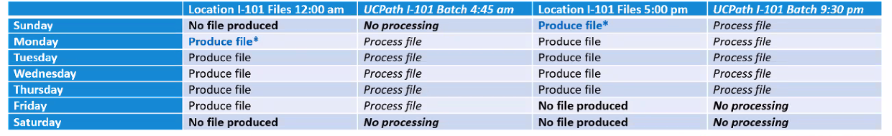

# 6.3.7.1 I101 Segment Outbound


### I-101 Processing Schedule

Files are picked up from the upload path on the UCPath servers at the earlier of the two times below.  Files are processed into the UCPath database at the later times.




### Data Flow Design

#### 1. Get the Current Timestamp
#### 2. Get Last Run Timestamp for Entity
```sql
SELECT TO_CHAR(LAST_RUN_TIMESTAMP, 'MM/dd/yyyy') AS LAST_RUN_TIMESTAMP
FROM ${int_db_staging_schema}.ucpath_i101_run_timestamp
WHERE SEGMENT = 'ENTITY_H'
```
#### 3. Query Database for Latest Changes and include any entity segments that have been restaged
```sql
select
 CODE
 ,START_DATE_ACTIVE
 ,END_DATE_ACTIVE
 ,ENABLED_FLAG AS ACTIVE_FLAG
 ,DESCRIPTION
 , now() AS TODAY
 ,'0701' || CASE WHEN extract(month from now()) < 7 THEN extract(year from now()) -1  else extract(year from now()) end as FY_STRING
 , to_char(now(), 'MMddYYYY') as TODAY_STRING
 , to_char(start_date_active, 'MMddYYYY') as START_DATE_STRING
 , to_char(end_date_active, 'MMddYYYY') as END_DATE_STRING
 from #{int_db_erp_schema}.erp_entity
 where last_update_date >='${last_run_timestamp}'
 or end_date_active between '${last_run_timestamp}'::date - INTERVAL '1 DAY' and '${last_run_timestamp}'::date
UNION
 select
  e.CODE
 ,e.START_DATE_ACTIVE
 ,e.END_DATE_ACTIVE
 ,e.ENABLED_FLAG AS ACTIVE_FLAG
 ,e.DESCRIPTION
 , now() AS TODAY
 ,'0701' || CASE WHEN extract(month from now()) < 7 THEN extract(year from now()) -1  else extract(year from now()) end as FY_STRING
 , to_char(now(), 'MMddYYYY') as TODAY_STRING
 , to_char(e.start_date_active, 'MMddYYYY') as START_DATE_STRING
 , to_char(e.end_date_active, 'MMddYYYY') as END_DATE_STRING
from #{int_db_erp_schema}.erp_entity e
join #{int_db_staging_schema}.ucpath_i101_restage r on e.code = r.code and e.segment = "ENTITY'
 ```

#### 4. Determine the Effective Dating and Effective Status  Logic
```sql
SELECT *
,CASE WHEN end_date_active <= today then 'I'
      WHEN active_flag = 'Y' then  'A'
      ELSE 'I' END AS status_flag
,CASE WHEN end_date_active <= today then END_DATE_STRING
      WHEN start_date_active is null and active_flag = 'Y' then FY_STRING
      WHEN start_date_active is null and active_flag = 'N' then TODAY_STRING
      ELSE START_DATE_STRING end as effective_date
from flowfile
```
#### 5. Branch into 2 flows to create SetId, Filenames for DVCMP and UCANR each
```sql
select
'DVCMP' as SETID
,*
FROM FLOWFILE

```
```sql
select
'UCANR' as SETID
,*
FROM FLOWFILE

```
1. FOR DVCMP:
   Create Filename: DVCMP_${partial.filename}_${now():format('YYYYMMddHHmm')}.txt
2. FOR UCANR:
   Create Filename: UCANR_${partial.filename}_${now():format('YYYYMMddHHmm')}.txt
3. ${partial.filename} = I101H_LOCATION_CHART

#### 6. Transform Data to the UCPath I-101 Requirements
```sql
select
 SETID
,CODE
,EFFECTIVE_DATE AS EFFDT
,STATUS_FLAG AS EFF_STATUS
,DESCRIPTION AS DESCR
,SUBSTRING(DESCRIPTION,1,10) AS DESCRSHORT
from flowfile
```

#### 7. Create the CSV files
Ensure proper format by attaching schema out.ucp.i101.generic.  2 CSV's will be created - one for DVCMP and one for UCANR.

#### 9. Update Timestamp with last run
```sql
UPDATE #{int_db_staging_schema}.ucpath_i101_run_timestamp SET LAST_RUN_TIMESTAMP = '${current_timestamp}' WHERE SEGMENT = '${segment.name}'
```

#### 10. Delete any segments/codes in restaging table
```sql
DELETE FROM #{int_db_staging_schema}.UCPATH_I101_RESTAGE WHERE SEGMENT = '${segment.name}'
```


### Data Flow Design
#### 1. Get the Current Timestamp
#### 2. Get Last Run Timestamp for Award
```sql
SELECT TO_CHAR(LAST_RUN_TIMESTAMP, 'MM/dd/yyyy') AS LAST_RUN_TIMESTAMP
FROM ${int_db_staging_schema}.ucpath_i101_run_timestamp
WHERE SEGMENT = 'AWARD_K'
```
#### 3. Query Database for Latest Changes and include any Award segments that may be restaged
```sql
SELECT
  award_number as code
 ,start_date as start_date_active
 ,end_date as end_date_active
, close_date
, case when close_date < now() then 'N' else 'Y' end as active_flag
 ,name as description
 , now() AS TODAY
 ,'0701' || CASE WHEN extract(month from now()) < 7 THEN extract(year from now()) -1  else extract(year from now()) end as fy_string
 , to_char(now(), 'MMddYYYY') as today_string
 , to_char(start_date, 'MMddYYYY') as start_date_string
 , to_char(end_date, 'MMddYYYY') as end_date_string
FROM #{int_db_erp_schema}.ppm_award_v
JOIN to_ucpath.i101_run_info b on b.segment = 'AWARD'
 where last_update_date >='${last_run_timestamp}'
 or end_date_active between '${last_run_timestamp}'::date - INTERVAL '1 DAY' and '${last_run_timestamp}'::date
UNION
SELECT
  v.award_number as code
 ,v.start_date as start_date_active
 ,v.end_date as end_date_active
, v.close_date
, v.case when close_date < now() then 'N' else 'Y' end as active_flag
 ,v.name as description
 , now() AS TODAY
 ,'0701' || CASE WHEN extract(month from now()) < 7 THEN extract(year from now()) -1  else extract(year from now()) end as fy_string
 , to_char(now(), 'MMddYYYY') as today_string
 , to_char(v.start_date, 'MMddYYYY') as start_date_string
 , to_char(v.end_date, 'MMddYYYY') as end_date_string
FROM #{int_db_erp_schema}.ppm_award_v v
JOIN #{int_db_staging_schema}.ucpath_i101_restage r on r.code = v.code and segment = 'AWARD_K'

 ```

#### 4. Determine the Effective Dating and Effective Status  Logic
```sql
SELECT *
,CASE WHEN end_date_active <= today then 'I'
      WHEN active_flag = 'Y' then  'A'
      ELSE 'I' END AS status_flag
,CASE WHEN end_date_active <= today then END_DATE_STRING
      WHEN start_date_active is null and active_flag = 'Y' then FY_STRING
      WHEN start_date_active is null and active_flag = 'N' then TODAY_STRING
      ELSE START_DATE_STRING end as effective_date
from flowfile
```
#### 5. Branch into 2 flows to create SetId, Filenames for DVCMP and UCANR each
```sql
select
'DVCMP' as SETID
,*
FROM FLOWFILE

```
```sql
select
'UCANR' as SETID
,*
FROM FLOWFILE

```
1. FOR DVCMP:
   Create Filename: DVCMP_${partial.filename}_${now():format('YYYYMMddHHmm')}.txt
2. FOR UCANR:
   Create Filename: UCANR_${partial.filename}_${now():format('YYYYMMddHHmm')}.txt
3. ${partial.filename} = I101K_PROJECT_AWARD

#### 6. Transform Data to the UCPath I-101 Requirements
```sql
select
 SETID
,CODE
,EFFECTIVE_DATE AS EFFDT
,STATUS_FLAG AS EFF_STATUS
,DESCRIPTION AS DESCR
,SUBSTRING(DESCRIPTION,1,10) AS DESCRSHORT
from flowfile
```

#### 7. Update Timestamp with last run
```sql
UPDATE #{int_db_staging_schema}.ucpath_i101_run_timestamp SET LAST_RUN_TIMESTAMP = '${current_timestamp}' WHERE SEGMENT = '${segment.name}'
```

#### 8 Delete any segments/codes in restaging table
```sql
DELETE FROM #{int_db_staging_schema}.UCPATH_I101_RESTAGE WHERE SEGMENT = '${segment.name}'


### Data Flow Design
#### 1. Get the Current Timestamp
#### 2. Get oldest Last Run Timestamp for Fund A1 and A2
```sql
SELECT TO_CHAR(LEAST(LAST_RUN_TIMESTAMP), 'MM/dd/yyyy') AS LAST_RUN_TIMESTAMP
FROM ${int_db_staging_schema}.ucpath_i101_run_timestamp
WHERE SEGMENT IN ('FUND_A1', 'FUND_A2')
```
#### 3. Query Database for Latest Changes and include any fund segments that have been restaged
```sql
 select
 CODE
 ,START_DATE_ACTIVE
 ,END_DATE_ACTIVE
 ,ENABLED_FLAG AS ACTIVE_FLAG
 ,DESCRIPTION
 ,attribute1
 ,attribute2
 ,attribute3
 ,attribute4
 ,attribute5
 ,attribute6
 , now() AS TODAY
 ,'0701' || CASE WHEN extract(month from now()) < 7 THEN extract(year from now()) -1  else extract(year from now()) end as FY_STRING
 , to_char(now(), 'MMddYYYY') as TODAY_STRING
 , to_char(start_date_active, 'MMddYYYY') as START_DATE_STRING
 , to_char(end_date_active, 'MMddYYYY') as END_DATE_STRING
from #{int_db_erp_schema }.erp_fund
 where last_update_date >='${last_run_timestamp}'
 or end_date_active between '${last_run_timestamp}'::date - INTERVAL '1 DAY' and '${last_run_timestamp}'::date
UNION
 select
  e.CODE
 ,e.START_DATE_ACTIVE
 ,e.END_DATE_ACTIVE
 ,e.ENABLED_FLAG AS ACTIVE_FLAG
 ,e.DESCRIPTION
 ,e.attribute1
 ,e.attribute2
 ,e.attribute3
 ,e.attribute4
 ,e.attribute5
 ,e.attribute6
 , now() AS TODAY
 ,'0701' || CASE WHEN extract(month from now()) < 7 THEN extract(year from now()) -1  else extract(year from now()) end as FY_STRING
 , to_char(now(), 'MMddYYYY') as TODAY_STRING
 , to_char(e.start_date_active, 'MMddYYYY') as START_DATE_STRING
 , to_char(e.end_date_active, 'MMddYYYY') as END_DATE_STRING
from #{int_db_erp_schema }.erp_fund e
JOIN #{int_db_staging_schema}.ucpath_i101_restage r on r.code = e.code and  r.segment in ('FUND_A1', 'FUND_A2')
 ```

#### 4. Determine the Effective Dating and Effective Status  Logic
```sql
SELECT *
,CASE WHEN end_date_active <= today then 'I'
      WHEN active_flag = 'Y' then  'A'
      ELSE 'I' END AS status_flag
,CASE WHEN end_date_active <= today then END_DATE_STRING
      WHEN start_date_active is null and active_flag = 'Y' then FY_STRING
      WHEN start_date_active is null and active_flag = 'N' then TODAY_STRING
      ELSE START_DATE_STRING end as effective_date
from flowfile
```

#### 5. Create SetId, Filenames for DVCMP and UCANR each
```sql
select
'DVCMP' as SETID
,*
FROM FLOWFILE

```
#### 6. Branch into 2 flows to create SetId, Filenames for DVCMP and UCANR each
```sql
select
'DVCMP' as SETID
,*
FROM FLOWFILE

```
```sql
select
'UCANR' as SETID
,*
FROM FLOWFILE

```
1. FOR A1:
* FOR DVCMP:
     -Create Filename: DVCMP_${partial.filename}_${now():format('YYYYMMddHHmm')}.txt
*  FOR UCANR:
    -Create Filename: UCANR_${partial.filename}_${now():format('YYYYMMddHHmm')}.txt
* ${partial.filename} =  I101A1_FUND_FUND
2. For A2:
* FOR DVCMP:
   -Create Filename: DVCMP_${partial.filename}_${now():format('YYYYMMddHHmm')}.txt
* FOR UCANR:
   -Create Filename: UCANR_${partial.filename}_${now():format('YYYYMMddHHmm')}.txt
* {partial.filename} = I101A2_FUND_FUND

#### 7. Transform Data to the UCPath I-101 Requirements
1. For A1:
```sql
select
 SETID
,CODE
,EFFECTIVE_DATE AS EFFDT
,STATUS_FLAG AS EFF_STATUS
,DESCRIPTION AS DESCR
,SUBSTRING(DESCRIPTION,1,10) AS DESCRSHORT
from flowfile
```
2. for A2:

#### 8. Create the CSV files
Ensure proper format by attaching schema
1. For A1: out.ucp.i101.generic
2. For A2: out.ucp.i101.fund.a2
3. Four CSV files will be created, DVCMP-A1, DVCMP-A2, UCANR-A1, UCANR-A2

#### 9. Update Timestamp with last run
```sql
UPDATE #{int_db_staging_schema}.ucpath_i101_run_timestamp SET LAST_RUN_TIMESTAMP = '${current_timestamp}' WHERE SEGMENT = '${segment.name}'
```

#### 10. Delete any segments/codes in restaging table
```sql
DELETE FROM #{int_db_staging_schema}.UCPATH_I101_RESTAGE WHERE SEGMENT = '${segment.name}'
```


### Data Flow Design
#### 1. Get the Current Timestamp
#### 2. Get Last Run Timestamp for Department B1,B2
```sql
SELECT TO_CHAR(LEAST(LAST_RUN_TIMESTAMP), 'MM/dd/yyyy') AS LAST_RUN_TIMESTAMP
FROM ${int_db_staging_schema}.ucpath_i101_run_timestamp
WHERE SEGMENT IN ('DEPARTMENT_B1', 'DEPARTMENT_B2')
```
#### 3. Query Database for Latest Changes and include any department segments that have been restaged
```sql
 select
 CODE
 ,START_DATE_ACTIVE
 ,END_DATE_ACTIVE
 ,ENABLED_FLAG AS ACTIVE_FLAG
 ,DESCRIPTION
 ,PARENT_LEVEL_5_CODE
 ,CASE WHEN PARENT_LEVEL_1_CODE = '132000B' THEN '2' ELSE '1' END AS UC_LOC
 , now() AS TODAY
 ,'0701' || CASE WHEN extract(month from now()) < 7 THEN extract(year from now()) -1  else extract(year from now()) end as FY_STRING
 , to_char(now(), 'MMddYYYY') as TODAY_STRING
 , to_char(start_date_active, 'MMddYYYY') as START_DATE_STRING
 , to_char(end_date_active, 'MMddYYYY') as END_DATE_STRING
 from #{int_db_erp_schema}.erp_fin_dept
 where last_update_date >='${last_run_timestamp}'
 or end_date_active between '${last_run_timestamp}'::date - INTERVAL '1 DAY' and '${last_run_timestamp}'::date
UNION
 select
  d.CODE
 ,d.START_DATE_ACTIVE
 ,d.END_DATE_ACTIVE
 ,d.ENABLED_FLAG AS ACTIVE_FLAG
 ,d.DESCRIPTION
 ,d.PARENT_LEVEL_5_CODE
 ,CASE WHEN d.PARENT_LEVEL_1_CODE = '132000B' THEN '2' ELSE '1' END AS UC_LOC
 , now() AS TODAY
 ,'0701' || CASE WHEN extract(month from now()) < 7 THEN extract(year from now()) -1  else extract(year from now()) end as FY_STRING
 , to_char(now(), 'MMddYYYY') as TODAY_STRING
 , to_char(d.start_date_active, 'MMddYYYY') as START_DATE_STRING
 , to_char(d.end_date_active, 'MMddYYYY') as END_DATE_STRING
 from #{int_db_erp_schema}.erp_fin_dept d
 join #{int_db_staging_schema}.ucpath_i101_restage r on r.code = d.code and segment in ('DEPARTMENT_B1', 'DEPARTMENT_B2') ```

#### 4. Determine the Effective Dating and Effective Status  Logic
```sql
SELECT *
,CASE WHEN end_date_active <= today then 'I'
      WHEN active_flag = 'Y' then  'A'
      ELSE 'I' END AS status_flag
,CASE WHEN end_date_active <= today then END_DATE_STRING
      WHEN start_date_active is null and active_flag = 'Y' then FY_STRING
      WHEN start_date_active is null and active_flag = 'N' then TODAY_STRING
      ELSE START_DATE_STRING end as effective_date
from flowfile
```
#### 5. Branch into 2 flows to create SetId, Filenames for DVCMP and UCANR each
```sql
select
'DVCMP' as SETID
,*
FROM FLOWFILE

```
```sql
select
'UCANR' as SETID
,*
FROM FLOWFILE

```
1. FOR B1:
* FOR DVCMP:
   -Create Filename: DVCMP_${partial.filename}_${now():format('YYYYMMddHHmm')}.txt
* FOR UCANR:
   -Create Filename: UCANR_${partial.filename}_${now():format('YYYYMMddHHmm')}.txt
* ${partial.filename} = I101B1_DEPT_ACCOUNT
2. For B2:
* FOR DVCMP:
   -Create Filename: DVCMP_${partial.filename}_${now():format('YYYYMMddHHmm')}.txt
* FOR UCANR:
   -Create Filename: UCANR_${partial.filename}_${now():format('YYYYMMddHHmm')}.txt
* ${partial.filename} = I101B2_DEPTATTRIB_ACCOUNT-ATTRIB


#### 6. Transform Data to the UCPath I-101 Requirements
1. For B1:
```sql
select
 SETID
,CODE
,EFFECTIVE_DATE AS EFFDT
,STATUS_FLAG AS EFF_STATUS
,DESCRIPTION AS DESCR
,SUBSTRING(DESCRIPTION,1,10) AS DESCRSHORT
from flowfile
```
2. for B2:
```sql
SELECT
SETID
,code as DEPTID
,effective_date as EFFDT
,PARENT_LEVEL_5_CODE as UC_DEPTID_ROLLUP
,' ' as UC_SAU
,UC_LOC
from flowfile

```

#### 7. Create the CSV files
Ensure proper format by attaching schema
1. For B1: out.ucp.i101.generic
2. For B2: out.ucp.i101.department.b2
3. Four CSV files will be created, DVCMP-B1, DVCMP-B2, UCANR-B1, UCANR-B2
#### 8. Update Timestamp with last run
```sql
UPDATE #{int_db_staging_schema}.ucpath_i101_run_timestamp SET LAST_RUN_TIMESTAMP = '${current_timestamp}' WHERE SEGMENT = '${segment.name}'
```

#### 9. Delete any segments/codes in restaging table
```sql
DELETE FROM #{int_db_staging_schema}.UCPATH_I101_RESTAGE WHERE SEGMENT = '${segment.name}'
```


### Data Flow Design
#### 1. Get the Current Timestamp
#### 2. Get  Last Run Timestamp for Account C1,C2
```sql
SELECT TO_CHAR(LEAST(LAST_RUN_TIMESTAMP), 'MM/dd/yyyy') AS LAST_RUN_TIMESTAMP
FROM ${int_db_staging_schema}.ucpath_i101_run_timestamp
WHERE SEGMENT IN ('ACCOUNT_C1', 'ACCOUNT_C2')
```

#### 3. Query Database for Latest Changes and include any account segments that may have been staged
```sql
SELECT
 code
 ,start_date_active
 ,end_date_active
 ,enabled_flag as active_flag
 ,description
 , now() AS TODAY
 ,'0701' || CASE WHEN extract(month from now()) < 7 THEN extract(year from now()) -1  else extract(year from now()) end as fy_string
 , to_char(now(), 'MMddYYYY') as today_string
 , to_char(start_date_active, 'MMddYYYY') as start_date_string
 , to_char(end_date_active, 'MMddYYYY') as end_date_string
 FROM #{int_db_erp_schema}.erp_account
 where last_update_date >='${last_run_timestamp}'
 or end_date_active between '${last_run_timestamp}'::date - INTERVAL '1 DAY' and '${last_run_timestamp}'::date
UNION
SELECT
  a.code
 ,a.start_date_active
 ,a.end_date_active
 ,a.enabled_flag as active_flag
 ,a.description
 , now() AS TODAY
 ,'0701' || CASE WHEN extract(month from now()) < 7 THEN extract(year from now()) -1  else extract(year from now()) end as fy_string
 , to_char(now(), 'MMddYYYY') as today_string
 , to_char(a.start_date_active, 'MMddYYYY') as start_date_string
 , to_char(a.end_date_active, 'MMddYYYY') as end_date_string
 FROM #{int_db_erp_schema}.erp_account a
 JOIN #{int_db_staging_schema}.ucpath.i101.restage r on r.code = a.code and r.segment in ('ACCOUNT_C1', 'ACCOUNT_C2')
 ```

#### 4. Determine the Effective Dating and Effective Status  Logic
```sql
SELECT *
,CASE WHEN end_date_active <= today then 'I'
      WHEN active_flag = 'Y' then  'A'
      ELSE 'I' END AS status_flag
,CASE WHEN end_date_active <= today then END_DATE_STRING
      WHEN start_date_active is null and active_flag = 'Y' then FY_STRING
      WHEN start_date_active is null and active_flag = 'N' then TODAY_STRING
      ELSE START_DATE_STRING end as effective_date
from flowfile
```

#### 5. Branch into 2 flows to create SetId, Filenames for DVCMP and UCANR each
```sql
select
'DVCMP' as SETID
,*
FROM FLOWFILE

```
```sql
select
'UCANR' as SETID
,*
FROM FLOWFILE

```
1. FOR C1:
   * FOR DVCMP:
     - Create Filename: DVCMP_${partial.filename}_${now():format('YYYYMMddHHmm')}.txt
   * FOR UCANR:
     - Create Filename: UCANR_${partial.filename}_${now():format('YYYYMMddHHmm')}.txt
   * ${partial.filename} = I101C1_ACCT_ACCOUNT
2. For C2:
   * FOR DVCMP:
      - Create Filename: DVCMP_${partial.filename}_${now():format('YYYYMMddHHmm')}.txt
   * FOR UCANR:
     - Create Filename: UCANR_${partial.filename}_${now():format('YYYYMMddHHmm')}.txt
   * ${partial.filename} = I101C2_ACCT_ACCOUNT

#### 6. Transform Data to the UCPath I-101 Requirements
1. For B1:
```sql
select
 SETID
,CODE
,EFFECTIVE_DATE AS EFFDT
,STATUS_FLAG AS EFF_STATUS
,DESCRIPTION AS DESCR
,SUBSTRING(DESCRIPTION,1,10) AS DESCRSHORT
from flowfile
```
2. for B2:
```sql
SELECT
SETID
,code as DEPTID
,effective_date as EFFDT
,PARENT_LEVEL_5_CODE as UC_DEPTID_ROLLUP
,' ' as UC_SAU
,UC_LOC
from flowfile

```

#### 7. Create the CSV files
Ensure proper format by attaching schema
1. For B1: out.ucp.i101.generic
2. For B2: out.ucp.i101.department.b2
3. Four CSV files will be created, DVCMP-C1, DVCMP-C2, UCANR-C1, UCANR-C2
#### 8. Update Timestamp with last run
```sql
UPDATE #{int_db_staging_schema}.ucpath_i101_run_timestamp SET LAST_RUN_TIMESTAMP = '${current_timestamp}' WHERE SEGMENT = '${segment.name}'
```

#### 9. Delete any segments/codes in restaging table
```sql
DELETE FROM #{int_db_staging_schema}.UCPATH_I101_RESTAGE WHERE SEGMENT = '${segment.name}'
```


### Data Flow Design
#### 1. Get the Current Timestamp
#### 2. Get Last Run Timestamp for Purpose
```sql
SELECT TO_CHAR(LAST_RUN_TIMESTAMP, 'MM/dd/yyyy') AS LAST_RUN_TIMESTAMP
FROM ${int_db_staging_schema}.ucpath_i101_run_timestamp
WHERE SEGMENT = 'PURPOSE_G'
```

#### 3. Query Database for Latest Changes and include any purpose files that have been restaged
```sql
SELECT
 code
 ,start_date_active
 ,end_date_active
 ,enabled_flag as active_flag
 ,description
 , now() AS TODAY
 ,'0701' || CASE WHEN extract(month from now()) < 7 THEN extract(year from now()) -1  else extract(year from now()) end as fy_string
 , to_char(now(), 'MMddYYYY') as today_string
 , to_char(start_date_active, 'MMddYYYY') as start_date_string
 , to_char(end_date_active, 'MMddYYYY') as end_date_string
 FROM #{int_db_erp_schema}.erp_purpose
 where last_update_date >='${last_run_timestamp}'
 or end_date_active between '${last_run_timestamp}'::date - INTERVAL '1 DAY' and '${last_run_timestamp}'::date
UNION
  p.code
 ,p.start_date_active
 ,p.end_date_active
 ,p.enabled_flag as active_flag
 ,p.description
 , now() AS TODAY
 ,'0701' || CASE WHEN extract(month from now()) < 7 THEN extract(year from now()) -1  else extract(year from now()) end as fy_string
 , to_char(now(), 'MMddYYYY') as today_string
 , to_char(p.start_date_active, 'MMddYYYY') as start_date_string
 , to_char(p.end_date_active, 'MMddYYYY') as end_date_string
 FROM #{int_db_erp_schema}.erp_purpose p
 JOIN #{int_db_staging_schema}.ucpath_i101_restage r on r.code = p.code and r.segment = 'PURPOSE_G'

 ```

#### 4. Determine the Effective Dating and Effective Status  Logic
```sql
SELECT *
,CASE WHEN end_date_active <= today then 'I'
      WHEN active_flag = 'Y' then  'A'
      ELSE 'I' END AS status_flag
,CASE WHEN end_date_active <= today then END_DATE_STRING
      WHEN start_date_active is null and active_flag = 'Y' then FY_STRING
      WHEN start_date_active is null and active_flag = 'N' then TODAY_STRING
      ELSE START_DATE_STRING end as effective_date
from flowfile
```
#### 5. Branch into 2 flows to create SetId, Filenames for DVCMP and UCANR each
```sql
select
'DVCMP' as SETID
,*
FROM FLOWFILE

```
```sql
select
'UCANR' as SETID
,*
FROM FLOWFILE

```
1. FOR DVCMP:
   Create Filename: DVCMP_${partial.filename}_${now():format('YYYYMMddHHmm')}.txt
2. FOR UCANR:
   Create Filename: UCANR_${partial.filename}_${now():format('YYYYMMddHHmm')}.txt
3. ${partial.filename} = I101G_CLASS_PURPOSE

#### 6. Transform Data to the UCPath I-101 Requirements
```sql
select
 SETID
,CODE
,EFFECTIVE_DATE AS EFFDT
,STATUS_FLAG AS EFF_STATUS
,DESCRIPTION AS DESCR
,SUBSTRING(DESCRIPTION,1,10) AS DESCRSHORT
from flowfile
```

#### 7. Create the CSV files
Ensure proper format by attaching schema out.ucp.i101.generic. Two CSV files will be created - one for DVCMP and one for UCANR.

#### 8. Update Timestamp with last run
```sql
UPDATE #{int_db_staging_schema}.ucpath_i101_run_timestamp SET LAST_RUN_TIMESTAMP = '${current_timestamp}' WHERE SEGMENT = '${segment.name}'
```

#### 9. Delete any segments/codes in restaging table
```sql
DELETE FROM #{int_db_staging_schema}.UCPATH_I101_RESTAGE WHERE SEGMENT = '${segment.name}'
```


### Data Flow Design
#### 1. Get the Current Timestamp
#### 2. Get Last Run Timestamp for Program
```sql
SELECT TO_CHAR(LAST_RUN_TIMESTAMP, 'MM/dd/yyyy') AS LAST_RUN_TIMESTAMP
FROM ${int_db_staging_schema}.ucpath_i101_run_timestamp
WHERE SEGMENT = 'PROGRAM_E'
```
#### 3. Query Database for Latest Changes and include any program files that may have been restaged
```sql
SELECT
 code
 ,start_date_active
 ,end_date_active
 ,enabled_flag as active_flag
 ,description
 , now() AS TODAY
 ,'0701' || CASE WHEN extract(month from now()) < 7 THEN extract(year from now()) -1  else extract(year from now()) end as fy_string
 , to_char(now(), 'MMddYYYY') as today_string
 , to_char(start_date_active, 'MMddYYYY') as start_date_string
 , to_char(end_date_active, 'MMddYYYY') as end_date_string
 FROM #{int_db_erp_schema}.erp_program
 where last_update_date >='${last_run_timestamp}'
 or end_date_active between '${last_run_timestamp}'::date - INTERVAL '1 DAY' and '${last_run_timestamp}'::date
UNION
  p.code
 ,p.start_date_active
 ,p.end_date_active
 ,p.enabled_flag as active_flag
 ,p.description
 , now() AS TODAY
 ,'0701' || CASE WHEN extract(month from now()) < 7 THEN extract(year from now()) -1  else extract(year from now()) end as fy_string
 , to_char(now(), 'MMddYYYY') as today_string
 , to_char(p.start_date_active, 'MMddYYYY') as start_date_string
 , to_char(p.end_date_active, 'MMddYYYY') as end_date_string
 FROM #{int_db_erp_schema}.erp_program p
 JOIN #{int_db_staging_schema}.ucpath_i101_restage r on r.code = p.code and r.segment = 'PROGRAM_E'
 ```

#### 4. Determine the Effective Dating and Effective Status  Logic
```sql
SELECT *
,CASE WHEN end_date_active <= today then 'I'
      WHEN active_flag = 'Y' then  'A'
      ELSE 'I' END AS status_flag
,CASE WHEN end_date_active <= today then END_DATE_STRING
      WHEN start_date_active is null and active_flag = 'Y' then FY_STRING
      WHEN start_date_active is null and active_flag = 'N' then TODAY_STRING
      ELSE START_DATE_STRING end as effective_date
from flowfile
```
#### 5. Branch into 2 flows to create SetId, Filenames for DVCMP and UCANR each
```sql
select
'DVCMP' as SETID
,*
FROM FLOWFILE

```
```sql
select
'UCANR' as SETID
,*
FROM FLOWFILE

```
1. FOR DVCMP:
   Create Filename: DVCMP_${partial.filename}_${now():format('YYYYMMddHHmm')}.txt
2. FOR UCANR:
   Create Filename: UCANR_${partial.filename}_${now():format('YYYYMMddHHmm')}.txt
3. ${partial.filename} = I101E_PROGRAM_ACTIVITY

#### 6. Transform Data to the UCPath I-101 Requirements
```sql
select
 SETID
,CODE
,EFFECTIVE_DATE AS EFFDT
,STATUS_FLAG AS EFF_STATUS
,DESCRIPTION AS DESCR
,SUBSTRING(DESCRIPTION,1,10) AS DESCRSHORT
from flowfile
```

#### 7. Update Timestamp with last run
```sql
UPDATE #{int_db_staging_schema}.ucpath_i101_run_timestamp SET LAST_RUN_TIMESTAMP = '${current_timestamp}' WHERE SEGMENT = '${segment.name}'
```

#### 9. Delete any segments/codes in restaging table
```sql
DELETE FROM #{int_db_staging_schema}.UCPATH_I101_RESTAGE WHERE SEGMENT = '${segment.name}'
```


### Data Flow Design
#### 1. Get the Current Timestamp
#### 2. Get Last Run Timestamp for Project D1,D2,D3
```sql
SELECT TO_CHAR(LEAST(LAST_RUN_TIMESTAMP), 'MM/dd/yyyy') AS LAST_RUN_TIMESTAMP
FROM ${int_db_staging_schema}.ucpath_i101_run_timestamp
WHERE SEGMENT IN ('PROJECT_D1', 'PROJECT_D2', PROJECT_D3')
```

#### 3. Query Database for Latest Changes and include any project files that may have been restaged
```sql
SELECT
  p.code
, TRIM(SUBSTRING(REGEXP_REPLACE(COALESCE(pp.project_name, p.description),'#{whitelist_descr}', '', 'g') , 1,30)) AS DESCRIPTION
, TRIM(SUBSTRING(pp.project_number,1,10)) as ppm_project_number
, pp.sponsored_project_flag
, pp.project_status_code
, TRIM(SUBSTRING(REGEXP_REPLACE(s.sponsor_name,'#{whitelist_descr}', '', 'g') , 1,25)) as sponsor_name
, k.name AS e_verify
, pp.award_type
-- if no start date, or before the min effective date for Oracle segments, use that default effective date
, TO_CHAR(CASE WHEN p.start_date_active IS NULL OR p.start_date_active < to_date('#{defaultEffectiveDate}', 'mmddyyyy') THEN to_date('#{defaultEffectiveDate}', 'mmddyyyy') ELSE p.start_date_active END, 'mmddyyyy') AS effective_date
--, TO_CHAR(CASE WHEN p.start_date_active IS NULL OR p.start_date_active < to_date('01012024', 'mmddyyyy') THEN to_date('01012024', 'mmddyyyy') ELSE p.start_date_active END, 'mmddyyyy') AS effective_date
, TO_CHAR(LEAST(pp.end_date, p.end_date_active), 'mm/dd/yyyy') AS end_date
, CASE WHEN p.enabled_flag = 'Y' THEN 'A' ELSE 'I' END AS status_flag
, m1.ucpath_value AS UC_CAP_TYPE
, m2.ucpath_value AS UC_AWARD_TYPE
, m3.ucpath_value AS UC_FED_FLOW_THRU
, m4.ucpath_value AS UC_SPONSOR_TYPE_OT
-- ID and update date fields for troubleshooting
--, p.value_id, pp.project_id, pa.id, v.id, k.id, s.sponsor_id, ca.cust_account_id, t1.id, t2.id, restage.code
--, P.last_update_date, PP.last_update_date, V.last_update_date, T1.last_update_date, T2.last_update_date, K.last_update_date, S.last_update_date, CA.last_update_date
FROM            #{int_db_erp_schema}    . erp_project p
LEFT OUTER JOIN #{int_db_erp_schema}    . ppm_project_v pp             ON pp.project_number  = p.code
LEFT OUTER JOIN #{int_db_erp_schema}    . ppm_project_award pa         ON pa.project_id = pp.project_id
LEFT OUTER JOIN #{int_db_erp_schema}    . ppm_award v                  ON v.id = pa.award_id
                                                                      AND v.award_number     = pp.award_number
LEFT OUTER JOIN #{int_db_erp_schema}    . ppm_award_keywords k         ON k.award_id         = v.id                   AND k.name = 'E-Verify'
LEFT OUTER JOIN #{int_db_erp_schema}    . ppm_sponsor s                ON v.party_id         = s.party_id
LEFT OUTER JOIN #{int_db_erp_schema}    . ar_customer_account ca       ON ca.cust_account_id = s.sponsor_acct_id
LEFT OUTER JOIN #{int_db_erp_schema}    . ppm_award_term t1            ON t1.award_id        = v.id                   AND t1.description       = 'Salary Cap'
LEFT OUTER JOIN #{int_db_erp_schema}    . ppm_award_term t2            ON t2.award_id        = v.id                   AND t2.description       = 'Award Instrument Type'
LEFT OUTER JOIN #{int_db_erp_schema}    . erp_lookup_values lv1        ON lv1.lookup_code    = pp.award_type          AND lv1.lookup_type_code = 'ORA_GMS_AWARD_TYPE'
LEFT OUTER JOIN #{int_db_erp_schema}    . erp_lookup_values lv2        ON lv2.lookup_code    = ca.customer_class_code AND lv2.lookup_type_code = 'CUSTOMER CLASS'
LEFT OUTER JOIN #{int_db_staging_schema}. ucpath_i101_field_mapping m1 ON m1.oracle_value    = t1.term_name           AND m1.field_name        = 'UC_CAP_TYPE'
LEFT OUTER JOIN #{int_db_staging_schema}. ucpath_i101_field_mapping m2 ON m2.oracle_value    = t2.term_name           AND m2.field_name        = 'UC_AWARD_TYPE'
LEFT OUTER JOIN #{int_db_staging_schema}. ucpath_i101_field_mapping m3 ON m3.oracle_value    = lv1.meaning            AND m3.field_name        = 'UC_FED_FLOW_THRU'
LEFT OUTER JOIN #{int_db_staging_schema}. ucpath_i101_field_mapping m4 ON m4.oracle_value    = lv2.meaning            AND m4.field_name        = 'UC_SPONSOR_TYPE_OT'
LEFT OUTER JOIN #{int_db_staging_schema}. ucpath_i101_restage  restage ON restage.code       = p.code                 AND restage.segment      = 'PROJECT'
WHERE p.summary_flag = 'N'
  AND p.code NOT LIKE 'DKO%'
  -- Get all projects which have been updated since the last run
  AND (
    (
      -- If this is the initial run, only get projects which are currently enabled
      CASE WHEN #{initialRun} THEN p.enabled_flag = 'Y' ELSE p.enabled_flag in ('Y', 'N') END
      AND (
          GREATEST(P.last_update_date, PP.last_update_date, V.last_update_date, T1.last_update_date, T2.last_update_date, K.last_update_date, S.last_update_date, CA.last_update_date ) >='${last_run_timestamp}'::date
          OR p.end_date_active BETWEEN '${last_run_timestamp}'::date - INTERVAL '#{I101_lookback_days}' AND '${last_run_timestamp}'::date
      )
--    CASE WHEN false THEN p.enabled_flag = 'Y' ELSE p.enabled_flag in ('Y', 'N') END
--    AND (
--        GREATEST(P.last_update_date, PP.last_update_date, V.last_update_date, T1.last_update_date, T2.last_update_date, K.last_update_date, S.last_update_date, CA.last_update_date ) >= '06/30/2024'::date
--        OR p.end_date_active BETWEEN '06/30/2024'::date - INTERVAL '7' AND '06/30/2024'::date
--    )
    )
    OR
    (
      restage.code IS NOT NULL
    )
  )
ORDER BY p.code
```

#### 4. Determine the Effective Dating and Effective Status  Logic
```sql
select *
,CASE WHEN ppm_project_number is not null and project_status_code = 'ACTIVE' then 'A'
      WHEN ppm_project_number is not null and project_status_code <> 'ACTIVE' THEN 'I'
      WHEN ppm_project_number is null and enabled_flag = 'Y' then 'A'
      WHEN ppm_project_number is null and enabled_flag <> 'Y' then 'I'
      ELSE 'I'
       END AS status_flag
,CASE WHEN ppm_project_number is not null and ppm_start_date_string is null THEN fy_string
 WHEN ppm_project_number is not null and ppm_start_date_string is not null THEN ppm_start_date_string
 WHEN ppm_project_number is null  and start_date_active_string is null THEN fy_string
 WHEN ppm_project_number is null and start_date_active_string is not null THEN start_date_active_string
 ELSE today_string END as effective_date
from flowfile
```

#### 5. Branch into 2 flows to create SetId, Filenames for DVCMP and UCANR each
```sql
select
'DVCMP' as SETID
,*
FROM FLOWFILE

```
```sql
select
'UCANR' as SETID
,*
FROM FLOWFILE

```
1. FOR D1:
   * FOR DVCMP:
      - Create Filename: DVCMP_${partial.filename}_${now():format('YYYYMMddHHmm')}.txt
   * FOR UCANR:
      - Create Filename: UCANR_${partial.filename}_${now():format('YYYYMMddHHmm')}.txt
   * ${partial.filename} = I101D1_PROJ_PROJECT
2. For D2:
   * FOR DVCMP:
      - Create Filename: DVCMP_${partial.filename}_${now():format('YYYYMMddHHmm')}.txt
   * FOR UCANR:
      - Create Filename: UCANR_${partial.filename}_${now():format('YYYYMMddHHmm')}.txt
   * ${partial.filename} = I101D2_PROJSTAT_PROJECT-STATUS
3. For D3:
   * FOR DVCMP:
      - Create Filename: DVCMP_${partial.filename}_${now():format('YYYYMMddHHmm')}.txt
   * FOR UCANR:
      - Create Filename: UCANR_${partial.filename}_${now():format('YYYYMMddHHmm')}.txt
   * ${partial.filename} = I101D3_PROJATTRIB_PROJECT-ATTRIB

#### 6. Transform Data to the UCPath I-101 Requirements
1. For D1:
```sql
select
BUSINESS_UNIT
,CODE AS PROJECT_ID
,STATUS_FLAG AS EFF_STATUS
,DESCRIPTION AS DESCR
,SET_OVERRIDE
,CASE WHEN PPM_PROJECT_NUMBER IS NOT NULL THEN PPM_START_DATE_STRING ELSE START_DATE_ACTIVE_STRING END AS START_DT
,CASE WHEN PPM_PROJECT_NUMBER IS NOT NULL THEN PPM_COMPLETION_DATE_STRING ELSE END_DATE_ACTIVE_STRING END AS END_DT
from flowfile
```
2. for D2:
```sql
select
BUSINESS_UNIT
,CODE as PROJECT_ID
,EFFECTIVE_DATE AS EFFDT
,0 AS EFFSEQ
,CASE WHEN STATUS_FLAG = 'A' THEN 'O' ELSE 'C' END AS PROJECT_STATUS
from flowfile

```
3. for D3:
```sql
select
BUSINESS_UNIT
,CODE as PROJECT_ID
,EFFECTIVE_DATE AS EFFDT
, 0 as EFFSEQ
, CASE WHEN e_verify is null then 'N' else 'Y' end AS UC_EVERIFY
, CASE WHEN award_type in ('1','2','3','21','22','23','24','25','26','27','28','29','30','31','32','33','34') THEN 'Y' ELSE 'N' END AS UC_FEDERAL
, CASE WHEN ppm_project_number is not null and sponsored_project_flag = 'Y' then 'Y'
       WHEN ppm_project_number is null and substring(code, 1,2) in ('K3', 'KL', 'KS') then 'Y'
       else 'N' end as UC_SPONSORED
, CASE WHEN award_type in ('4','5','6')  then 'Y' else 'N' end as UC_STATE_FUND
, '' AS UC_GENERAL
, sponsor_name AS UC_SPONSOR_NAME
, case when ppm_project_number is not null then ppm_completion_date_string else end_date_active_string end as UC_PROJ_END_DT
, 'N' AS UC_PROJ_TYPE_ENCUM
, '' AS UC_ATTRIBUTE1
, 'Y' AS UC_ATTRIBUTE2
, '' AS UC_ATTRIBUTE3
, '0' AS UC_CAPRATE
from flowfile

```

#### 7. Create the CSV files
Ensure proper format by attaching schema
1. For D1: out.ucp.i101.project.d1
2. For D2: out.ucp.i101.project.d2
3. For D3: out.ucp.i101.project.d3
4. Six CSV files will be created, DVCMP-D1, DVCMP-D2, DVCMP-D3, UCANR-D1, UCANR-D2, UCANR-D3

#### 8. Update Timestamp with last run
```sql
UPDATE #{int_db_staging_schema}.ucpath_i101_run_timestamp SET LAST_RUN_TIMESTAMP = '${current_timestamp}' WHERE SEGMENT = '${segment.name}'
```

#### 9. Delete any segments/codes in restaging table
```sql
DELETE FROM #{int_db_staging_schema}.UCPATH_I101_RESTAGE WHERE SEGMENT = '${segment.name}'
```


### Data Flow Design
#### 1. Get the Current Timestamp
#### 2. Get Last Run Timestamp for Activity
```sql
SELECT TO_CHAR(LAST_RUN_TIMESTAMP, 'MM/dd/yyyy') AS LAST_RUN_TIMESTAMP
FROM ${int_db_staging_schema}.ucpath_i101_run_timestamp
WHERE SEGMENT = 'ACTIVITY_J'
```
#### 3. Query Database for Latest Changes and include any activity segments restaged
```sql
select
 code
 ,start_date_active
 ,end_date_active
 ,enabled_flag as active_flag
 ,description
 , now() AS TODAY
 ,'0701' || CASE WHEN extract(month from now()) < 7 THEN extract(year from now()) -1  else extract(year from now()) end as fy_string
 , to_char(now(), 'MMddYYYY') as today_string
 , to_char(start_date_active, 'MMddYYYY') as start_date_string
 , to_char(end_date_active, 'MMddYYYY') as end_date_string
from #{int_db_erp_schema}.erp_activity
 where last_update_date >='${last_run_timestamp}'
 or end_date_active between '${last_run_timestamp}'::date - INTERVAL '1 DAY' and '${last_run_timestamp}'::date
UNION
  a.code
 ,a.start_date_active
 ,a.end_date_active
 ,a.enabled_flag as active_flag
 ,a.description
 , now() AS TODAY
 ,'0701' || CASE WHEN extract(month from now()) < 7 THEN extract(year from now()) -1  else extract(year from now()) end as fy_string
 , to_char(now(), 'MMddYYYY') as today_string
 , to_char(a.start_date_active, 'MMddYYYY') as start_date_string
 , to_char(a.end_date_active, 'MMddYYYY') as end_date_string
from #{int_db_erp_schema}.erp_activity a
join #{int_db_staging_schema}.ucpath_i101_restage r on r.code = a.code and r.segment = 'ACTIVITY_J'

 ```

#### 4. Determine the Effective Dating and Effective Status  Logic
```sql
SELECT *
,CASE WHEN end_date_active <= today then 'I'
      WHEN active_flag = 'Y' then  'A'
      ELSE 'I' END AS status_flag
,CASE WHEN end_date_active <= today then END_DATE_STRING
      WHEN start_date_active is null and active_flag = 'Y' then FY_STRING
      WHEN start_date_active is null and active_flag = 'N' then TODAY_STRING
      ELSE START_DATE_STRING end as effective_date
from flowfile
```
#### 5. Branch into 2 flows to create SetId, Filenames for DVCMP and UCANR each
```sql
select
'DVCMP' as SETID
,*
FROM FLOWFILE

```
```sql
select
'UCANR' as SETID
,*
FROM FLOWFILE

```
1. FOR DVCMP:
   Create Filename: DVCMP_${partial.filename}_${now():format('YYYYMMddHHmm')}.txt
2. FOR UCANR:
   Create Filename: UCANR_${partial.filename}_${now():format('YYYYMMddHHmm')}.txt
3. ${partial.filename} = I101J_CHARTFIELD1_ACTIVITY

#### 6. Transform Data to the UCPath I-101 Requirements
```sql
select
 SETID
,CODE
,EFFECTIVE_DATE AS EFFDT
,STATUS_FLAG AS EFF_STATUS
,DESCRIPTION AS DESCR
,SUBSTRING(DESCRIPTION,1,10) AS DESCRSHORT
from flowfile
```

#### 7. Create the CSV files
Ensure proper format by attaching schema out.ucp.i101.generic. Two CSV files will be created - one for DVCMP and one for UCANR.

#### 8. Update Timestamp with last run
```sql
UPDATE #{int_db_staging_schema}.ucpath_i101_run_timestamp SET LAST_RUN_TIMESTAMP = '${current_timestamp}' WHERE SEGMENT = '${segment.name}'
```

#### 9. Delete any segments/codes in restaging table
```sql
DELETE FROM #{int_db_staging_schema}.UCPATH_I101_RESTAGE WHERE SEGMENT = '${segment.name}'


### Data Flow Design

#### 1. Get the Current Timestamp
#### 2. Get Last Run Timestamp for Task
```sql
SELECT TO_CHAR(LAST_RUN_TIMESTAMP, 'MM/dd/yyyy') AS LAST_RUN_TIMESTAMP
FROM ${int_db_staging_schema}.ucpath_i101_run_timestamp
WHERE SEGMENT = 'TASK_F'
```
#### 3. Query Database for Latest Changes
```sql
 SELECT DISTINCT task_number
  ,FIRST_VALUE(task_start_date)  OVER (PARTITION BY task_number ORDER BY last_update_date ) AS start_date_active
  ,FIRST_VALUE(task_finish_date)  OVER (PARTITION BY task_number ORDER BY last_update_date ) AS end_date_active
  ,FIRST_VALUE(name)  OVER (PARTITION BY task_number ORDER BY last_update_date ) AS name
  ,FIRST_VALUE(SUBSTRING(name, 1, 10))  OVER (PARTITION BY task_number ORDER BY last_update_date ) AS description
  ,FIRST_VALUE(chargeable_flag)  OVER (PARTITION BY task_number ORDER BY last_update_date ) AS active_flag
 ,'0701' || CASE WHEN extract(month from now()) < 7 THEN extract(year from now()) -1  else extract(year from now()) end as fy_string
 , now() AS TODAY
 , to_char(now(), 'MMddYYYY') as today_string
 , to_char(task_start_date, 'MMddYYYY') as start_date_string
 , to_char(task_finish_date, 'MMddYYYY') as end_date_string
 FROM #{int_db_erp_schema}.ppm_task
 where last_update_date >='${last_run_timestamp}'
 or end_date_active between '${last_run_timestamp}'::date - INTERVAL '1 DAY' and '${last_run_timestamp}'::date
UNION
  ,FIRST_VALUE(t.task_start_date)  OVER (PARTITION BY t.task_number ORDER BY t.last_update_date ) AS start_date_active
  ,FIRST_VALUE(t.task_finish_date)  OVER (PARTITION BY t.task_number ORDER BY t.last_update_date ) AS end_date_active
  ,FIRST_VALUE(t.name)  OVER (PARTITION BY t.task_number ORDER BY t.last_update_date ) AS name
  ,FIRST_VALUE(SUBSTRING(t.name, 1, 10))  OVER (PARTITION BY t.task_number ORDER BY t.last_update_date ) AS description
  ,FIRST_VALUE(t.chargeable_flag)  OVER (PARTITION BY t.task_number ORDER BY t.last_update_date ) AS active_flag
 ,'0701' || CASE WHEN extract(month from now()) < 7 THEN extract(year from now()) -1  else extract(year from now()) end as fy_string
 , now() AS TODAY
 , to_char(now(), 'MMddYYYY') as today_string
 , to_char(t.task_start_date, 'MMddYYYY') as start_date_string
 , to_char(t.task_finish_date, 'MMddYYYY') as end_date_string
 FROM #{int_db_erp_schema}.ppm_task t
 JOIN #{int_db_staging_schema}.ucpath_i101.restage r r.code = t.code and r.segment = 'TASK_F'

 ```

#### 4. Determine the Effective Dating and Effective Status  Logic
```sql
SELECT *
,CASE WHEN end_date_active <= today then 'I'
      WHEN active_flag = 'Y' then  'A'
      ELSE 'I' END AS status_flag
,CASE WHEN end_date_active <= today then END_DATE_STRING
      WHEN start_date_active is null and active_flag = 'Y' then FY_STRING
      WHEN start_date_active is null and active_flag = 'N' then TODAY_STRING
      ELSE START_DATE_STRING end as effective_date
from flowfile
```
#### 5. Branch into 2 flows to create SetId, Filenames for DVCMP and UCANR each
```sql
select
'DVCMP' as SETID
,*
FROM FLOWFILE

```
```sql
select
'UCANR' as SETID
,*
FROM FLOWFILE

```
1. FOR DVCMP:
   Create Filename: DVCMP_${partial.filename}_${now():format('YYYYMMddHHmm')}.txt
2. FOR UCANR:
   Create Filename: UCANR_${partial.filename}_${now():format('YYYYMMddHHmm')}.txt
3. ${partial.filename} = I101F_PRODUCT_TASK

#### 6. Transform Data to the UCPath I-101 Requirements
```sql
SELECT
SETID
,task_number as PRODUCT
,effective_date as EFFDT
,status_flag AS EFF_STATUS
,name AS DESCR
,description AS DESCRSHORT
,'' AS ACCOUNTING_OWNER
from flowfile
```

#### 7. Create the CSV files
Ensure proper format by attaching schema out.ucp.i101.task.f. Two CSV files will be created - one for DVCMP and one for UCANR.

#### 8. Update Timestamp with last run
```sql
UPDATE #{int_db_staging_schema}.ucpath_i101_run_timestamp SET LAST_RUN_TIMESTAMP = '${current_timestamp}' WHERE SEGMENT = '${segment.name}'
```

#### 9. Delete any segments/codes in restaging table
```sql
DELETE FROM #{int_db_staging_schema}.UCPATH_I101_RESTAGE WHERE SEGMENT = '${segment.name}'
