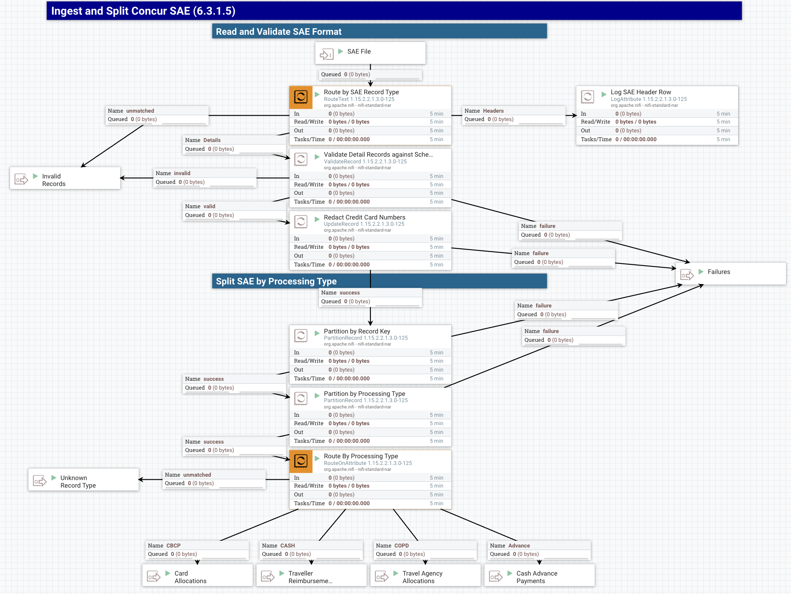

# 6.3.1.5 SAE Ingestion

### Summary

Imports the SAE file from a file source, splits it into records, and sends those records down to queues based on their type for further processing.

### Flow Summary and Principles

We are taking a batch-provided file and submitting it into a streaming data processing flow.  As such, some aspects of batch processing do not apply.  In a streaming architecture, it is necessary break down projects into atomic units of work if it is _absolutely required_ that activities not be separated.  (An example of this would be offsetting transactions.  Transaction debit and credit entries must be processed together.)  As such, any records which MUST be processed as a unit should be contained within single flow files/queue entries.  However, they must also be kept small enough to take advantage of streaming flows.

With that in mind, the units of work we can define for Concur will be the expense report.  All entries for a given report (of a type - that later) must be processed together or not at all.  Once the entries for a report have been partitioned into a flowfile for each report, those will be further segmented by their disposition type.  (e.g., GL Journal, Payment to Traveller)

1. Import SAE as single flow file
2. Extract the report header and detail records into separate flows
3. Map the CSV to a schema to allow for property access
4. Extract the report key from the records in the SAE detail flow
5. Partition into flowfiles by report key
   * These flowfiles should only have 2-200 records each
6. Extract attributes needed to determine proper flow
7. Partition records into flows for processing based on contents
   * At this point, each flowfile should could be smaller, as payments, allocations, and cash advances have all been separated.
8. Perform data conversions, aggregations, and validations as needed by the data type.
9. Reformat the payloads on each stream as expected for the common pipelines.
10. Feed into the queues (GL/PPM/One-Time Payment) for processing and submission to Oracle.

### Flow Walkthrough

1. Processor reads file as records and splits by newline.
2. Records are tested as strings to determine if header or detail lines. (`RouteText`)
3. Header record is extracted and routed separately. (and used to gate the processing of all records?) (number of records in file is part of that record.) (Feed count to `Wait` processor of so.)
4. Detail records are linked to a schema and run through Validation.  (`CSVReader`, `ValidateRecord`)
5. Travel card numbers are redacted except for last 4 digits. (`UpdateRecord`)
6. Records are partitioned by the report key. (`PartitionRecord`)
7. Record-key records are partitioned by the nature of the transaction. (`PartitionRecord`)
8. Write records to queues for each type of further processing required.
   1. Cash Advance Payments
   2. Payments to Traveller
   3. Allocations for Travel Card and Purchasing Card
   4. Allocations for Travel Agency Items
   5. Other (unprocessed)
      1. Cash Advance Clearing Only
      2. Personal expenses
      3. Anything Else

<!-- 5. Detail records are counted, incrementing a value in a distributed map. (`UpdateCounter`)
   1. Records have multiple types.  Header record (first in file) can be used to ensure that the entire file is processed at once. -->
<!-- 5. After Wait processor releases (meaning all detail lines passed validations), write all items to a persistent topic. -->

> Each line is tokenized on the pipe character to extract the columns as referenceable attributes.  (The SAE has no headers, so all fields will have to be referenced by index.)
> Partition based on export type and record key: PartitionRecord (DONE)
> Will need schema definition for the SAE to get record attributes (DONE)

TODO: Split by report key also needs to split by /CashAdvanceKey_187 since the report key is blank

### Grouping Attributes (in development)

> This is after separating by report key.

* `/EmployeeID_5`
  * for reference
* `/EmployeeLastName_6`
  * for reference
* Policy Name: `/ReportPolicyName_33`
  * Tells whether pcard
* Payment Type: `/PaymentTypeCode_126`
  * Type of card - Pcard and travel card share the same
* Report Entry Payment Type Name: `/ReportEntryPaymentTypeName_250`
  * Can differentiate between Pcard and travel card
* `/CashAdvanceTransactionType_185`
  * Tells about issuance of a cash advance

### NiFi Process Flow

### Generation Notes

#### CBCP

For Company Billed/Company Paid transactions, these are one-sided entries to be offset by the default account recorded on the matching card account record.

If POET, then PPM cost generation plus generation of static debit side to the GL in the PPM balancing chartstring.  Credit is same.

On personal expenses, Concur generates a transaction User -> University (on a debit) to reflect that UCD paid the card and now the traveller owes UCD those funds.  Need to determine whether to ignore or process those lines.

Offset chartstring will be on the concur card account table.  This will need to be loaded and made available to the integration servers so that the offset for these transactions may be generated.  A special lookup view keyed by the employee ID, card type, and last 4 digits will need to be created from the concur card account table.

#### CASH

For payments to travellers, the credit is to a static chartstring which will be expensed during the payment generation.  These entries also need to be sent through (as a summary) to generate the payment.

Same rules on the GL side if the allocation is to ppm.

#### COPD

Mainly the same - but still need to determine what the offset would be.  This is entered in the travel approver application.  We might need to reach out to it or a cache to generate the offset.

#### Cash Advance

Most accounting information is missing from these records.  Only the object code and the cash advance information provide details.  Will expense to a central account.  Need credit offset.  No PPM considerations here.

