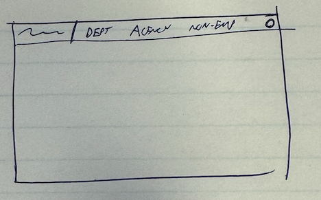
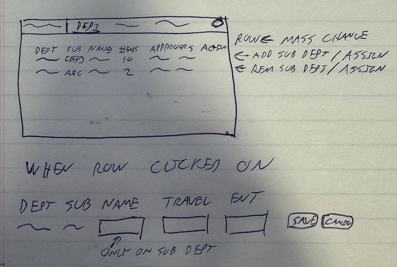

# 7.1 AggieExpense Support

## AggieExpense Integration Support Application

> Reimplementation Epic: <https://afs-dev.ucdavis.edu/jira/browse/INT-1443>

### Overview

This application is used by the central travel office to maintain certain control data which is imported into AggieExpense.  The data maintained by this application then used by various integration pipelines when generating data to send to both Concur Expense and Oracle Financials.

It is also used as a transactional data maintenance tool for files received from our partner travel agencies.  These files contain expenses (hotel reservations, flights, etc.) incurred by UC Davis employees.  We import these files to expense the departments, and then into Concur Expense as "QuickExpenses" so the can be reconciled and transferred to the correct department and funding source.

Data types which are maintained by this application include:

* Sub-Departments
* Employee Assignments to Sub-Departments
* Department Travel and Entertainment Approvers
* Travel Agency Transaction Person References and Transmission Statuses
* Departmental Default Travel Agency Expense Segment Strings
* Non-Employee Travellers

### Application Structure

This application will be split into 3 main components:

* Sub-Department and Department Approver Maintenance
* Travel Agency Data Maintenance
* Non-Employee Traveller Maintenance

Of these, the first two are only used by central office staff.  Non-Employees are established by all campus users, but central office staff have additional permissions to maintain them.

### Base Application Functionality

The application must be able to perform the following functions.  (High-level user stories.)

#### Sub-Department and Department Approver Maintenance

* View/Search departments / sub-departments and their approvers
* Move employees between sub-departments within a department
* Set the approvers for a department or sub-department
* Add and remove sub-departments
* Save and view history of approver changes
* Support three levels of access to this portion of the application: department administrator, campus department owner, UCDH department owner

#### Travel Agency Data Maintenance

* Set the default expense segment string for a department
* Review unprocessed or error transactions from travel agencies
* Allow correction of imported data from travel agencies
* Mark a transaction as requiring re-transmission to Concur QuickExpenses
* Mark a transaction as unprocessed to get it to re-import to Oracle Financials
* UI to import expense files from travel agencies and validate data during the process

#### Non-Employee Traveller Maintenance

* Allow campus user to sponsor a new non-employee traveller
* Allow campus user to update the information for a non-employee traveller
* Allow campus user to end the non-employee traveller sponsorship
* Allow central office staff to view and update any non-employee traveller record

### Prerequisites

* UCPath department and employee data must be available to the application
* GraphQL ERP data must be available to the application to validate expense segment strings


## Application Requirements

### General UI Guidelines

* Application will be a standard React SPA with multiple sub-components.  The application front-end is expected to interact with back-end components via API calls for all data retrievals.

* Application will have three sub-UIs for each major component of the application as listed in the feature summary.  (Tabs/Sidebar)

* Application must use AggieExpense branding marks as provided by the SCM team and should utilize the [UCD Brand Communications Guide](https://communicationsguide.ucdavis.edu/brand-guide/colors) as guidelines for the use of color and typography.

* Form fields should validate upon tab-out where possible.

* Data should be persisted to the back-end only when the user explicitly interacts with a "Save" or "Submit" button.

* All data updates must be validated on the server side before actions are taken to ensure UI tampering does not result in unauthorized data access or updates.

* Fields with problems should be highlighted using one of the common UI patterns for indicating a problem with a field.  (E.g., red border, red text, etc.)  A message indicating the problem should appear near the field.

* If a data submission is not processed due to an error (either client-side validation or server error response), an appropriately colored banner should appear at the top of the UI (if that will definitely be visible to the user) indicating the problem and providing a message to the user about what to do next.  If the banner could be in a position where it might not be seen, the message should appear near the submit button.

* As with many current web sites, the upper right would contain the user's name (we don't have profile images) and a drop-down menu with an option to allow the user to log out.  (Username could also be within the menu - if some image is used to represent the user.)

* Tables/grid data should be dynamically populated with pages of information to optimize rendering type and speed.  Ideally, all loaded rows would fit on the screen to prevent the need for the browser page to scroll.  Paging controls should be visible at the bottom of the viewable portion.

* Tables should be sortable and filterable within the header.  The header of tables should be two rows.  First row is the header (clickable to sort by that column) and the second row would be a set of fields used to filter the results by a substring of that column's value.  Update the table contents dynamically as the user types in the filter fields.  Use a debounce pattern to prevent excessive API calls.
  * Where it makes sense, date columns should support date range filtering.  (Multiple fields/custom control field to allow selection of start and end dates - whichever makes most sense in context.)

#### Page Outline Concept




### Sub-Department and Department Approver Maintenance

This portion of the application is used by the central travel office to maintain the travel and entertainment approvers.  While this it _technically_ doable within Concur, it is not simple, especially for mass changes in approvers.  Additionally, we depend on department assignments from UCPath.  Unfortunately, those departments are not granular enough for T&E approvals.  Additionally, often the approvers for a department are within the same department, which would cause a workflow failure in Concur.  These two issues are the reason for the existence of sub-departments for the loads into Concur.

This application's base function is to display all departments in use by campus employees and allow the central offices (Campus and UCDH) to maintain the approvers for department/sub-department combinations.  The creation and assignment of employees to sub-departments is only done by the Campus staff.

It also supports the ability to create sub-departments within a department and then assign employees to those sub-departments.  An employee can be in only one sub-department at a time and an employee will always be in the same overall department as defined by their primary job record.

For ease of use (and because all hierarchies in Concur must be the same depth), all departments have a `[DEF]` sub-department record which represents the department as a whole.

NiFi processes will take care of loading new departments into the table for this application.  New departments will be given a `[DEF]` sub-department record by default.  NiFi will also load employees into the base employee table.  Any new employees will be assigned to the `[DEF]` sub-department of their department.  If an employee's primary department is changed from that in this application's table, that employee's record will be updated to the `[DEF]` sub-department of the new department.

#### Business Function Summary

* Assignment of approvers to dept/sub-dept records.
* Creation, modification, and removal of sub-departments.
* Assignment of employees to sub-departments.

#### UI Function Details

* Default to displaying a searchable grid of all departments.  Use a data paging model to avoid loading all departments at once.  (There are enough departments that the slowdown will be noticeable if we load all at once.)
* Provide a dynamic search field to filter the departments displayed in the grid as typed by searching on department code and name.
* Sub-departments should appear in the main list, with indentation to indicate their relationship to the parent department.
* Grid should contain columns for:
  * Department Code
  * Sub-Department Code
  * Department Name (or Sub-Department Name)
  * Travel Approver
  * Entertainment Approver
  * Actions
* Sub-Department Name, Travel Approver, and Entertainment approver should be fields - or convert to fields when clicked to allow editing.
  * Once a field is edited, a "Save" and "Cancel" button should appear near the field or at the right of the table row.
* The action column should contain a button to "Add Sub-Dept" on department lines.
* Sub-Department lines should have a button to "Remove Sub-Dept".  However, this button should be disabled if there are employees assigned to the sub-department.
* The action column should have an "Assign" button.  Clicking it will will open a modal dialog to allow the user to move employees to that department or sub-department.
  * When moving, show employees in the selected department or sub-department in a list on the left side of the dialog.
  * Show all other employees in the department in a list on the right side of the dialog along with what sub-department they are currently in.
* The approver fields should use a type-ahead search to find potential approvers.  The type-ahead should search on the employee's name, user ID, and employee ID.
  * The approver must be an active UCD employee.  (Staff or Faculty)
* Provide a link to activate a mass-change action.  When clicked, bring up a modal dialog.
  * Provide From and To fields for the old and new approvers.
  * After the from field is populated, populate a list of all the affected departments and sub-departments below it the dialog.
  * When the user clicks the "Save" button, display a pop-up confirmation, and then update all the affected departments and sub-departments with the new approver in both the travel and entertainment approver fields.



#### Data Structure Notes

* The departmental table needs to have a key set of division code, department code, and sub-department code.
  * Division code is a 2-character code which represents the division of the university.  (Might be optional if can join in from master table)
  * Department code is a 6-character code which represents the department within the division.
  * Sub-Department code is a up-to-5-character code which represents the sub-department within the department.
* There will be a table in the Postgres database which will contain all the base department information from UCPath.  This application can join to that table
* The employee table will be keyed by the employee ID and will designate what department/sub-department they are in.
* All table records should have last update user and date fields.


### Non-Employee Traveller Maintenance

The University works with, and sometimes pays the expenses for non-employees who are guests of the university or doing business on behalf of the university.  To allow these persons to receive reimbursement for any out-of-pocket expenses they may incur, a UCD employee sponsors them to get a record created within AggieExpense (Concur) system to record their expenses.

Sponsorships are usually for a specific time period, and the sponsor (or a delegate they identify) is responsible for entering and submitting for approval the non-employee traveller's expenses in AggieExpense.  The assignment of this delegate is part of the data entry.  Departmental users are able to come back to this application to see any of their current or prior sponsorships and edit them as needed.

These records are simply saved to the database.  Separate NiFi processes will pick up changes to these records and load them into Concur as non-employee travellers.

#### Business Function Summary

* Allow entry and maintenance of employee-sponsored travellers by departmental employees.
* Allow administrative staff to view and update any non-employee traveller record.

#### Function Details

* The default behavior depends on the user's role:
  * If the user only has the employee role, show a list of non-employee travellers they have sponsored.
  * If the user is a travel office employee, show a search bar allowing them to filter, but defaulted to their user ID as the owner.
  * (This results in the same intitial grid output for all users, but provides the search bar to the central office so they can look up other department's sponsored travellers.)
* The contents of the grid should include:
  * Non-Employee Name
  * Non-Employee ID
  * Department
  * Sponsor Name
  * Sponsored Date
  * Sponsorship End Date
  * Actions Column
* Above the table include a button: "Sponsor Non-Employee Traveller".  This will replace the UI with the data entry form.
* In the main display grid, the actions should include a button to "Edit" the non-employee traveller.  This will replace the UI with the data entry form.
* There should also be a button to end sponsorship of the non-employee traveller.  This will display a confirmation dialog before taking action.
  * Date extensions can be performed by editing the record and changing the end date.
* Non-Employee IDs are auto-generated.  They are "N" followed by an 8-digit number.  This value should be the PK of the non-employee table and must be set to an initial value which is above those being generated by the existing application.
* The fields which need to be present when creating or editing a non-employee traveller are:
  * ID (auto-generated - read-only)
  * First Name
  * Last Name
  * Middle Name
  * Logon ID (auto-generated - read-only)
  * email address
  * Department Information (read only - copied from sponsor)
  * Address Lines 1/2
  * City/State/Zip/Country
  * Sponsorship End Date (default to 1 year from today - editable)
* Additional fields may be needed for batch control for sending to Concur
  * Concur last export date
  * last updated by/date


### Travel Agency Data Maintenance

This application provides a means for the business office to manage transactions incurred by UCD employees with our partner travel agencies.  The agencies provide us files in Excel/CSV format which must be imported by central office staff to allow for financial distribution within the University as well as to gather the appropriate approvals for the activity.

Once imported, the data is validated to ensure that we can identify the employee to whom the expense is to be attributed.  The import process should highlight these in order to allow the business office to correct the entries.  Separate processes will take error-free imported data (a) generate a journal to expense them to the default accounting string for the employee's department, and (b) generate a "QuickExpense" for each in Concur for the employee to reconcile and assign to the correct department and funding source for their travel.

After that, the default mode of the application is to display any transactions which were not imported into Concur or Oracle properly per their status fields.  The controls on the table would allow the users to correct the data and reset the import flags as needed.  This application _does not_ interact with Concur or Oracle Financials directly.  Those interactions are handled by NiFi processes.

The other function for this application is to maintain the default expense segment string for each department.  The application will contain a list of all HR departments and allow the assignment (with appropriate validation) of the default expense segment string for each department.

#### Business Function Summary

* Import files provided by travel agencies into system table.
* Validate the data as it is imported.
* Allow correction of invalid data.
* Allow user to enter notes on transactions.
* View, Sort, and Filter data from the tables.
* Flag individual transactions for re-transmission to Concur.

#### Function Details

* This sub-application has two functions:
  * Import and correct data from travel agencies
  * Maintain default expense segment strings for departments
* The above should be selectable via a tab or sidebar navigation.  (Probably tabs, don't want to use horizontal space for a sidebar.)
* The default display will be the grid/table of UNPROCESSED transactions in the staging table.
* Columns: _See Below_
* The action column would have the actions below:
  * If PROCESSED - allow the user to "re-Transmit" the transaction to Concur.  (This just updates a status flag on the record.  Integration components will take care of the actual sending.)
  * If UNPROCESSED or ERROR - allow the user to "Mark as Unprocessed".  This will allow the transaction to be re-imported into Oracle Financials.
  * If ERROR or INVALID - allow the user to "Correct" the transaction.  This will bring up a modal dialog to allow the user to correct the transaction data.
* The default display will also include a button to "Import Agency Transactions" (above the table - right aligned to the table in the display area).  This will bring up a modal dialog to allow the user to select a file to import.
  * This upload process loads the transactions from the file into the staging table.
  * If any row in the file fails parsing, the entire file will be rejected and an error message will be displayed to the user.
  * Any data imported will be truncated to the database column widths.
  * After import to the table, the process will run validations on the data.  Any records which fail validation at this point will be marked as INVALID.  Others get marked as UNPROCESSED.
  * After the import - the modal will report the number of records imported, and those with validation errors.
  * When the Modal closes, if there were any validation errors, the grid filters will be updated to show INVALID transactions.  Otherwise, show all UNPROCESSED transactions.
* For the default expense segment string maintenance, the user will be presented with a grid of departments and their default expense segment strings.
  * The grid will have columns for:
    * Department Code
    * Department Name
    * Default Expense Segments
      * Entity
      * Fund
      * Department
      * Purpose
      * Project
      * Program
      * Activity
    * Actions
  * The segment values can be editable in the main table view.  (No need to click to edit.)
  * A Save button will be present in the Actions column to save any changes to a given row.
* Each transactions may have notes added.  These notes should be stored in a separate table, identify the user and date, and link to the transaction by a unique identifier.
* (NTH) A Function to allow scanning of all default segment strings in the department table to determine if they are still valid.  This would be done by sending each to the GL segment validation operation on the GraphQL API.

##### Old Table Columns

```json
  columnConfig: [
      { label: 'Actions', propName: 'skip', customContentCallback: ComponentUtils.getAgencyPaymentActions },
      { label: 'PBP Payment Id', propName: '_id' },
      { label: 'Traveler Name', propName: 'travelerName' },
      { label: 'Traveler Id', propName: 'travelerId' },
      { label: 'Amount', propName: 'transactionAmount' },
      { label: 'Trans Date', propName: 'transactionDate' },
      { label: 'Depart Date', propName: 'departDate' },
      { label: 'Vendor', propName: 'merchantName' },
      { label: 'Error Message', propName: 'validationMessage' },
      { label: 'Notes', propName: 'notes', customContentCallback: ComponentUtils.getNoteContent },
      { label: 'Status', propName: 'corrected', customContentCallback: ComponentUtils.getCorrectedIcon },
  ],
```

##### Requested Changes to Above

* Agency Record locator from the BCD file (column J)
* Arranger from all files (column M)
* Invoice # from hotel files (column G)
* And REMOVE Depart Date.


### Security (General)

* The application must only be accessible to authenticated users via the campus SSO system.  (Apereo CAS)
* API access from the front-end to the back-end API components must be authenticated.  Some secure token must be established during the login process to ensure that all API requests made by the user of the application are authorized per that user's identity and permissions.
* UI Components which the user does not have access to should not be visible to the user.  (E.g., campus users should not see that the other two sub-UIs exist.)
* Security roles/permissions for a given user will be stored in and retrieved from Grouper via the back-end server.  Grouper maintains a JSON web-service interface which can be queried to get the roles (groups) for a given user.

#### System Roles

* The application will have the following roles:
  * travel_office
  * campus_dept_admin
  * ucdh_dept_admin
  * travel_agency_admin
  * employee

The first 4 roles will be maintained within grouper.  "employee" is granted to all authenticated users who are campus employees.  (This too can be checked via Grouper - or might be available within the Postgres database used by the application.)  Users may have more than one role.

#### Permissions

Application Permissions are as follows - with their assignment to roles:

* **Non-Employee Permissions**
  * Sponsor Non-Employee Traveller
    * employee
  * List/Edit/Deactivate Own Non-Employee Travellers
    * employee
  * List/Edit/Deactivate Others' Non-Employee Travellers
    * travel_office
* **Department and Approver Maintenance Permissions**
  * Create/Update/Delete Sub-Departments
    * travel_office
  * Assign Employees to Sub-Departments
    * travel_office
  * Set Department or Sub-Department Approvers
    * travel_office (for all departments)
    * campus_dept_admin (for non UCDH departments)
    * ucdh_dept_admin (for UCDH departments)
  * Mass Change Approvers
    * travel_office
* **Travel Agency Transaction Maintenance**
  * Default Expense Segment String Maintenance
    * travel_agency_admin
  * Import Agency Transactions
    * travel_agency_admin
  * Review/Correct Agency Transactions
    * travel_agency_admin
  * Flag Transactions for Re-Transmission
    * travel_agency_admin


## Technical Implementation Notes

* Use of grouper for AuthZ
* Determine if per-dept owners are needed any more or if just by division or all centrally.
* Determine how to maintain the list of departments...use UCPath API server to pull the information?
* Same with employees.  Determine how much data for this application to maintain locally vs. pull from other sources already in postgres.
* Eliminate term CTS and replace with "Travel Agency"
* Should we bring up an AggieTravel API server which uses AIT_INT or the copies made for other integrations?

* Department length: 7 characters
* Sub-Department length: 5 characters
  * Default value `[DEF]`
* Sub-Department Name length: 30 characters
* Approvers stored as: Employee ID (8 characters - 11 character DB column)
  * Due to state law requirements, do not store the employee's name in the approver table.  The name must be looked up/joined from the employee table when returning data to the UI.
* Approver table should track last update user ID and date.  (Presently no requirement to show this information in the UI.)
* Changes to approvers should be tracked in a history table.  (No requirement for UI at this time - tracking for audit purposes.)
* Use of geographies data from Oracle to validate city/state/zip/country values on non-employee.
* Agency validations:
  * employee ID or non-emp ID
  * Unable to get department for employee
  * Department does not have default segments set up
