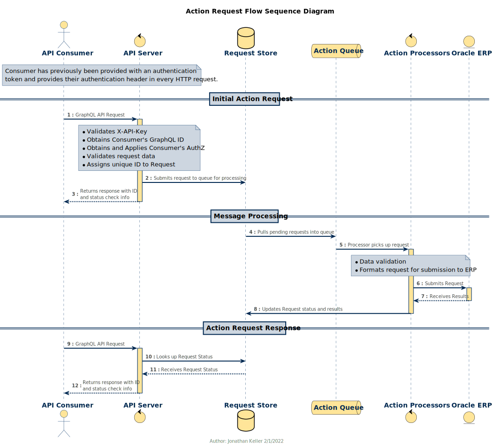

# ERP API Documentation

* [ERP API Overview](#ERP-API-Overview)
  * [3.2 Oracle ERP Data Server](#3.2-Oracle-ERP-Data-Server)
    * [3.2.1 Data Objects](#3.2.1-Data-Objects)
      * [3.2.1.1 GL Segments](#3.2.1.1-GL-Segments)
      * [3.2.1.2 PPM Segments](#3.2.1.2-PPM-Segments)
      * [3.2.1.3 GL Reference Data](#3.2.1.3-GL-Reference-Data)
      * [3.2.1.4 PPM Reference Data](#3.2.1.4-PPM-Reference-Data)
    * [3.2.2 Data Requests](#3.2.2-Data-Requests)
    * [3.2.3 Action Requests](#3.2.3-Action-Requests)
      * [3.2.3.1 GL Journal](#3.2.3.1-GL-Journal)
    * [3.2.5 File Based Action Requests](#3.2.5-File-Based-Action-Requests)
      * [3.2.5.1 GL Journal File Submission](#3.2.5.1-GL-Journal-File-Submission)

---

## ERP API Overview


Oracle ERP integrations are being designed around delivering an API-first approach.  APIs will be available for all outbound and inbound data the project team has defined as a requirement for this project.  It is designed to support the needs for data integrations only.  Access to data to be used for reporting is not in the scope for these APIs.

The model for submitting data updates to Oracle is different from existing data update APIs.  The integration platform implements a model of asynchronous operations when interaction with the Oracle system is required.  This may require more work on the part of each consumer, and require a change in how data flows are managed within boundary systems.  This is being done in part due to Oracle Financials being a SaaS-based ERP system.  We have less control over the end-to-end connections (both in systems and networks) than we have with KFS.  We also must contend with potential downtimes of Oracle or integration components.  Moving to an asynchronous queue-based system eliminates these compound dependencies and potential performance bottlenecks.  And, it relieves boundary systems from having to be aware of, or schedule around, most components of integrations.  This also allows for requests to be retried (independent of the boundary system) until completion in the case of service downtimes.

Because the API is based on GraphQL, there will be a single API endpoint to serve all API data and action requests for systems managed by AdminIT.  Users of the API will be able to query data (in the same request) across all supported systems (presently Oracle Financials and UCPath), with defined internal links that will allow for data from one system to be enriched by data from the others.

Below are the primary components of the integration framework, each described in a section below:

1. GraphQL Data Request API
2. Asynchronous Action Request API
3. API Gateway Portal
4. Structured File Uploads

### 1. GraphQL Data Request API

A federated GraphQL data graph API which enables retrieval of data across multiple data sources managed or accessed by Admin IT.  This provides a standarized, stable manner in which to retrieve data both individually and in bulk utilizing a well known data transfer format.

GraphQL is a operation and data model specification using JSON as the underlying data structure format and runs on top of the standard HTTP POST operation used by many APIs today.  While the most benefit can be gained by using a GraphQL client library (which exist for for most programming languages), one is not necessary to use the API.  Any application capable of posting JSON-over-HTTP to an API endpoint would be able to adapt to query via GraphQL with little difficulty.

#### Cross-Domain Data Retrieval

One benefit of GraphQL requests is that each may contain multiple queries, with all results being returned in a single HTTP response.  And, due to the data federation tools used, a single request can contain data from multiple sources (e.g., Oracle Financials and UCPath) if the relationship has been established in the data graph.  (For Example, anywhere an employee ID appears in the Oracle data model, we could have a reference to the Employee object in UCPath to allow retrieval of more information about the person than Oracle can return.)

#### Object and Property Level Authorization

The structure of GraphQL requests allows for fine-grained access controls.  Through this, we are able to assign security roles to whole domains of data, specific operations, data objects, and individual properties of objects.  This allows the data model design to contain different versions of data objects with and without sensitive data properties.  All properties may exist on a single version of an object.  In GraphQL, each property of an object must be explicitly requested.  Security on sensitive properties is only applied _if_ those specific properties are requested by the consumer.  Such a authorization failure does not result in a failure of results to return.  The offending objects are blanked out, and the remainder of the data is returned, along with error information informing the consumer of the redaction.

### 2. Asynchronous Action Request API

Requests which require Oracle to take an action will be made asynchronously with request to the consumer's API call.  The call will be handled as a _request_ to perform the action.  The interaction with the ERP system to perform the action will be handled by the integration platform at a later time.  (Though most often within seconds.)  If preliminary validation by the API passes, the consumer will be returned a unique ID to allow for checks on the completion of the request at a later point in time.

#### Action Requests

Each _request_ will be pushed into a queue. (Depending on the API, there may be some validation performed which would result in an immediate response.)  The API will return tracking information about the request with a request identifier and an GraphQL payload (another API operation) which the consumer can then use to check on and retrieve the results of their request.

#### Result Polling

Clients have two options to get the results of their request.  The provided operation may be invoked to obtain the results or the present status (if incomplete).

#### Result Callbacks (future development)

Another option which may be available pending completion of other work would be to have the integration platform perform a callback to the consumer's server.  If this is an option for a boundary system, a callback URL may be provided in the request.  And, if present, when the request is complete the response will be placed in a queue for posting the data back to the client.  The URL must be an HTTPS URL with a trusted certificate to a white-listed domain.  The platform will attempt some retries of the callback if there is a problem connecting to the consumer system.  However, any consumer who chooses this option should have a fallback to use the results URL provided for any callbacks not received.

### 3. API Gateway Portal

We plan to offer a HTTP gateway server through which all requests will be proxied and authenticated.  It would also provide a portal for API consumers with documentation of all exposed APIs, whether for this API or others within Admin IT.  It also acts as a web application firewall, detecting and rejecting fradulent requests in order to protect the API servers.

#### Authentication

The API gateway supports multiple methods of authenticating consumers of API services and provides self-service setup of application-level authentication tokens.

We will be able to support multiple models of authentication depending on the needs and capabilities of the consumer as well as the sensitivity of the data the consumer will be able to access or modify.  (E.g., OAuth, static access tokens, etc...)

#### Developer Portal

We also want this to be a portal to allow for integration developers to be able to discover available endpoints, test calls against non-prod instances, and manage their own authentication keys for their boundary applications.  Our selected software provides for a self-signup approach, with workflows to request access to needed APIs.

### 4. Secure File Uploads

API integrations are the preferred method.  It provides more immediate feedback in the case of malformed files or data which is invalid in trivial ways.  However, we will still support a path for file-based data uploads in the following exception cases:

1. Units that can demonstrate they would be unable to update their systems to utilize a web service API for data updates.
2. The data is of such volume that providing it via API could be problematic for server resources.

The latter of the above should be rare, as size of uploads could be mitigated by sending batches of transactions more frequently.

It should also be noted that there is no database or reference data export for supporting the validation of data to be submitted to these files.  Boundary systems will still need to be able to call API endpoints to obtain valid values or run validations on segment values provided by customers.

Responses on uploaded files will be less timely than API calls, where more validation can be performed before accepting the data.  Results of file uploads (success or failure) will only be provided by email.  Though, as much as possible, we will indicate the reason for the failure so you can perform manual resolution of issues and resubmit the file.

That said, it is not required to batch data to be uploaded.  Processes will be regularly monitoring the upload locations and will process the files as soon as resources are available.

#### Upload Data Formats

As with the API, the data structure format will be JSON.  The schema will be the same as that used for the API payload for the same data type though there will likely be additional requirements for uploaded files.

The header data sent may be slightly different to account for the different timing semantics of API vs. file submission.  However, the business data content should be identical.


## 3.2 Oracle ERP Data Server

[ERP API Overview](#ERP-API-Documentation)

This server is responsible for exposing data from a local copy of the Oracle ERP data through a GraphQL API.  It will connect directly to a local database as needed to retrieve the data.  This database will be populated regularly from the Oracle ERP.  Retrievals from the database will be cached within the server for a configured period of time.

It will also provide operations for "Action Requests" for sending updates into Oracle.  Action Requests are asynchronous in that the request will not be sent to Oracle during the initial call.  The request will be recorded and queued for submission to the ERP system.  Each request will be assigned a unique identifier, and the caller given a location to call back to check on the status and obtain results of the call once it has completed.

### Using the API (IN PROGRESS)

The ERP data and operations are exposed to boundary systems via a GraphQL API.  GraphQL is a specification for executing queries and mutations in a standard manner.  The underlying technology is just JSON over HTTP.  GraphQL is a specification for the contents of the JSON messages.  GraphQL allows us to tightly define the data model and the allowed contents within fields of the data model.  As such it is (almost) impossible to send incorrectly formatted data to the API when using a GraphQL-aware tool.

See: <https://graphql.org/>

This document will contain the system-specific payload specifications and examples of sending those payloads.  However, describing the full specification of GraphQL is out of scope for this document and you should refer to the above URL for more information.

#### Connecting

For connecting to the API, you will be provided with an URL as the endpoint.  You use the same URL for all calls to the API.  GraphQL uses a single `https://<host name>/graphql` endpoint.  To that URL, you will sent HTTP post operations using the required JSON payload to execute the needed operation.  Authentication will be accepted in the form of a token in an HTTP header.  The nature of the token is still under development, but plan for it to be a JWT token, as that is the largest token option we are considering.

Once connected, your access roles will be determined.  They will identify what operations you have permissions to execute and what data elements you are able to retrieve.

#### Clients

There are a number of clients for various languages available from package repositories.

See: <https://graphql.org/graphql-js/graphql-clients/>

While a GraphQL client is not needed to access the API, it can make the use of the API easier.  A client can inspect the data model you are about to send and provide validation before sending them to the API.  Some can generate client stubs for calling provided operations.

Ultimately, a GraphQL call is an HTTP POST operation to a single endpoint.  The GraphQL specification dictates the structure of the JSON payload sent in the body of the HTTP POST and where in that body you need to include the operation-specfic data.

The below is a sample of that payload for submitting a journal feed.  It is 100% JSON.  The only GraphQL-specific syntax is in the `query` property and will generally be the same or similar for all action request operations.  Comments may not be included, they are there for illustration purposes only.

The GraphQL specification for each operation defines the structure of the data which must be submitted.  Development sandboxes can be used to test any payload formats.

```jsonc
{
  // Name of the operation
  "operationName": "glJournalRequest",
  // GraphQL String defining the data variable and requesting the properties to return from the result
  "query": "mutation glJournalRequest($data: GlJournalRequestInput!) {  glJournalRequest(data: $data) {    requestStatus {      requestId      consumerId      requestDateTime      requestStatus      operationName    }   }}",
  // payload data
  "variables": {
    // payload object named in the operation definition
    "data": {
      // header common to all operations identifying the API user and
      // providing reference information to allow for tracking by the boundary system
      "header": {
        "boundaryApplicationName": "TESTING_APP",
        "consumerId": "CONSUMER_ID",
        "consumerReferenceId": "A_UNIQUE_ID",
        "consumerTrackingId": "CONSUMER_ORDER_NBR"
      },
      // the operation-specific payload for the operation
      "payload": {
        "journalSourceName": "A_BOUNDARY_SYSTEM",
        "journalCategoryName": "Recharge",
        "journalDescription": "Journal Description For Oracle",
        "journalName": "Journal Name For Oracle",
        "journalReference": "JournalReference",
        "accountingDate": "2021-09-10",
        "journalLines": [
            {
                "glSegments": {
                    "entity": "1311",
                    "fund": "12345",
                    "department": "1234567",
                    "purpose": "68",
                    "account": "700002"
                },
                "externalSystemIdentifier": "ORDER123",
                "debitAmount": 123.45
            },
            {
                "glSegments": {
                    "entity": "1311",
                    "fund": "12345",
                    "department": "1234567",
                    "account": "200001"
                },
                "externalSystemIdentifier": "ORDER123",
                "creditAmount": 123.45
            }
        ]
      }
    }
  }
}
```

#### Testing Operations

Because every GraphQL server publishes its operations and schema, it is simple to point a GraphQL-aware tool at the server and get a full description of the API as well as (usually) a dynamic editor which can validate your request and payload contents in real-time based on the schema definitions.  You can utilize tools like Postman, Insomnia, or GraphiQL.  We might also be able to provide a playground as part of our API Portal.  (time permitting)

You will just need to provide your credentials in the HTTP header per the tool's configuration to be sent as part of the requests to allow for retrieval of the schema and submission of operations.

#### Obtaining Action Request Results

In order to provide an infrastructure with minimum downtime from the perspective of our boundary applications, API data submissions to Oracle are performed an an asynchronous manner.  The submission is validated and stored within the integration platform.  The API then immediately returns the necessary information to follow-up on the request in its response.  The caller is responsible for checking in on the success or failure of the request.  (If possible, we may also provide a service to post a status message back to a URL provided by the caller.)

So, in the case where this type of request is submitted to the API, it will be validated and (if valid), queued for execution.  The operation will respond to the call at that point with a unique identifier you can use to track the status of the request.  This UUID has no meaning to the ERP system, but can be used against these APIs to check on the status.  Depending on the type of operation, you may be able to get an Oracle-generated identifier back once the request has been successfully processed.

Below are some examples of responses from the API.  Successful response data is wrapped by a `data.<operation name>` property.  If there are any errors, they are reported in a top-level `errors` property looking like the 2nd response below.

```json
{
    "data": {
        "glJournalRequest": {
            "requestStatus": {
                "requestId": "5c928b62-d729-4fdf-bc10-c313fe28386d",
                "consumerId": "CONSUMER_ID",
                "requestDateTime": "2022-01-20T00:42:38.908Z",
                "requestStatus": "PENDING",
                "operationName": "glJournalRequest"
            },
        }
    }
}
```

```json
{
  "error": {
    "errors": [
      {
        "message": "Variable \"$data\" got invalid value \"Journal Reference\" at \"data.payload.journalReference\"; Expected type \"GlReferenceField25\". Value is not a valid GlReferenceField25. (Journal Reference)  Must match pattern: /^[A-Za-z0-9_-]{0,25}$/",
        "extensions": {
          "code": "BAD_USER_INPUT"
        }
      }
    ]
  }
}
```

#### Example of Action Request Flow


<!--BREAK-->
### Data Objects Provided

#### Key Accounting Field Segments

* [`ErpEntity`](3.2.1%20Data%20Objects/ErpEntity.md)
  * Chartstring element representing the sub-entity of the University to which a transaction belongs.
* [`ErpFinancialDepartment`](3.2.1%20Data%20Objects/ErpFinancialDepartment.md)
  * Campus department to which a transaction belongs.  Aligned with, but not always the same as, the UCPath HR Department.
* [`ErpFund`](3.2.1%20Data%20Objects/ErpFund.md)
  * Fund which the transaction debits or credits.  Replacement for the legacy OP Fund.
* [`ErpAccount`](3.2.1%20Data%20Objects/ErpAccount.md)
  * Classification of the transaction (revenue/expense/asset/libility).  Cooresponds to the KFS Object Code.
* [`ErpPurpose`](3.2.1%20Data%20Objects/ErpPurpose.md)
  * Purpose of the transaction as it relates to the campus functions (instruction, operations)
* [`ErpProgram`](3.2.1%20Data%20Objects/ErpProgram.md)
  * The Program segment records revenue and expense transactions associated with a formal, ongoing system-wide or cross-campus/location academic or administrative activity that demonstrates UC Davis' mission of teaching, research, public service and patient care.
* [`ErpProject`](3.2.1%20Data%20Objects/ErpProject.md)
  * The Project segment tracks financial activity for a "body of work" that often has a start and an end date that spans across fiscal years.
* [`ErpActivity`](3.2.1%20Data%20Objects/ErpActivity.md)
  * Systemwide activity to which a transaction is assigned.
* [`ErpFlex1`](3.2.1%20Data%20Objects/ErpFlex1.md) (**FUTURE**)
* [`ErpFlex2`](3.2.1%20Data%20Objects/ErpFlex2.md) (**FUTURE**)

<!-- * [`ErpInterEntity`](3.2.1%20Data%20Objects/ErpInterEntity.md) (**FUTURE**) -->
  <!-- * Internal accounting use only when transactions cross between entities, to represent the nature of the funds transfer. -->

#### GL Reference Data

* [`GlJournalSource`](3.2.1%20Data%20Objects/GlJournalSource.md)
  * Boundary system source for a journal sent in via integrations.
* [`GlJournalCategory`](3.2.1%20Data%20Objects/GlJournalCategory.md)
  * Type of activity recorded on a journal.  Cooresponds to the KFS document type code.
* [`GlAccountingPeriod`](3.2.1%20Data%20Objects/GlAccountingPeriod.md)
  * Accounting period to which a transaction is assigned.
* [`GlChartstringAlias`](3.2.1%20Data%20Objects/GlChartstringAlias.md)
  * Shortcut string for a full set of key accounting segments.  Usable on integration journals instead of specifying all chartfields.  Will be resolved by the integration layer.

#### PPM Costing Segments

* [`PpmProject`](3.2.1%20Data%20Objects/PpmProject.md)
* [`PpmTask`](3.2.1%20Data%20Objects/PpmTask.md)
* [`PpmExpenseOrganization`](3.2.1%20Data%20Objects/PpmExpenseOrganization.md)
* [`PpmExpenseType`](3.2.1%20Data%20Objects/PpmExpenseType.md)
* [`PpmAward`](3.2.1%20Data%20Objects/PpmAward.md)
* [`PpmFundingSource`](3.2.1%20Data%20Objects/PpmFundingSource.md)

#### PPM Reference Data

* [`PpmDocumentEntry`](3.2.1%20Data%20Objects/PpmDocumentEntry.md) (**IN PROGRESS**)
  * This will serve the function of the Journal Source in the GL module.

<!-- * [`PpmCostingType`](3.2.1%20Data%20Objects/PpmCostingType.md) (**TBD**) -->
<!-- * [`PpmCustomer`](3.2.1%20Data%20Objects/PpmCustomer.md) (**TBD**) -->
<!-- * [`PpmDocument`](3.2.1%20Data%20Objects/PpmDocument.md) (**TODO**) -->
  <!-- * This will serve the function of the Journal Source / Payment Source in other modules. -->
<!-- * [`PpmExpenseCategory`](3.2.1%20Data%20Objects/PpmExpenseCategory.md) (**TODO**) -->
<!-- * [`PpmExpenseTypeClass`](3.2.1%20Data%20Objects/PpmExpenseTypeClass.md) (**TODO**) -->
  <!-- * Classification of the PpmExpenseType.  Used to control business rules around usable PPM expense types. -->
<!-- * [`PpmProjectStatus`](3.2.1%20Data%20Objects/PpmProjectStatus.md) (**TBD**) -->
<!-- * [`PpmProjectType`](3.2.1%20Data%20Objects/PpmProjectType.md) (**TBD**) -->
<!-- * [`PpmSource`](3.2.1%20Data%20Objects/PpmSource.md) (**TBD**) -->
<!-- * [`PpmTransactionSource`](3.2.1%20Data%20Objects/PpmTransactionSource.md) (**TBD**) -->

#### SCM Reference Data

* [`ScmSupplier`](3.2.1%20Data%20Objects/ScmSupplier.md)
  * [`ScmSupplierSite`](3.2.1%20Data%20Objects/ScmSupplierSite.md)
* [`ScmPaymentTerms`](3.2.1%20Data%20Objects/ScmPaymentTerms.md) (**TODO**)
* [`ScmPaymentType`](3.2.1%20Data%20Objects/ScmPaymentType.md) (**TODO**)
* [`ScmSupplierType`](3.2.1%20Data%20Objects/ScmSupplierType.md) (**TODO**)

#### AR Reference Data

* [`ArAccountingPeriod`](3.2.1%20Data%20Objects/ArAccountingPeriod.md)
* [`ArCustomer`](3.2.1%20Data%20Objects/ArCustomer.md) (**TODO**)
  * [`ArCustomerSite`](3.2.1%20Data%20Objects/ArCustomerSite.md) (**TODO**)
* [`ArInvoiceSummary`](3.2.1%20Data%20Objects/ArInvoiceSummary.md) (**TODO**)
* [`ArPaymentTerm`](3.2.1%20Data%20Objects/ArPaymentTerm.md)
* [`ArTransactionSource`](3.2.1%20Data%20Objects/ArTransactionSource.md) (**TBD**)

#### Common Reference Data

* [`ErpCountry`](3.2.1%20Data%20Objects/ErpCountry.md) (**TODO**)
* [`ErpLocation`](3.2.1%20Data%20Objects/ErpLocation.md) (**TBD**)
* [`ErpPerson`](3.2.1%20Data%20Objects/ErpPerson.md) (**TBD**)
* [`ErpUnitOfMeasure`](3.2.1%20Data%20Objects/ErpUnitOfMeasure.md) (**TODO**)
  * Might need per-module types (e.g., AR and SCM might have different lists.)

<!-- * [`ErpCurrency`](3.2.1%20Data%20Objects/ErpCurrency.md) (**TBD**) -->


<!--BREAK-->
### Data Requests Supported

> Data Requests are actions which request data that is not directly linked to an underlying data object or require an additional level of processing to satisfy the request.

#### Data Conversion Support

* [`kfsConvertAccount`](3.2.2%20Data%20Requests/kfsDataRequests.md) (**TBD**)
  * Given a chart and account, returns the best matching Oracle accounting segments.
  * This will be based on the data conversion rules created for cutover.
  * These could be either glSegments or ppmSegments depending on the KFS account.
  * For `glSegments` the response will contain the Entity, Fund, Department, and Purpose.
  * For `ppmSegments` the response will contain the Project, Task, and Expenditure Organization.
  * **TBD: The business need for this service is presently unknown.**

* [`kfsConvertOrgCode`](3.2.2%20Data%20Requests/kfsDataRequests.md) (**TBD**)
  * Given a KFS Organization code, returns the best matching Oracle Financial Department.
  * This will be based on the data conversion rules created for cutover.
  * **TBD: The business need for this service is presently unknown.**

#### General Ledger

* [`glChartSegmentsValidate`](3.2.2%20Data%20Requests/glDataRequests.md) (**IN PROGRESS**)
  * Given a set of segment values, validate if they will be accepted by Oracle.
  * This does not include situational correctness.  E.g., use of a labor account on a recharge journal or payable.
* [`glChartstringValidate`](3.2.2%20Data%20Requests/glDataRequests.md) (**IN PROGRESS**)
  * Given a complete GL Chartstring, validate if it will be accepted by Oracle.
  * This does not include situational correctness.  E.g., use of a labor account on a recharge journal or payable.

<!-- * [`erpFiscalApprover`](3.2.2%20Data%20Requests/glDataRequests.md) (**TODO**)
  * For a given set of segment values, return the person(s) who would need to approve any transactions against that chartstring.
  * **TBD: We do not yet know how or where approvers will be attached.** -->

#### Project and Portfolio Management

* [`ppmSegmentsValidate`](3.2.2%20Data%20Requests/ppmDataRequests.md) (**TODO**)
  * Validate that the given POET segments will be accepted by Oracle.

<!--
* [`ppmCostApprover`](3.2.2%20Data%20Requests/ppmCostApprover.md) (**TODO**)
  * For a given set of POET segment values, return the person(s) who would need to approve any transactions against that project.
-->

#### Accounts Receivable

* [`arInvoiceSummary`](3.2.2%20Data%20Requests/arDataRequests.md) (**TODO**)
  * (This may end up as a data object - but falls more into the area of a special data request since it involves transactional data.)


<!--BREAK-->
### Action Requests Supported

#### Common Operations

* [Common Types](3.2.3%20Action%20Requests/1_CommonTypes.md)
  * Input and output types common across ERP Action Requests.
* [Common Operations](3.2.3%20Action%20Requests/2_CommonOperations.md)
  * Action Request-related operations not specific to a particular type.

#### General Ledger

* [`GlJournal`](3.2.3%20Action%20Requests/GlJournal-1-summary.md) (**IN PROGRESS**)
  * Combined GL/PPM Journal import

#### Supply Chain Management / PTP

* [`ScmRequisition`](3.2.3%20Action%20Requests/ScmRequisition-1-summary.md) (**IN PROGRESS**)
  * Creation of new purchasing requisitions
* [`ScmInvoicePayment`](3.2.3%20Action%20Requests/ScmInvoicePayment-1-summary.md) (**IN PROGRESS**)
  * Creation of PO Invoice and Non PO Payment Requests

#### Accounts Receivable

* [`ArInvoice`](3.2.3%20Action%20Requests/ArInvoice-1-summary.md) (**IN PROGRESS**)
  * AR Invoices




## 3.2.1 Data Objects

[ERP API Overview](#ERP-API-Documentation)


All data objects must have at least 2 operations:

* `get` : get a single data object by a unique identifier
* `search` : general purpose, multi-property search
<!-- * `searchCount` : as above, but only returns the number of matching results -->

The first always takes the complete set of primary key fields for the data object and returns 0 or 1 objects.

The second takes a filter input type specific to the data object and returns an array of 0 or more of that objects data types.

They may also include standardized optional operations:

* `xxxxxxAll` : get all currently valid instances of this data object
* `xxxxxxChildren` : for data with hierarchies, get all currently valid child instances

### `get` Query

The get query should be the name of the data object starting with a lower case letter.  E.g., for the `Department` data object, this query definition would look like:

```gql
  "Returns a single record based on its primary key"
  department(setId: String!, departmentCode: String!): Department
```

* All primary key fields must be required.
* The return value must not be, as this method could return a null result if the record does not exist.

### `search` Query

The search query is the general purpose lookup for this data object.  Its name is the name of the data object (again starting with lower case), and followed by the term `Search`.  The only parameter is a filter object.

#### Common Search Data Types

These are two common data types to be used on the input and output of all search queries.  They provide standard properties which clients can provide to control the results of the search.  If any function on the common inputs can not be supported by a given search operation, it must be clearly documented in the operation's description.

* `sort` (optional): Array of property name strings by which to sort the results.  If not provided, a default sort will be applied.
* `limit` (optional): The maximum number of records to return.  Defaults to a server-configured value.
* `startIndex` (optional): Zero-based record to start with.  Allows for paging results.
* `includeTotalResultCount` : If present and true will trigger the server to perform a count of all matching records.  As this may increase the return time of the search, it is disabled by default.  It is present to be turned on in cases where the calling application (perhaps for UI display) needs to know the total number of records which could be returned at time of downloading the first page of results.

```gql
  """
  Special properties common to all common search operations.
  """
  input SearchCommonInputs {
    "Array of property names to sort on"
    sort: [String!],
    "maximum number of records to retrieve"
    limit: PositiveInt,
    "Record number to start with"
    startIndex: NonNegativeInt
    "Whether to include a count of all records to be returned by this search.  Will increase search time."
    includeTotalResultCount: Boolean
  }

  """
  Metadata about the search results returned in a given response.
  Used to provide metrics of the results and the information necessary
  to pull in the next set of records.
  """
  type SearchResultMetadata {
    "Array of property names used to sort the results"
    sort: [String!],
    "requested limit to the number of records to retrieve"
    limit: PositiveInt,
    "Results returned in the data property."
    returnedResultCount: NonNegativeInt!
    "Starting index for the current result set."
    startIndex: NonNegativeInt!
    "Start index for getting the next page of results.  Unset if there are no more results."
    nextStartIndex: NonNegativeInt
    "Total number of results.  Will only be populated if `includeTotalResultCount` is true in the search request."
    totalResultCount: NonNegativeInt
  }
```

#### Search Filter and Results Patterns

Every `FilterInput` and `SearchResults` object on a common search function must implement with the following patterns.  Use of these for custom searches is optional, but highly encouraged for overall API consistency.

The `FilterInput` object must look like the following, with an optional `searchCommon` property of the `SearchCommonInputs` seen above.  Other properties in this object should match the property names on the data object.  Properties which do not match the base object may be added for special purposes, but must have documentation as to how they are applied to the search.

```gql
  type XxxxxxxxxFilterInput {
    searchCommon:   SearchCommonInputs

    propertyName:   StringFilterInput
    propertyName2:  StringFilterInput
    boolProp:       BooleanFilterInput
  }
```

The `SearchResults` object is a wrapper object for the results which contains `metadata` about the results and a `data` array containing the list of matching records.  Every `SearchResults` object must have the following properties.

```gql
type XxxxxxxxxSearchResults {
  "Information about the search results returned."
  metadata: SearchResultMetadata!
  "Results of the search"
  data: [Xxxxxxxxx!]!
}
```

#### Example: ErpFinancialDepartment Search

Below is how the search input, output, and operation could look for the ErpFinancialDepartment object.

```gql
  type ErpFinancialDepartmentFilterInput {
    searchCommon:   SearchCommonInputs

    code:           StringFilterInput
    name:           StringFilterInput
    enabled:        BooleanFilterInput
  }

  type ErpFinancialDepartmentSearchResults {
    metadata: SearchResultMetadata!
    "Results of the search"
    data:     [ErpFinancialDepartment!]!
  }

  type Query {
  "Search for records based on a set of filters."
  erpFinancialDepartmentSearch(
    "Criteria to apply to the search"
    filter: ErpFinancialDepartmentFilterInput!) : ErpFinancialDepartmentSearchResults!
  }
```

### `xxxxxxAll` Query

The optional getAll query should be the name of the data object starting with a lower case letter followed by `All`.  E.g., for the `Department` data object, this query definition would look like:

```gql
  "Get all currently valid departments"
  departmentAll(sort: [String!]): [Department!]!
```

* The `sort` input is optional.  Array of property name strings by which to sort the results.  If not provided, a default sort will be applied.
* The return value must always return an array.
* It should return all currently valid (i.e., Active, Not Expired) records for the object type.  If a consumer wants to get inactive values, they can use the search method above.
* This should not be added to any data object whose number of active records over the lifetime of the system could exceed `1,000`.  There is no facility to limit or page results as part of this API to keep processing the response simple for consumers.

### `xxxxxxChildren` Query

The optional getChildren query should be the name of the data object starting with a lower case letter followed by `Children`.  E.g., for the `Department` data object, this query definition would look like:

```gql
  """
  Get items under the given ${this.mainDataObjectName} in the hierarchy.
  Returns undefined if the parent does not exist.
  Returns an empty list if the given record has no children.
  """
  departmentChildren(code: String!): [Department!]
```

* The `sort` input is optional.  Array of property name strings by which to sort the results.  If not provided, a default sort will be applied.
* The `immediateOnly` input is optional.  It should default to a true value.  When true, the results should only include records which have the given code as their direct parent.  Otherwise, it should recurse to include all records under the given code in the hierarchy.
  * Inclusion of this as a parameter is optional in cases where execution of a hierarchical query can not be performed efficiently.
* It should return all currently valid (i.e., Active, Not Expired) child records for the object type.  If a consumer wants to get inactive values, they can use the search method above.
* If no valid record exists for the given code, the method should return undefined.
* If no valid children exist for a given code, the method should return an empty list.
* This should not be added to any data object whose number of active records over the lifetime of the system could exceed `1,000`.  There is no facility to limit or page results as part of this API to keep processing the response simple for consumers.

### Other Queries

Other queries may be added as relevant for special use cases not covered by the generic filter or for convenience for common use cases.  (E.g., we could have a `departmentByDivision(divisionCode:String!) : [Department!]` operation.)

All queries for a data object **_MUST_** start with the data object name to ensure that there is no confusion or potential name collision between operations hosted on different data servers.


### Common Input Structures

#### Search Inputs

Per the above, for each data object's generic search, a GraphQL `input` type will need to be created.  This object will contain many of the same properties as the data object (with the same name).  Not all properties on the data object must to be present if it does not make sense to (or would cause problems to) include them as search criteria.  (for complexity or performance reasons)

However, the type of these properties should be of one of the `FilterInput` types below, with common attributes for performing the standard types of comparisons needed during lookups.  (In v1, there is no support for "or"-type filtering.)

It is the responsibility of any backing datasource to be able to implement these filters.  This can be done as needed by a combination of use of the back-end datasource's (e.g., Oracle) capabilities and additional filtering logic in the server's datasource class.

At the time of writing, the common filter input data types were defined as:

* `StringInputFilter`
* `IntInputFilter`
* `FloatInputFilter`
* `BooleanInputFilter`
* `DateInputFilter`

```gql
"Generic string filter criteria object, only one of these properties should be set"
input StringFilterInput {
  "Test if property is equal to the given value"
  eq: String
  "Test if property is NOT equal to the given value"
  ne: String
  "Test if property is less than or equal to the given value"
  le: String
  "Test if property is less than the given value"
  lt: String
  "Test if property is greater than or equal to the given value"
  ge: String
  "Test if property is greater than the given value"
  gt: String
  "Test if property begins with the given value"
  beginsWith: String
  "Test if property ends with the given value"
  endsWith: String
  "Test if property contains the given value"
  contains: String
  "Test if property does not contain the given value"
  notContains: String
  "Test if property is between the first 2 elements in the array"
  between: [String!]
  "Test if property is equal to one of the given values"
  in: [String]
}

"Generic integer filter criteria object, only one of these properties should be set"
input IntFilterInput {
  "Test if property is equal to the given value"
  eq: Int
  "Test if property is NOT equal to the given value"
  ne: Int
  "Test if property is less than or equal to the given value"
  le: Int
  "Test if property is less than the given value"
  lt: Int
  "Test if property is greater than or equal to the given value"
  ge: Int
  "Test if property is greater than the given value"
  gt: Int
  "Test if property is between the first 2 elements in the array"
  between: [Int!]
  "Test if property is equal to one of the given values"
  in: [Int]
}

"Generic decimal number filter criteria object, only one of these properties should be set"
input FloatFilterInput {
  "Test if property is equal to the given value"
  eq: Float
  "Test if property is NOT equal to the given value"
  ne: Float
  "Test if property is less than or equal to the given value"
  le: Float
  "Test if property is less than the given value"
  lt: Float
  "Test if property is greater than or equal to the given value"
  ge: Float
  "Test if property is greater than the given value"
  gt: Float
  "Test if property is between the first 2 elements in the array"
  between: [Float!]
  "Test if property is equal to one of the given values"
  in: [Float]
}

"Generic date filter criteria object, only one of these properties should be set"
input DateFilterInput {
  "Test if property is equal to the given value"
  eq: LocalDate
  "Test if property is NOT equal to the given value"
  ne: LocalDate
  "Test if property is less than or equal to the given value"
  le: LocalDate
  "Test if property is less than the given value"
  lt: LocalDate
  "Test if property is greater than or equal to the given value"
  ge: LocalDate
  "Test if property is greater than the given value"
  gt: LocalDate
  "Test if property is between the first 2 elements in the array"
  between: [LocalDate!]
}

input BooleanFilterInput {
  "Test if property is equal to the given value"
  eq: Boolean
  "Test if property is NOT equal to the given value"
  ne: Boolean
}
```


## 3.2.1.1 GL Segments

[ERP API Overview](#ERP-API-Documentation)

<!--BREAK-->
### Data Object: ErpAccount

For clarity between the CoA Account segment and the current KFS Account, we will refer to the CoA segment as "Natural Account", a commonly used accounting term.

The (Natural) Account segment categorizes the nature of the transaction being recorded. The transaction is either revenue-producing, an expenditure, an asset that is owned, or a liability that is owed. Additionally, Account maintains Net Position for Entities and Funds.

(Natural) Account values will generally be shared across Financial Departments to provide consistency in operational and management reporting for UC Davis.

**FAU Value Comparison:**

The (Natural) Account segment most closely aligns with the KFS Object Code.

#### Access Controls

* Required Role: `erp:reader-refdata`

#### Data Source

* Local Table/View: `ERP_ACCOUNT` (view)
  * Support Tables:
    * `VALUE_SET_TYPED_VALUES_PVO`
    * `VALUE_SET_TYPED_VALUES_TL_PVO`
    * `VALUE_SET_VALUES_PVO`
    * `GL_SEG_VAL_HIER_CF`
    * `FND_TREE_AND_VERSION_VO`
* Data Origin:
  * System: Oracle BICC
  * Extract Objects:
    * View Object: FscmTopModelAM.AnalyticsServiceAM.ValueSetTypedValuesPVO
    * View Object: FscmTopModelAM.AnalyticsServiceAM.ValueSetTypedValuesTLPVO
    * View Object: FscmTopModelAM.FinExtractAM.GlBiccExtractAM.SegmentValueHierarchyExtractPVO
    * View Object: FscmTopModelAM.AnalyticsServiceAM.ValueSetValuesPVO
  * Underlying Database Objects:
    * FND_VS_VALUES_B
    * GL_SEG_VAL_HIER_CF
    * FND_VS_VALUE_SETS
    * FND_VS_VALUES_TL

##### Properties

| Property Name      | Data Type                 | Key Field [^2] | Searchable [^1] | Required Role | Notes |
| ------------------ | ------------------------- | :------------: | :-------------: | ------------- | ----- |
| code               | ErpAccountCode!           |       Y        |        Y        |               | Unique identifier of an ErpAccount |
| id                 | Long!                     |                |                 |               | Internal numeric identifier of an ErpAccount |
| name               | NonEmptyTrimmedString240! |                |        Y        |               | Descriptive name of an ErpAccount |
| enabled            | Boolean!                  |                |        Y        |               | Whether this ErpAccount is presently enabled for use. |
| startDate          | LocalDate                 |                |                 |               | The date from when the value is available for use. |
| endDate            | LocalDate                 |                |                 |               | The date till which the value is available for use. |
| summaryOnly        | Boolean!                  |                |        Y        |               | Indicates that the ErpAccount is only used for summarization and may not be used on GL Entries |
| securityEnabled    | Boolean!                  |                |                 |               | Indicates that data linked to this ErpAccount is protected by row-level security. |
| sortOrder          | PositiveInt               |                |                 |               | The number that indicates the order in which the values appear in the list of values. |
| lastUpdateDateTime | DateTime!                 |                |        Y        |               | Timestamp this record was last updated in the financial system. |
| lastUpdateUserId   | ErpUserId                 |                |                 |               | User ID of the person who last updated this record. |
| parentCode         | ErpAccountCode            |                |                 |               | Code of the ErpAccount which is the immediate parent of this one.<br/>Will be undefined if the ErpAccount has no parent. |
| parent             | ErpAccount                |                |                 |               | The ErpAccount which is the immediate parent of this one.<br/>Will be undefined if the ErpAccount has no parent. |
| children           | [ErpAccount!]             |                |                 |               | The ErpAccounts which are the immediate children of this one.<br/>Will be an empty list if the ErpAccount has no children. |
| hierarchyDepth     | Int                       |                |        Y        |               | Level below the top for a ErpAccount that is part of a reporting hierarchy. |
| hierarchyLevel     | String                    |                |        Y        |               | Reporting Level designation based on the hierarchy depth. |
| eligibleForUse     | Boolean!                  |                |                 |               | Returns whether this ErpAccount is valid to use on transactional documents for the given accounting date.  If not provided, the date will be defaulted to the current date.<br/><br/>To be eligible for use, the ErpAccount must:<br/>- Be enabled<br/>- Not be summaryOnly<br/>- Have a startDate and endDate range which includes the given accountingDate |
| purposeRequired    | Boolean!                  |                |                 |               | Whether GL segment strings using this account code require a purpose code.  All expenses require an assigned purpose code.  Purpose is optional on other types of transactions.<br/><br/>Expense accounts are defined as those which descend from account 50000B. |

* `parent` : `ErpAccount`
  * The ErpAccount which is the immediate parent of this one.<br/>Will be undefined if the ErpAccount has no parent.
* `eligibleForUse` : `Boolean!`
  * Returns whether this ErpAccount is valid to use on transactional documents for the given accounting date.  If not provided, the date will be defaulted to the current date.<br/><br/>To be eligible for use, the ErpAccount must:<br/>- Be enabled<br/>- Not be summaryOnly<br/>- Have a startDate and endDate range which includes the given accountingDate
  * Arguments:
    * `accountingDate` : `LocalDate`

##### Linked Data Objects

(None)

#### Query Operations

##### `erpAccount`

> Get a single ErpAccount by code.  Returns undefined if does not exist

* **Parameters**
  * `code : String!`
* **Returns**
  * `ErpAccount`

##### `erpAccountAll`

> Get all currently valid ErpAccount objects.

* **Parameters**
  * `sort : [String!]`
* **Returns**
  * `[ErpAccount!]!`

##### `erpAccountChildren`

> Get items under the given ErpAccount in the hierarchy.
> Returns undefined if the parent does not exist.
> Returns an empty list if the given record has no children.

* **Parameters**
  * `code : String!`
* **Returns**
  * `[ErpAccount!]`

##### `erpAccountSearch`

> Search for ErpAccount objects by multiple properties.
> See the ErpAccountFilterInput type for options.

* **Parameters**
  * `filter : ErpAccountFilterInput!`
* **Returns**
  * `ErpAccountSearchResults!`

[^1]: Searchable attributes are available as part of the general search filter input.
[^2]: Key fields are considered unique identifiers for a data type and can be used to retrieve single records via dedicated operations.


<!--BREAK-->
### Data Object: ErpActivity

The Activity segment will track significant transactions which are recurring and take place at a point in time.

**Expanded Definition and Criteria:**

The Activity segment will track activities or events which support:

- Financial Departments
- and/or Programs
- and/or GL-Only Projects.

Activities need to be tracked and reported on because of their financial significance.
Activity values will generally be shared across Financial Departments to provide consistency in operational and management reporting for UC Davis.
Activity values are assigned by UC Davis.

**Examples:**

- Commencement
- Student Orientation & Welcome Events
- Fund Raising Campaigns
- Symposiums/ Colloquiums
- Student Advising
- Professional Development/Awards
- Student Competitions
- Marketing & Media Campaigns
- Recruitment & Relocation
- Student Organizations & Sports Clubs
- Campus-wide Activities (e.g. Picnic Day)

**FAU Value Comparison:**

Due to significant variations in how departments track activities in KFS, it is not possible to align the Activity segment with a KFS value.

#### Access Controls

* Required Role: `erp:reader-refdata`

#### Data Source

* Local Table/View: `ERP_ACTIVITY` (view)
  * Support Tables:
    * `VALUE_SET_TYPED_VALUES_PVO`
    * `VALUE_SET_TYPED_VALUES_TL_PVO`
    * `VALUE_SET_VALUES_PVO`
    * `GL_SEG_VAL_HIER_CF`
    * `FND_TREE_AND_VERSION_VO`
* Data Origin:
  * System: Oracle BICC
  * Extract Objects:
    * View Object: FscmTopModelAM.AnalyticsServiceAM.ValueSetTypedValuesPVO
    * View Object: FscmTopModelAM.AnalyticsServiceAM.ValueSetTypedValuesTLPVO
    * View Object: FscmTopModelAM.FinExtractAM.GlBiccExtractAM.SegmentValueHierarchyExtractPVO
    * View Object: FscmTopModelAM.AnalyticsServiceAM.ValueSetValuesPVO
  * Underlying Database Objects:
    * FND_VS_VALUES_B
    * GL_SEG_VAL_HIER_CF
    * FND_VS_VALUE_SETS
    * FND_VS_VALUES_TL

##### Properties

| Property Name      | Data Type                 | Key Field [^2] | Searchable [^1] | Required Role | Notes |
| ------------------ | ------------------------- | :------------: | :-------------: | ------------- | ----- |
| code               | ErpActivityCode!          |       Y        |        Y        |               | Unique identifier of an ErpActivity |
| id                 | Long!                     |                |                 |               | Internal numeric identifier of an ErpActivity |
| name               | NonEmptyTrimmedString240! |                |        Y        |               | Descriptive name of an ErpActivity |
| enabled            | Boolean!                  |                |        Y        |               | Whether this ErpActivity is presently enabled for use. |
| startDate          | LocalDate                 |                |                 |               | The date from when the value is available for use. |
| endDate            | LocalDate                 |                |                 |               | The date till which the value is available for use. |
| summaryOnly        | Boolean!                  |                |        Y        |               | Indicates that the ErpActivity is only used for summarization and may not be used on GL Entries |
| securityEnabled    | Boolean!                  |                |                 |               | Indicates that data linked to this ErpActivity is protected by row-level security. |
| sortOrder          | PositiveInt               |                |                 |               | The number that indicates the order in which the values appear in the list of values. |
| lastUpdateDateTime | DateTime!                 |                |        Y        |               | Timestamp this record was last updated in the financial system. |
| lastUpdateUserId   | ErpUserId                 |                |                 |               | User ID of the person who last updated this record. |
| parentCode         | ErpActivityCode           |                |                 |               | Code of the ErpActivity which is the immediate parent of this one.<br/>Will be undefined if the ErpActivity has no parent. |
| parent             | ErpActivity               |                |                 |               | The ErpActivity which is the immediate parent of this one.<br/>Will be undefined if the ErpActivity has no parent. |
| children           | [ErpActivity!]            |                |                 |               | The ErpActivitys which are the immediate children of this one.<br/>Will be an empty list if the ErpActivity has no children. |
| hierarchyDepth     | Int                       |                |        Y        |               | Level below the top for a ErpActivity that is part of a reporting hierarchy. |
| hierarchyLevel     | String                    |                |        Y        |               | Reporting Level designation based on the hierarchy depth. |
| eligibleForUse     | Boolean!                  |                |                 |               | Returns whether this ErpActivity is valid to use on transactional documents for the given accounting date.  If not provided, the date will be defaulted to the current date.<br/><br/>To be eligible for use, the ErpActivity must:<br/>- Be enabled<br/>- Not be summaryOnly<br/>- Have a startDate and endDate range which includes the given accountingDate |

* `parent` : `ErpActivity`
  * The ErpActivity which is the immediate parent of this one.<br/>Will be undefined if the ErpActivity has no parent.
* `eligibleForUse` : `Boolean!`
  * Returns whether this ErpActivity is valid to use on transactional documents for the given accounting date.  If not provided, the date will be defaulted to the current date.<br/><br/>To be eligible for use, the ErpActivity must:<br/>- Be enabled<br/>- Not be summaryOnly<br/>- Have a startDate and endDate range which includes the given accountingDate
  * Arguments:
    * `accountingDate` : `LocalDate`

##### Linked Data Objects

(None)

#### Query Operations

##### `erpActivity`

> Get a single ErpActivity by code.  Returns undefined if does not exist

* **Parameters**
  * `code : String!`
* **Returns**
  * `ErpActivity`

##### `erpActivityChildren`

> Get items under the given ErpActivity in the hierarchy.
> Returns undefined if the parent does not exist.
> Returns an empty list if the given record has no children.

* **Parameters**
  * `code : String!`
* **Returns**
  * `[ErpActivity!]`

##### `erpActivitySearch`

> Search for ErpActivity objects by multiple properties.
> See the ErpActivityFilterInput type for options.

* **Parameters**
  * `filter : ErpActivityFilterInput!`
* **Returns**
  * `ErpActivitySearchResults!`

[^1]: Searchable attributes are available as part of the general search filter input.
[^2]: Key fields are considered unique identifiers for a data type and can be used to retrieve single records via dedicated operations.


<!--BREAK-->
### Data Object: ErpEntity

The Entity segment identifies the major UC system organizational units. These units generally require their own complete, separately audited financial statements to comply with external, regulatory reporting requirements (e.g., external audits, tax reporting), which cannot achieve compliance by using the audited financial statements issued by the Office of the President. Entity, however, will also provide high level management and operational reports.

The balancing segment designation in Oracle Financials Cloud allows for net position (e.g., fund balance) to be calculated at the Entity level.

Entities at all levels have unique reporting and/or external auditing needs that can only be met with an Entity level designation (e.g., UC Davis Health).

**FAU Value Comparison:**
The Entity segment most closely aligns with the KFS Chart (e.g. 3, H, L, P).

#### Access Controls

* Required Role: `erp:reader-refdata`

#### Data Source

* Local Table/View: `ERP_ENTITY` (view)
  * Support Tables:
    * `VALUE_SET_TYPED_VALUES_PVO`
    * `VALUE_SET_TYPED_VALUES_TL_PVO`
    * `VALUE_SET_VALUES_PVO`
    * `GL_SEG_VAL_HIER_CF`
    * `FND_TREE_AND_VERSION_VO`
* Data Origin:
  * System: Oracle BICC
  * Extract Objects:
    * View Object: FscmTopModelAM.AnalyticsServiceAM.ValueSetTypedValuesPVO
    * View Object: FscmTopModelAM.AnalyticsServiceAM.ValueSetTypedValuesTLPVO
    * View Object: FscmTopModelAM.FinExtractAM.GlBiccExtractAM.SegmentValueHierarchyExtractPVO
    * View Object: FscmTopModelAM.AnalyticsServiceAM.ValueSetValuesPVO
  * Underlying Database Objects:
    * FND_VS_VALUES_B
    * GL_SEG_VAL_HIER_CF
    * FND_VS_VALUE_SETS
    * FND_VS_VALUES_TL

##### Properties

| Property Name      | Data Type                 | Key Field [^2] | Searchable [^1] | Required Role | Notes |
| ------------------ | ------------------------- | :------------: | :-------------: | ------------- | ----- |
| code               | ErpEntityCode!            |       Y        |        Y        |               | Unique identifier of an ErpEntity |
| id                 | Long!                     |                |                 |               | Internal numeric identifier of an ErpEntity |
| name               | NonEmptyTrimmedString240! |                |        Y        |               | Descriptive name of an ErpEntity |
| enabled            | Boolean!                  |                |        Y        |               | Whether this ErpEntity is presently enabled for use. |
| startDate          | LocalDate                 |                |                 |               | The date from when the value is available for use. |
| endDate            | LocalDate                 |                |                 |               | The date till which the value is available for use. |
| summaryOnly        | Boolean!                  |                |        Y        |               | Indicates that the ErpEntity is only used for summarization and may not be used on GL Entries |
| securityEnabled    | Boolean!                  |                |                 |               | Indicates that data linked to this ErpEntity is protected by row-level security. |
| sortOrder          | PositiveInt               |                |                 |               | The number that indicates the order in which the values appear in the list of values. |
| lastUpdateDateTime | DateTime!                 |                |        Y        |               | Timestamp this record was last updated in the financial system. |
| lastUpdateUserId   | ErpUserId                 |                |                 |               | User ID of the person who last updated this record. |
| parentCode         | ErpEntityCode             |                |        Y        |               | Code of the ErpEntity which is the immediate parent of this one.<br/>Will be undefined if the ErpEntity has no parent. |
| parent             | ErpEntity                 |                |                 |               | The ErpEntity which is the immediate parent of this one.<br/>Will be undefined if the ErpEntity has no parent. |
| children           | [ErpEntity!]              |                |                 |               | The ErpEntitys which are the immediate children of this one.<br/>Will be an empty list if the ErpEntity has no children. |
| hierarchyDepth     | Int                       |                |        Y        |               | Level below the top for a ErpEntity that is part of a reporting hierarchy. |
| hierarchyLevel     | String                    |                |        Y        |               | Reporting Level designation based on the hierachy depth. |
| eligibleForUse     | Boolean!                  |                |                 |               | Returns whether this ErpEntity is valid to use on transactional documents for the given accounting date.  If not provided, the date will be defaulted to the current date.<br/><br/>To be eligible for use, the ErpEntity must:<br/>- Be enabled<br/>- Not be summaryOnly<br/>- Have a startDate and endDate range which includes the given accountingDate |

* `parent` : `ErpEntity`
  * The ErpEntity which is the immediate parent of this one.<br/>Will be undefined if the ErpEntity has no parent.
* `eligibleForUse` : `Boolean!`
  * Returns whether this ErpEntity is valid to use on transactional documents for the given accounting date.  If not provided, the date will be defaulted to the current date.<br/><br/>To be eligible for use, the ErpEntity must:<br/>- Be enabled<br/>- Not be summaryOnly<br/>- Have a startDate and endDate range which includes the given accountingDate
  * Arguments:
    * `accountingDate` : `LocalDate`

##### Linked Data Objects

(None)

#### Query Operations

##### `erpEntity`

> Get a single ErpEntity by code.  Returns undefined if does not exist

* **Parameters**
  * `code : String!`
* **Returns**
  * `ErpEntity`

##### `erpEntityAll`

> Get all currently valid ErpEntity objects.

* **Parameters**
  * `sort : [String!]`
* **Returns**
  * `[ErpEntity!]!`

##### `erpEntityChildren`

> Get items under the given ErpEntity in the hierarchy.
> Returns undefined if the parent does not exist.
> Returns an empty list if the given record has no children.

* **Parameters**
  * `code : String!`
* **Returns**
  * `[ErpEntity!]`

##### `erpEntitySearch`

> Search for ErpEntity objects by multiple properties.
> See
> See the ErpEntityFilterInput type for options.

* **Parameters**
  * `filter : ErpEntityFilterInput!`
* **Returns**
  * `ErpEntitySearchResults!`

[^1]: Searchable attributes are available as part of the general search filter input.
[^2]: Key fields are considered unique identifiers for a data type and can be used to retrieve single records via dedicated operations.


<!--BREAK-->
### Data Object: ErpFinancialDepartment

Financial Department is often known as the "cost center" or "department". This field records, tracks and retains the Financial Department's financial transactions. There are several levels of Financial Departments within the CoA hierarchy. The mid-level hierarchy aligns with the UCPath HR Departments.

**Financial Departments have:**
- An ongoing business objective and operational function with no planned end date (enabling historical trend analysis + long-range planning)

- Identifiable, permanently funded employees and generally an allocation of physical space

**FAU Value Comparison:**
Due to significant variations in departments' financial structure in KFS, it is not possible to align the Financial Department segment with  specific KFS values.

**Access Roles: erp:reader-refdata**

#### Access Controls

* Required Role: `erp:reader-refdata`

#### Data Source

* Local Table/View: `ERP_FIN_DEPT` (view)
  * Support Tables:
    * `VALUE_SET_TYPED_VALUES_PVO`
    * `VALUE_SET_TYPED_VALUES_TL_PVO`
    * `VALUE_SET_VALUES_PVO`
    * `GL_SEG_VAL_HIER_CF`
    * `FND_TREE_AND_VERSION_VO`
* Data Origin:
  * System: Oracle BICC
  * Extract Objects:
    * View Object: FscmTopModelAM.AnalyticsServiceAM.ValueSetTypedValuesPVO
    * View Object: FscmTopModelAM.AnalyticsServiceAM.ValueSetTypedValuesTLPVO
    * View Object: FscmTopModelAM.FinExtractAM.GlBiccExtractAM.SegmentValueHierarchyExtractPVO
    * View Object: FscmTopModelAM.AnalyticsServiceAM.ValueSetValuesPVO
  * Underlying Database Objects:
    * FND_VS_VALUES_B
    * GL_SEG_VAL_HIER_CF
    * FND_VS_VALUE_SETS
    * FND_VS_VALUES_TL

##### Properties

| Property Name      | Data Type                  | Key Field [^2] | Searchable [^1] | Required Role | Notes |
| ------------------ | -------------------------- | :------------: | :-------------: | ------------- | ----- |
| code               | ErpDepartmentCode!         |       Y        |        Y        |               | Unique identifier of an ErpFinancialDepartment |
| id                 | Long!                      |                |                 |               | Internal numeric identifier of an ErpFinancialDepartment |
| name               | NonEmptyTrimmedString240!  |                |        Y        |               | Descriptive name of an ErpFinancialDepartment |
| enabled            | Boolean!                   |                |        Y        |               | Whether this ErpFinancialDepartment is presently enabled for use. |
| startDate          | LocalDate                  |                |                 |               | The date from when the value is available for use. |
| endDate            | LocalDate                  |                |                 |               | The date till which the value is available for use. |
| summaryOnly        | Boolean!                   |                |        Y        |               | Indicates that the ErpFinancialDepartment is only used for summarization and may not be used on GL Entries |
| securityEnabled    | Boolean!                   |                |                 |               | Indicates that data linked to this ErpFinancialDepartment is protected by row-level security. |
| sortOrder          | PositiveInt                |                |                 |               | The number that indicates the order in which the values appear in the list of values. |
| lastUpdateDateTime | DateTime!                  |                |        Y        |               | Timestamp this record was last updated in the financial system. |
| lastUpdateUserId   | ErpUserId                  |                |                 |               | User ID of the person who last updated this record. |
| parentCode         | ErpDepartmentCode          |                |                 |               | Code of the ErpFinancialDepartment which is the immediate parent of this one.<br/>Will be undefined if the ErpFinancialDepartment has no parent. |
| parent             | ErpFinancialDepartment     |                |                 |               | The ErpFinancialDepartment which is the immediate parent of this one.<br/>Will be undefined if the ErpFinancialDepartment has no parent. |
| children           | [ErpFinancialDepartment!]! |                |                 |               | The ErpFinancialDepartments which are the immediate children of this one.<br/>Will be an empty list if the ErpFinancialDepartment has no children. |
| hierarchyDepth     | Int                        |                |        Y        |               | Level below the top for a ErpFinancialDepartment that is part of a reporting hierarchy. |
| hierarchyLevel     | String                     |                |        Y        |               | Reporting Level designation based on the hierarchy depth. |
| departmentType     | ErpDepartmentTypeCode      |                |                 |               | Reporting Level designation based on the hierarchy depth. |
| fiscalOfficerName  | NonEmptyTrimmedString240   |                |        Y        |               | Fiscal Officer: Display Name of the assigned fiscal officer for expenses charged to this department. |
| eligibleForUse     | Boolean!                   |                |                 |               | Returns whether this ErpFinancialDepartment is valid to use on transactional documents for the given accounting date.  If not provided, the date will be defaulted to the current date.<br/><br/>To be eligible for use, the ErpFinancialDepartment must:<br/>- Be enabled<br/>- Not be summaryOnly<br/>- Have a startDate and endDate range which includes the given accountingDate |

* `parent` : `ErpFinancialDepartment`
  * The ErpFinancialDepartment which is the immediate parent of this one.<br/>Will be undefined if the ErpFinancialDepartment has no parent.
* `eligibleForUse` : `Boolean!`
  * Returns whether this ErpFinancialDepartment is valid to use on transactional documents for the given accounting date.  If not provided, the date will be defaulted to the current date.<br/><br/>To be eligible for use, the ErpFinancialDepartment must:<br/>- Be enabled<br/>- Not be summaryOnly<br/>- Have a startDate and endDate range which includes the given accountingDate
  * Arguments:
    * `accountingDate` : `LocalDate`

##### Linked Data Objects

(None)

#### Query Operations

##### `erpFinancialDepartment`

> Get a single ErpFinancialDepartment by code.  Returns undefined if does not exist.

* **Parameters**
  * `code : String!`
* **Returns**
  * `ErpFinancialDepartment`

##### `erpFinancialDepartmentAll`

> Get all currently enabled ErpFinancialDepartment objects.

* **Parameters**
  * `sort : [String!]`
* **Returns**
  * `[ErpFinancialDepartment!]!`

##### `erpFinancialDepartmentChildren`

> Get items under the given ErpFinancialDepartment in the segment hierarchy.
> Returns undefined if the parent does not exist.
> Returns an empty list if the given record has no children.

* **Parameters**
  * `code : String! - The code of the parent.`
* **Returns**
  * `[ErpFinancialDepartment!]`

##### `erpFinancialDepartmentSearch`

> Search for ErpFinancialDepartment objects by multiple properties.
> See
> See the ErpFinancialDepartmentFilterInput type for options.

* **Parameters**
  * `filter : ErpFinancialDepartmentFilterInput!`
* **Returns**
  * `ErpFinancialDepartmentSearchResults!`

[^1]: Searchable attributes are available as part of the general search filter input.
[^2]: Key fields are considered unique identifiers for a data type and can be used to retrieve single records via dedicated operations.


<!--BREAK-->
### Data Object: ErpFund

Funds provide a method of tracking funding resources whose use is limited by donors, granting agencies, regulations and other external individuals or entities, or by governing boards. A Fund is maintained for each specific funding type (e.g., Unrestricted, Restricted-Expendable, Capital) which supports the compilation of GASB audited financial statements.

The balancing segment designation in Oracle Financials Cloud allows for net position (e.g., fund balance) to be calculated at the Fund level.

In most cases, Fund activity will be presented in the general ledger in summary and the Fund values will be shared amongst Financial Departments. For example, all Financial Departments will share one Restricted Expendable Federal Contracts fund. The detailed transactional information related to each federally sponsored project within this fund will be tracked using the PPM module.

**FAU Value Comparison:**
The Fund segment most closely aligns with the fund attribute of the KFS Account.

#### Access Controls

* Required Role: `erp:reader-refdata`

#### Data Source

* Local Table/View: `ERP_FUND` (view)
  * Support Tables:
    * `VALUE_SET_TYPED_VALUES_PVO`
    * `VALUE_SET_TYPED_VALUES_TL_PVO`
    * `VALUE_SET_VALUES_PVO`
    * `GL_SEG_VAL_HIER_CF`
    * `FND_TREE_AND_VERSION_VO`
* Data Origin:
  * System: Oracle BICC
  * Extract Objects:
    * View Object: FscmTopModelAM.AnalyticsServiceAM.ValueSetTypedValuesPVO
    * View Object: FscmTopModelAM.AnalyticsServiceAM.ValueSetTypedValuesTLPVO
    * View Object: FscmTopModelAM.FinExtractAM.GlBiccExtractAM.SegmentValueHierarchyExtractPVO
    * View Object: FscmTopModelAM.AnalyticsServiceAM.ValueSetValuesPVO
  * Underlying Database Objects:
    * FND_VS_VALUES_B
    * GL_SEG_VAL_HIER_CF
    * FND_VS_VALUE_SETS
    * FND_VS_VALUES_TL

##### Properties

| Property Name      | Data Type                 | Key Field [^2] | Searchable [^1] | Required Role | Notes |
| ------------------ | ------------------------- | :------------: | :-------------: | ------------- | ----- |
| code               | ErpFundCode!              |       Y        |        Y        |               | Unique identifier of an ErpFund |
| id                 | Long!                     |                |                 |               | Internal numeric identifier of an ErpFund |
| name               | NonEmptyTrimmedString240! |                |        Y        |               | Descriptive name of an ErpFund |
| enabled            | Boolean!                  |                |        Y        |               | Whether this ErpFund is presently enabled for use. |
| startDate          | LocalDate                 |                |                 |               | The date from when the value is available for use. |
| endDate            | LocalDate                 |                |                 |               | The date till which the value is available for use. |
| summaryOnly        | Boolean!                  |                |        Y        |               | Indicates that the ErpFund is only used for summarization and may not be used on GL Entries |
| securityEnabled    | Boolean!                  |                |                 |               | Indicates that data linked to this ErpFund is protected by row-level security. |
| sortOrder          | PositiveInt               |                |                 |               | The number that indicates the order in which the values appear in the list of values. |
| lastUpdateDateTime | DateTime!                 |                |        Y        |               | Timestamp this record was last updated in the financial system. |
| lastUpdateUserId   | ErpUserId                 |                |                 |               | User ID of the person who last updated this record. |
| parentCode         | ErpFundCode               |                |                 |               | Code of the ErpFund which is the immediate parent of this one.<br/>Will be undefined if the ErpFund has no parent. |
| parent             | ErpFund                   |                |                 |               | The ErpFund which is the immediate parent of this one.<br/>Will be undefined if the ErpFund has no parent. |
| children           | [ErpFund!]!               |                |                 |               | The ErpFunds which are the immediate children of this one.<br/>Will be an empty list if the ErpFund has no children. |
| hierarchyDepth     | Int                       |                |        Y        |               | Level below the top for a ErpFund that is part of a reporting hierarchy. |
| hierarchyLevel     | String                    |                |        Y        |               | Reporting Level designation based on the hierachy depth. |
| budgeted           | Boolean                   |                |        Y        |               | Whether this fund is used for budgeting purposes. |
| eligibleForUse     | Boolean!                  |                |                 |               | Returns whether this ErpFund is valid to use on transactional documents for the given accounting date.  If not provided, the date will be defaulted to the current date.<br/><br/>To be eligible for use, the ErpFund must:<br/>- Be enabled<br/>- Not be summaryOnly<br/>- Have a startDate and endDate range which includes the given accountingDate |

* `parent` : `ErpFund`
  * The ErpFund which is the immediate parent of this one.<br/>Will be undefined if the ErpFund has no parent.
* `eligibleForUse` : `Boolean!`
  * Returns whether this ErpFund is valid to use on transactional documents for the given accounting date.  If not provided, the date will be defaulted to the current date.<br/><br/>To be eligible for use, the ErpFund must:<br/>- Be enabled<br/>- Not be summaryOnly<br/>- Have a startDate and endDate range which includes the given accountingDate
  * Arguments:
    * `accountingDate` : `LocalDate`

##### Linked Data Objects

(None)

#### Query Operations

##### `erpFund`

> Get a single ErpFund by code.  Returns undefined if does not exist

* **Parameters**
  * `code : String!`
* **Returns**
  * `ErpFund`

##### `erpFundChildren`

> Get items under the given ErpFund in the hierarchy.
> Returns undefined if the parent does not exist.
> Returns an empty list if the given record has no children.

* **Parameters**
  * `code : String!`
* **Returns**
  * `[ErpFund!]`

##### `erpFundSearch`

> Search for ErpFund objects by multiple properties.
> See
> See the ErpFundFilterInput type for options.

* **Parameters**
  * `filter : ErpFundFilterInput!`
* **Returns**
  * `ErpFundSearchResults!`

[^1]: Searchable attributes are available as part of the general search filter input.
[^2]: Key fields are considered unique identifiers for a data type and can be used to retrieve single records via dedicated operations.


<!--BREAK-->
### Data Object: ErpLocation


#### Access Controls

* Required Role: `erp:reader-supplier`

#### Data Source

* Local Table/View: `ERP_LOCATION`
* Data Origin:
  * System: Oracle BICC
  * Extract Objects:
    * file_crmanalyticsam_partiesanalyticsam_location-batch.cvs
  * Underlying Database Objects:
    * HZ_LOCATIONS

##### Properties

| Property Name          | Data Type               | Key Field [^2] | Searchable [^1] | Required Role | Notes |
| ---------------------- | ----------------------- | :------------: | :-------------: | ------------- | ----- |
| locationId             | Long                    |                |                 |               | Value that uniquely identifies the supplier site. |
| addressLine1           | ScmAddressLine          |                |                 |               | Address Line 1 |
| addressLine2           | ScmAddressLine          |                |                 |               | Address Line 2 |
| addressLine3           | ScmAddressLine          |                |                 |               | Address Line 3 |
| addressLine4           | ScmAddressLine          |                |                 |               | Address Line 4 |
| addressPurposeOrdering | Boolean                 |                |                 |               | If true, then you can use the supplier address for ordering. If false, then you cannot use this address. The default value is false. |
| addressPurposeRemitTo  | Boolean                 |                |                 |               | If true, then you can use the supplier address to send payment |
| city                   | CityName                |                |                 |               | City of the supplier address |
| postalCode             | ErpPostalCode           |                |                 |               | Postal code of the supplier address |
| countryName            | NonEmptyTrimmedString80 |                |                 |               | Country of the supplier address |
| countryCode            | CountryCode             |                |                 |               | Abbreviation that identifies the country where the supplier address is located |
| county                 | NonEmptyTrimmedString60 |                |                 |               | County of the supplier address |
| state                  | NonEmptyTrimmedString60 |                |                 |               | State of the supplier address |

##### Linked Data Objects

(None)

#### Query Operations

[^1]: Searchable attributes are available as part of the general search filter input.
[^2]: Key fields are considered unique identifiers for a data type and can be used to retrieve single records via dedicated operations.


<!--BREAK-->
### Data Object: ErpProgram

The Program segment records revenue and expense transactions associated with a formal, ongoing system-wide or cross-campus/location academic or administrative activity that demonstrates UC Davis' mission of teaching, research, public service and patient care.

**Expanded Definition and Criteria:**
There are two categories of Programs:
1. Those pre-defined and sanctioned by UCOP, of which values are predesignated
2. Those endorsed and acknowledged by UC Davis Leadership

Programs have permanence, are a going-concern, and are considered significant due to their prominence and impact.

In general, Programs have allocated, not dedicated, FTEs and cannot be identified through a single Financial Department, Project Code or Activity Code.

Program values are determined by both UCOP and UC Davis.

**Examples:**

* UCOP System-wide examples:
  * Ag Experiment Station (AES)
  * California State Summer School for Mathematics & Science (COSMOS)
  * UC Sacramento
* UC Davis examples (possible programs):
  * Self-Supporting Degree Programs
  * Student Success Programs
  * Graduate Groups
  * Campus-wide Programs
  * Campus Ready
  * Healthy Davis Together
  * International/ Study Abroad Programs
  * Housing Services Programs

**FAU Value Comparison:**
Due to significant variations in how departments track programs in KFS, it is not possible to align the Program segment with a KFS value.

#### Access Controls

* Required Role: `erp:reader-refdata`

#### Data Source

* Local Table/View: `ERP_PROGRAM` (view)
  * Support Tables:
    * `VALUE_SET_TYPED_VALUES_PVO`
    * `VALUE_SET_TYPED_VALUES_TL_PVO`
    * `VALUE_SET_VALUES_PVO`
    * `GL_SEG_VAL_HIER_CF`
    * `FND_TREE_AND_VERSION_VO`
* Data Origin:
  * System: Oracle BICC
  * Extract Objects:
    * View Object: FscmTopModelAM.AnalyticsServiceAM.ValueSetTypedValuesPVO
    * View Object: FscmTopModelAM.AnalyticsServiceAM.ValueSetTypedValuesTLPVO
    * View Object: FscmTopModelAM.FinExtractAM.GlBiccExtractAM.SegmentValueHierarchyExtractPVO
    * View Object: FscmTopModelAM.AnalyticsServiceAM.ValueSetValuesPVO
  * Underlying Database Objects:
    * FND_VS_VALUES_B
    * GL_SEG_VAL_HIER_CF
    * FND_VS_VALUE_SETS
    * FND_VS_VALUES_TL

##### Properties

| Property Name      | Data Type                 | Key Field [^2] | Searchable [^1] | Required Role | Notes |
| ------------------ | ------------------------- | :------------: | :-------------: | ------------- | ----- |
| code               | ErpProgramCode!           |       Y        |        Y        |               | Unique identifier of an ErpProgram |
| id                 | Long!                     |                |                 |               | Internal numeric identifier of an ErpProgram |
| name               | NonEmptyTrimmedString240! |                |        Y        |               | Descriptive name of an ErpProgram |
| enabled            | Boolean!                  |                |        Y        |               | Whether this ErpProgram is presently enabled for use. |
| startDate          | LocalDate                 |                |                 |               | The date from when the value is available for use. |
| endDate            | LocalDate                 |                |                 |               | The date till which the value is available for use. |
| summaryOnly        | Boolean!                  |                |        Y        |               | Indicates that the ErpProgram is only used for summarization and may not be used on GL Entries |
| securityEnabled    | Boolean!                  |                |                 |               | Indicates that data linked to this ErpProgram is protected by row-level security. |
| sortOrder          | PositiveInt               |                |                 |               | The number that indicates the order in which the values appear in the list of values. |
| lastUpdateDateTime | DateTime!                 |                |        Y        |               | Timestamp this record was last updated in the financial system. |
| lastUpdateUserId   | ErpUserId                 |                |                 |               | User ID of the person who last updated this record. |
| parentCode         | ErpProgramCode            |                |                 |               | Code of the ErpProgram which is the immediate parent of this one.<br/>Will be undefined if the ErpProgram has no parent. |
| parent             | ErpProgram                |                |                 |               | The ErpProgram which is the immediate parent of this one.<br/>Will be undefined if the ErpProgram has no parent. |
| children           | [ErpProgram!]             |                |                 |               | The ErpPrograms which are the immediate children of this one.<br/>Will be an empty list if the ErpProgram has no children. |
| hierarchyDepth     | Int                       |                |        Y        |               | Level below the top for a ErpProgram that is part of a reporting hierarchy. |
| hierarchyLevel     | String                    |                |        Y        |               | Reporting Level designation based on the hierachy depth. |
| eligibleForUse     | Boolean!                  |                |                 |               | Returns whether this ErpProgram is valid to use on transactional documents for the given accounting date.  If not provided, the date will be defaulted to the current date.<br/><br/>To be eligible for use, the ErpProgram must:<br/>- Be enabled<br/>- Not be summaryOnly<br/>- Have a startDate and endDate range which includes the given accountingDate |

* `parent` : `ErpProgram`
  * The ErpProgram which is the immediate parent of this one.<br/>Will be undefined if the ErpProgram has no parent.
* `eligibleForUse` : `Boolean!`
  * Returns whether this ErpProgram is valid to use on transactional documents for the given accounting date.  If not provided, the date will be defaulted to the current date.<br/><br/>To be eligible for use, the ErpProgram must:<br/>- Be enabled<br/>- Not be summaryOnly<br/>- Have a startDate and endDate range which includes the given accountingDate
  * Arguments:
    * `accountingDate` : `LocalDate`

##### Linked Data Objects

(None)

#### Query Operations

##### `erpProgram`

> Get a single ErpProgram by code.  Returns undefined if does not exist

* **Parameters**
  * `code : String!`
* **Returns**
  * `ErpProgram`

##### `erpProgramChildren`

> Get items under the given ErpProgram in the hierarchy.
> Returns undefined if the parent does not exist.
> Returns an empty list if the given record has no children.

* **Parameters**
  * `code : String!`
* **Returns**
  * `[ErpProgram!]`

##### `erpProgramSearch`

> Search for ErpProgram objects by multiple properties.
> See
> See the ErpProgramFilterInput type for options.

* **Parameters**
  * `filter : ErpProgramFilterInput!`
* **Returns**
  * `ErpProgramSearchResults!`

[^1]: Searchable attributes are available as part of the general search filter input.
[^2]: Key fields are considered unique identifiers for a data type and can be used to retrieve single records via dedicated operations.


<!--BREAK-->
### Data Object: ErpProject

The Project segment tracks financial activity for a "body of work" that often has a start and an end date that spans across fiscal years.

**Expanded Definition and Criteria:**

There are two categories of Projects:

1. GL-Only Projects
2. Projects supported with the PPM (Projects Portfolio Management).

GL-Only Projects - Activities, initiatives, or bodies of work with explicit funding, low complexity of budget management and/or reporting needs, &         which are not explicitly defined as a PPM Project.

- Are associated with a Financial Department, and are formally recognized and of financial significance.
- Billing/invoicing to a third party is not required.

PPM Projects - Generally, a body of work, often supported by a contract, with complex budget and third-party invoicing needs, or designated to a         specific faculty member by agreement.

- Generally, have a designated start and end date.
- Managed under the terms and conditions of a contract.
- Supported by multi-funding sources.
- Supports reporting across fiscal years.

**FAU Value Comparison:**

Due to significant variations in how departments track projects in KFS, it is not possible to align the Project segment with a KFS value.

#### Access Controls

* Required Role: `erp:reader-refdata`

#### Data Source

* Local Table/View: `ERP_PROJECT` (view)
  * Support Tables:
    * `VALUE_SET_TYPED_VALUES_PVO`
    * `VALUE_SET_TYPED_VALUES_TL_PVO`
    * `VALUE_SET_VALUES_PVO`
    * `GL_SEG_VAL_HIER_CF`
    * `FND_TREE_AND_VERSION_VO`
* Data Origin:
  * System: Oracle BICC
  * Extract Objects:
    * View Object: FscmTopModelAM.AnalyticsServiceAM.ValueSetTypedValuesPVO
    * View Object: FscmTopModelAM.AnalyticsServiceAM.ValueSetTypedValuesTLPVO
    * View Object: FscmTopModelAM.FinExtractAM.GlBiccExtractAM.SegmentValueHierarchyExtractPVO
    * View Object: FscmTopModelAM.AnalyticsServiceAM.ValueSetValuesPVO
  * Underlying Database Objects:
    * FND_VS_VALUES_B
    * GL_SEG_VAL_HIER_CF
    * FND_VS_VALUE_SETS
    * FND_VS_VALUES_TL

##### Properties

| Property Name      | Data Type                 | Key Field [^2] | Searchable [^1] | Required Role | Notes |
| ------------------ | ------------------------- | :------------: | :-------------: | ------------- | ----- |
| code               | ErpProjectCode!           |       Y        |        Y        |               | Unique identifier of an ErpProject |
| id                 | Long!                     |                |                 |               | Internal numeric identifier of an ErpProject |
| name               | NonEmptyTrimmedString240! |                |        Y        |               | Descriptive name of an ErpProject |
| enabled            | Boolean!                  |                |        Y        |               | Whether this ErpProject is presently enabled for use. |
| startDate          | Date                      |                |                 |               | The date from when the value is available for use. |
| endDate            | Date                      |                |                 |               | The date till which the value is available for use. |
| summaryOnly        | Boolean!                  |                |        Y        |               | Indicates that the ErpProject is only used for summarization and may not be used on GL Entries |
| securityEnabled    | Boolean!                  |                |                 |               | Indicates that data linked to this ErpProject is protected by row-level security. |
| sortOrder          | PositiveInt               |                |                 |               | The number that indicates the order in which the values appear in the list of values. |
| lastUpdateDateTime | DateTime                  |                |        Y        |               | Timestamp this record was last updated in the financial system. |
| lastUpdateUserId   | ErpUserId                 |                |                 |               | User ID of the person who last updated this record. |
| parentCode         | ErpProjectCode            |                |                 |               | Code of the ErpProject which is the immediate parent of this one.<br/>Will be undefined if the ErpProject has no parent. |
| parent             | ErpProject                |                |                 |               | The ErpProject which is the immediate parent of this one.<br/>Will be undefined if the ErpProject has no parent. |
| children           | [ErpProject!]             |                |                 |               | The ErpProjects which are the immediate children of this one.<br/>Will be an empty list if the ErpProject has no children. |
| hierarchyDepth     | Int                       |                |        Y        |               | Level below the top for a ErpProject that is part of a reporting hierarchy. |
| hierarchyLevel     | String                    |                |        Y        |               | Reporting Level designation based on the hierachy depth. |
| isPpmProject       | Boolean                   |                |                 |               | Whether this is a PPM project or a GL Only project.  Only GL-only projects may be expensed directly on a journal feed.  PPM Projects must be expensed via the POET strings via the ppmSegments inputs on the journal or distribution lines. |
| ppmProject         | PpmProject                |                |                 |               | If a project code represents a PPM Project, this property will be a reference to that project. |
| eligibleForUse     | Boolean!                  |                |                 |               | Returns whether this ErpProject is valid to use on transactional documents for the given accounting date.  If not provided, the date will be defaulted to the current date.<br/><br/>To be eligible for use, the ErpProject must:<br/>- Be enabled<br/>- Not be summaryOnly<br/>- Have a parentCode of GL0000000A (parent of all GL-only projects)<br/>- Have a startDate and endDate range which includes the given accountingDate |

* `parent` : `ErpProject`
  * The ErpProject which is the immediate parent of this one.<br/>Will be undefined if the ErpProject has no parent.
* `ppmProject` : `PpmProject`
  * If a project code represents a PPM Project, this property will be a reference to that project.
* `eligibleForUse` : `Boolean!`
  * Returns whether this ErpProject is valid to use on transactional documents for the given accounting date.  If not provided, the date will be defaulted to the current date.<br/><br/>To be eligible for use, the ErpProject must:<br/>- Be enabled<br/>- Not be summaryOnly<br/>- Have a parentCode of GL0000000A (parent of all GL-only projects)<br/>- Have a startDate and endDate range which includes the given accountingDate
  * Arguments:
    * `accountingDate` : `LocalDate`

##### Linked Data Objects

(None)

#### Query Operations

##### `erpProject`

> Get a single ErpProject by code.  Returns undefined if does not exist

* **Parameters**
  * `code : String!`
* **Returns**
  * `ErpProject`

##### `erpProjectChildren`

> Get items under the given ErpProject in the hierarchy.
> Returns undefined if the parent does not exist.
> Returns an empty list if the given record has no children.

* **Parameters**
  * `code : String!`
* **Returns**
  * `[ErpProject!]`

##### `erpProjectSearch`

> Search for ErpProject objects by multiple properties.
> See the ErpProjectFilterInput type for options.

* **Parameters**
  * `filter : ErpProjectFilterInput!`
* **Returns**
  * `ErpProjectSearchResults!`

[^1]: Searchable attributes are available as part of the general search filter input.
[^2]: Key fields are considered unique identifiers for a data type and can be used to retrieve single records via dedicated operations.


<!--BREAK-->
### Data Object: ErpPurpose

The Purpose segment tracks the purpose of the transaction, such as NACUBO-defined functional expense classification and mission.

NACUBO classification data is utilized for far-reaching external reporting (e.g., institution ranking). This field is also essential for compliance with federal cost principles and financial statement reporting requiring expenditures be displayed by functional class.

**FAU Value Comparison:**

The Purpose segment most closely aligns with the HEFC (Higher Ed. Function Code) attribute of the KFS Account.

#### Access Controls

* Required Role: `erp:reader-refdata`

#### Data Source

* Local Table/View: `ERP_PURPOSE` (view)
  * Support Tables:
    * `VALUE_SET_TYPED_VALUES_PVO`
    * `VALUE_SET_TYPED_VALUES_TL_PVO`
    * `VALUE_SET_VALUES_PVO`
    * `GL_SEG_VAL_HIER_CF`
    * `FND_TREE_AND_VERSION_VO`
* Data Origin:
  * System: Oracle BICC
  * Extract Objects:
    * View Object: FscmTopModelAM.AnalyticsServiceAM.ValueSetTypedValuesPVO
    * View Object: FscmTopModelAM.AnalyticsServiceAM.ValueSetTypedValuesTLPVO
    * View Object: FscmTopModelAM.FinExtractAM.GlBiccExtractAM.SegmentValueHierarchyExtractPVO
    * View Object: FscmTopModelAM.AnalyticsServiceAM.ValueSetValuesPVO
  * Underlying Database Objects:
    * FND_VS_VALUES_B
    * GL_SEG_VAL_HIER_CF
    * FND_VS_VALUE_SETS
    * FND_VS_VALUES_TL

##### Properties

| Property Name      | Data Type                 | Key Field [^2] | Searchable [^1] | Required Role | Notes |
| ------------------ | ------------------------- | :------------: | :-------------: | ------------- | ----- |
| code               | ErpPurposeCode!           |       Y        |        Y        |               | Unique identifier of an ErpPurpose |
| id                 | Long!                     |                |                 |               | Internal numeric identifier of an ErpPurpose |
| name               | NonEmptyTrimmedString240! |                |        Y        |               | Descriptive name of an ErpPurpose |
| enabled            | Boolean!                  |                |        Y        |               | Whether this ErpPurpose is presently enabled for use. |
| startDate          | LocalDate                 |                |                 |               | The date from when the value is available for use. |
| endDate            | LocalDate                 |                |                 |               | The date till which the value is available for use. |
| summaryOnly        | Boolean!                  |                |        Y        |               | Indicates that the ErpPurpose is only used for summarization and may not be used on GL Entries |
| securityEnabled    | Boolean!                  |                |                 |               | Indicates that data linked to this ErpPurpose is protected by row-level security. |
| sortOrder          | PositiveInt               |                |                 |               | The number that indicates the order in which the values appear in the list of values. |
| lastUpdateDateTime | DateTime!                 |                |        Y        |               | Timestamp this record was last updated in the financial system. |
| lastUpdateUserId   | ErpUserId                 |                |                 |               | User ID of the person who last updated this record. |
| parentCode         | ErpPurposeCode            |                |                 |               | Code of the ErpPurpose which is the immediate parent of this one.<br/>Will be undefined if the ErpPurpose has no parent. |
| parent             | ErpPurpose                |                |                 |               | The ErpPurpose which is the immediate parent of this one.<br/>Will be undefined if the ErpPurpose has no parent. |
| children           | [ErpPurpose!]             |                |                 |               | The ErpPurposes which are the immediate children of this one.<br/>Will be an empty list if the ErpPurpose has no children. |
| hierarchyDepth     | Int                       |                |        Y        |               | Level below the top for a ErpPurpose that is part of a reporting hierarchy. |
| hierarchyLevel     | String                    |                |        Y        |               | Reporting Level designation based on the hierachy depth. |
| eligibleForUse     | Boolean!                  |                |                 |               | Returns whether this ErpPurpose is valid to use on transactional documents for the given accounting date.  If not provided, the date will be defaulted to the current date.<br/><br/>To be eligible for use, the ErpPurpose must:<br/>- Be enabled<br/>- Not be summaryOnly<br/>- Have a startDate and endDate range which includes the given accountingDate |

* `parent` : `ErpPurpose`
  * The ErpPurpose which is the immediate parent of this one.<br/>Will be undefined if the ErpPurpose has no parent.
* `eligibleForUse` : `Boolean!`
  * Returns whether this ErpPurpose is valid to use on transactional documents for the given accounting date.  If not provided, the date will be defaulted to the current date.<br/><br/>To be eligible for use, the ErpPurpose must:<br/>- Be enabled<br/>- Not be summaryOnly<br/>- Have a startDate and endDate range which includes the given accountingDate
  * Arguments:
    * `accountingDate` : `LocalDate`

##### Linked Data Objects

(None)

#### Query Operations

##### `erpPurpose`

> Get a single ErpPurpose by code.  Returns undefined if does not exist

* **Parameters**
  * `code : String!`
* **Returns**
  * `ErpPurpose`

##### `erpPurposeAll`

> Get all currently valid ErpPurpose objects.

* **Parameters**
  * `sort : [String!]`
* **Returns**
  * `[ErpPurpose!]!`

##### `erpPurposeChildren`

> Get items under the given ErpPurpose in the hierarchy.
> Returns undefined if the parent does not exist.
> Returns an empty list if the given record has no children.

* **Parameters**
  * `code : String!`
* **Returns**
  * `[ErpPurpose!]`

##### `erpPurposeSearch`

> Search for ErpPurpose objects by multiple properties.
> See
> See the ErpPurposeFilterInput type for options.

* **Parameters**
  * `filter : ErpPurposeFilterInput!`
* **Returns**
  * `ErpPurposeSearchResults!`

[^1]: Searchable attributes are available as part of the general search filter input.
[^2]: Key fields are considered unique identifiers for a data type and can be used to retrieve single records via dedicated operations.


## 3.2.1.2 PPM Segments

[ERP API Overview](#ERP-API-Documentation)

<!--BREAK-->
### Data Object: PpmAward


#### Access Controls

* Required Role: `erp:reader-refdata`

#### Data Source

* Local Table/View: `PPM_AWARD`
  * Support Tables:
    * `PPM_PROJECT_AWARD`
* Data Origin:
  * System: Oracle BICC
  * Extract Objects:
    * file_fscmtopmodelam_gmsawardam_awardheaderviewpvo-batch316123518-20220126_234329
  * Underlying Database Objects:
    * GMS_AWARD_HEADERS_B
    * GMS_AWARD_HEADERS_TL
    * GMS_AWARD_HEADERS_VL

##### Properties

| Property Name               | Data Type                | Key Field [^2] | Searchable [^1] | Required Role | Notes |
| --------------------------- | ------------------------ | :------------: | :-------------: | ------------- | ----- |
| id                          | Long!                    |       Y        |        Y        |               | Award ID: Unique identifier of the award. |
| name                        | NonEmptyTrimmedString240 |                |        Y        |               | Award Name: Name of the award. |
| description                 | NonEmptyTrimmedString240 |                |                 |               | Description: Brief description of the award. |
| projectId                   | Long!                    |                |        Y        |               | Project ID: Project Identifier for award. |
| endDate                     | LocalDate                |                |                 |               | End Date: End date of the award. |
| closeDate                   | LocalDate                |                |                 |               | Close Date: Date past the end date of the award. Transactions for the award can be entered up to this date. |
| awardOwningOrganizationName | String                   |                |                 |               | Award Owning Organization: An organization that owns awards within an enterprise. An organizing unit in the internal or external structure of your enterprise. Organization structures provide the framework for performing legal reporting, financial control, and management reporting for the award. |
| awardPurpose                | NonEmptyTrimmedString80  |                |                 |               | Purpose: Name of the award purpose. |
| awardType                   | NonEmptyTrimmedString30  |                |        Y        |               | Type: Classification of an award, for example, Federal grants or Private grants. |
| businessUnitName            | NonEmptyTrimmedString100 |                |                 |               | Business Unit: Unit of an enterprise that performs one or many business functions that can be rolled up in a management hierarchy. An award business unit is one within which the award is created. |
| sponsorAwardNumber          | NonEmptyTrimmedString30  |                |        Y        |               | Sponsor Award Number: Award number tracked by the sponsor. |
| lastUpdateDate              | DateTime!                |                |                 |               | The date when the award was last updated. |
| lastUpdatedBy               | ErpUserId                |                |                 |               | The user that last updated the award. |
| awardFundingSource          | [PpmFundingSource!]      |                |                 |               | Award Funding Sources: The Award Funding Sources resource is used to view the attributes used to create or update a funding source for the award. |
| eligibleForUse              | Boolean!                 |                |                 |               | Returns whether this PpmAward is valid to use on transactional documents for the given accounting date.  If not provided, the date will be defaulted to the current date.<br/><br/>To be eligible for use, the PpmAward must:<br/>- Have closeDate after the given accountingDate |

* `eligibleForUse` : `Boolean!`
  * Returns whether this PpmAward is valid to use on transactional documents for the given accounting date.  If not provided, the date will be defaulted to the current date.<br/><br/>To be eligible for use, the PpmAward must:<br/>- Have closeDate after the given accountingDate
  * Arguments:
    * `accountingDate` : `LocalDate`

##### Linked Data Objects

(None)

#### Query Operations

##### `ppmAward`

> Get a single PpmAward by id.  Returns undefined if does not exist

* **Parameters**
  * `id : String!`
* **Returns**
  * `PpmAward`

##### `ppmAwardByName`

> Gets PpmAwards by exact name.  Returns empty list if none are found

* **Parameters**
  * `name : String!`
* **Returns**
  * `[PpmAward!]!`

##### `ppmAwardByProjectId`

> Gets PpmAwards by project.  Returns empty list if none are found

* **Parameters**
  * `projectId : String!`
* **Returns**
  * `[PpmAward!]!`

##### `ppmAwardByProjectNumber`

> Gets PpmAwards by project number.  Returns empty list if none are found

* **Parameters**
  * `projectNumber : PpmProjectNumber!`
* **Returns**
  * `[PpmAward!]!`

##### `ppmAwardSearch`

> Search for PpmAward objects by multiple properties.
> See
> See the PpmAwardFilterInput type for options.

* **Parameters**
  * `filter : PpmAwardFilterInput!`
* **Returns**
  * `PpmAwardSearchResults!`

[^1]: Searchable attributes are available as part of the general search filter input.
[^2]: Key fields are considered unique identifiers for a data type and can be used to retrieve single records via dedicated operations.


<!--BREAK-->
### Data Object: PpmExpenditureType


#### Access Controls

* Required Role: `erp:reader-refdata`

#### Data Source

* Local Table/View: `PPM_EXPENDITURE_TYPE`
* Data Origin:
  * System: Oracle BICC
  * Extract Objects:
    * View Object:file_fscmtopmodelam_pjfsetuptransactionsam_expendituretypeview
  * Underlying Database Objects:
    * PJF_EXP_TYPES_B
    * PJF_EXP_TYPES_TL

##### Properties

| Property Name       | Data Type                 | Key Field [^2] | Searchable [^1] | Required Role | Notes |
| ------------------- | ------------------------- | :------------: | :-------------: | ------------- | ----- |
| id                  | Long!                     |       Y        |        Y        |               | Expenditure Type ID: Unique identifier of the expenditure type. |
| name                | NonEmptyTrimmedString240! |                |        Y        |               | Expenditure Type: Name of the expenditure type. |
| description         | String                    |                |                 |               | Expenditure Type Description: Description of the expenditure type. |
| startDate           | LocalDate                 |                |                 |               | Expenditure Type Start Date: Start date of an expenditure type. |
| endDate             | LocalDate                 |                |                 |               | Expenditure Type End Date: End date of an expenditure type. |
| expenditureCategory | NonEmptyTrimmedString240  |                |                 |               | Expenditure Category: Name of the expenditure category. |
| revenueCategoryCode | NonEmptyTrimmedString30   |                |                 |               | Revenue Category Code: Code of a category grouping of expenditure types by type of revenue. |
| lastUpdateDateTime  | DateTime!                 |                |        Y        |               | The date when the expenditure type was last updated. |
| lastUpdatedBy       | ErpUserId                 |                |                 |               | The user that last updated the expenditure type. |
| eligibleForUse      | Boolean!                  |                |                 |               | Returns whether this PpmExpenditureType is valid to use on transactional documents for the given accounting date.  If not provided, the date will be defaulted to the current date.<br/><br/>To be eligible for use, the PpmExpenditureType must:<br/>- Have a startDate and endDate range which includes the given accoutingDate |

* `eligibleForUse` : `Boolean!`
  * Returns whether this PpmExpenditureType is valid to use on transactional documents for the given accounting date.  If not provided, the date will be defaulted to the current date.<br/><br/>To be eligible for use, the PpmExpenditureType must:<br/>- Have a startDate and endDate range which includes the given accoutingDate
  * Arguments:
    * `accountingDate` : `LocalDate`

##### Linked Data Objects

(None)

#### Query Operations

##### `ppmExpenditureType`

> Get a single PpmExpenditureType by id.  Returns undefined if does not exist.
> 
> This ID is an internal tracking number used by the financial system.  It is only used to link between objects internally.
> Use the ppmExpenditureTypeByName or ppmExpenditureTypeByAccount operations to pull by a unique identifier.

* **Parameters**
  * `id : Long!`
* **Returns**
  * `PpmExpenditureType`

##### `ppmExpenditureTypeByName`

> Gets PpmExpenditureTypes by exact name.  Returns empty list if none are found

* **Parameters**
  * `name : NonEmptyTrimmedString100!`
* **Returns**
  * `PpmExpenditureType!`

##### `ppmExpenditureTypeByAccount`

> Gets PpmExpenditureTypes by the associated GL Account.  Returns undefined if none is found.
> 
> PPM Expense Type names will be the GL Account number plus a description.  This full string must be used in file-based feeds.
> This method will allow you to obtain the exact string (in the name property) that needs to be included.

* **Parameters**
  * `account : ErpAccountCode!`
* **Returns**
  * `PpmExpenditureType`

##### `ppmExpenditureTypeSearch`

> Search for PpmExpenditureType objects by multiple properties.
> See
> See the PpmExpenditureTypeFilterInput type for options.

* **Parameters**
  * `filter : PpmExpenditureTypeFilterInput!`
* **Returns**
  * `PpmExpenditureTypeSearchResults!`

[^1]: Searchable attributes are available as part of the general search filter input.
[^2]: Key fields are considered unique identifiers for a data type and can be used to retrieve single records via dedicated operations.


<!--BREAK-->
### Data Object: PpmFundingSource


#### Access Controls

* Required Role: `erp:reader-refdata`

#### Data Source

* Local Table/View: `PPM_FUNDING_SOURCE`
* Data Origin:
  * System: Oracle BICC
  * Extract Objects:
    * View Object:file_fscmtopmodelam_prjextractam_gmsbiccextractam_fundingsourceextractpvo-batch
  * Underlying Database Objects:
    * GMS_FUNDING_SOURCES_B
    * GMS_FUNDING_SOURCES_TL

##### Properties

| Property Name         | Data Type                 | Key Field [^2] | Searchable [^1] | Required Role | Notes |
| --------------------- | ------------------------- | :------------: | :-------------: | ------------- | ----- |
| id                    | Long!                     |                |        Y        |               | Funding Source ID: The unique identifier of the funding source. |
| name                  | NonEmptyTrimmedString360! |                |        Y        |               | Funding Source Name: The source name of the funding source. |
| fundingSourceNumber   | NonEmptyTrimmedString50!  |                |        Y        |               | Funding Source Number: The number of the funding source. |
| description           | NonEmptyTrimmedString240  |                |                 |               | Funding Source Description: The description of the funding source. |
| fundingSourceFromDate | LocalDate!                |                |                 |               | Funding Source From Date: The date from which the funding source is active. |
| fundingSourceToDate   | LocalDate                 |                |                 |               | Funding Source To Date: The date till which the funding source is active. |
| fundingSourceTypeCode | String                    |                |                 |               | The code of the funding source type. |
| lastUpdateDateTime    | DateTime!                 |                |        Y        |               | The date when the funding source was last updated. |
| lastUpdatedBy         | ErpUserId                 |                |                 |               | The user that last updated the funding source. |
| eligibleForUse        | Boolean!                  |                |                 |               | Returns whether this PpmFundingSource is valid to use on transactional documents for the given accounting date.  If not provided, the date will be defaulted to the current date.<br/><br/>To be eligible for use, the PpmFundingSource must:<br/>- Have a projectStatusCode of ACTIVE<br/>- Not be a templateProject<br/>- Have a fundingSourceFromDate and fundingSourceToDate range which includes the given accountingDate |

* `eligibleForUse` : `Boolean!`
  * Returns whether this PpmFundingSource is valid to use on transactional documents for the given accounting date.  If not provided, the date will be defaulted to the current date.<br/><br/>To be eligible for use, the PpmFundingSource must:<br/>- Have a projectStatusCode of ACTIVE<br/>- Not be a templateProject<br/>- Have a fundingSourceFromDate and fundingSourceToDate range which includes the given accountingDate
  * Arguments:
    * `accountingDate` : `LocalDate`

##### Linked Data Objects

(None)

#### Query Operations

##### `ppmFundingSource`

> Get a single PpmFundingSource by id.  Returns undefined if does not exist

* **Parameters**
  * `id : String!`
* **Returns**
  * `PpmFundingSource`

##### `ppmFundingSourceByNumber`

> Get a single PpmFundingSource by number.  Returns undefined if does not exist

* **Parameters**
  * `fundingSourceNumber : String!`
* **Returns**
  * `PpmFundingSource`

##### `ppmFundingSourceByName`

> Gets PpmFundingSources by exact name.  Returns empty list if none are found

* **Parameters**
  * `name : String!`
* **Returns**
  * `[PpmFundingSource!]!`

##### `ppmFundingSourceSearch`

> Search for PpmFundingSource objects by multiple properties.
> See
> See the PpmFundingSourceFilterInput type for options.

* **Parameters**
  * `filter : PpmFundingSourceFilterInput!`
* **Returns**
  * `PpmFundingSourceSearchResults!`

[^1]: Searchable attributes are available as part of the general search filter input.
[^2]: Key fields are considered unique identifiers for a data type and can be used to retrieve single records via dedicated operations.


<!--BREAK-->
### Data Object: PpmOrganization


#### Access Controls

* Required Role: `erp:reader-refdata`

#### Data Source

* Local Table/View: `PPM_ORGANIZATION`
* Data Origin:
  * System: Oracle BICC
  * Extract Objects:
    * View Object: FscmTopModelAM.file_fscmtopmodelam_organizationam_projectexpenditureorganizationpvo-batch.ProjectView
  * Underlying Database Objects:
    * HR_ORG_UNIT_CLASSIFICATIONS_F
    * HR_ORGANIZATION_UNITS_F_TL

##### Properties

| Property Name      | Data Type                 | Key Field [^2] | Searchable [^1] | Required Role | Notes |
| ------------------ | ------------------------- | :------------: | :-------------: | ------------- | ----- |
| id                 | Long!                     |       Y        |        Y        |               | Organization ID: Unique identifier of the Organization. |
| name               | NonEmptyTrimmedString100! |                |        Y        |               | Organization Name: Name of the Organization |
| effectiveStartDate | LocalDate!                |                |                 |               | Effective Start Date: Start date of Organization |
| effectiveEndDate   | LocalDate                 |                |                 |               | Effective End Date: End date of Organization |
| lastUpdateDateTime | DateTime!                 |                |        Y        |               | The date when the organization was last updated. |
| lastUpdatedBy      | ErpUserId                 |                |                 |               | The user that last updated the organization. |
| eligibleForUse     | Boolean!                  |                |                 |               | Returns whether this PpmOrganization is valid to use on transactional documents for the given accounting date.  If not provided, the date will be defaulted to the current date.<br/><br/>To be eligible for use, the PpmOrganization must:<br/>- Have a effectiveStartDate and effectiveEndDate range which includes the given accountingDate |

* `eligibleForUse` : `Boolean!`
  * Returns whether this PpmOrganization is valid to use on transactional documents for the given accounting date.  If not provided, the date will be defaulted to the current date.<br/><br/>To be eligible for use, the PpmOrganization must:<br/>- Have a effectiveStartDate and effectiveEndDate range which includes the given accountingDate
  * Arguments:
    * `accountingDate` : `LocalDate`

##### Linked Data Objects

(None)

#### Query Operations

##### `ppmOrganization`

> Get a single PpmOrganization by id.  Returns undefined if does not exist

* **Parameters**
  * `id : String!`
* **Returns**
  * `PpmOrganization`

##### `ppmOrganizationByName`

> Gets PpmOrganizations by exact name.  Returns empty list if none are found

* **Parameters**
  * `name : String!`
* **Returns**
  * `PpmOrganization`

##### `ppmOrganizationByDepartment`

> Gets PpmOrganizations by the associated GL Financial Department.  Returns undefined if none is found.
> 
> PPM Expense Organization names will be the GL Financial Department number plus a description.  This full string must be used in file-based feeds.
> This method will allow you to obtain the exact string (in the name property) that needs to be included.

* **Parameters**
  * `department : ErpDepartmentCode!`
* **Returns**
  * `PpmOrganization`

##### `ppmOrganizationSearch`

> Search for PpmOrganization objects by multiple properties.
> See
> See the PpmOrganizationFilterInput type for options.

* **Parameters**
  * `filter : PpmOrganizationFilterInput!`
* **Returns**
  * `PpmOrganizationSearchResults!`

[^1]: Searchable attributes are available as part of the general search filter input.
[^2]: Key fields are considered unique identifiers for a data type and can be used to retrieve single records via dedicated operations.


<!--BREAK-->
### Data Object: PpmProject


#### Access Controls

* Required Role: `erp:reader-refdata`

#### Data Source

* Local Table/View: `PPM_PROJECT`
* Data Origin:
  * System: Oracle BICC
  * Extract Objects:
    * View Object: FscmTopModelAM.PjfProjectAM.ProjectView
  * Underlying Database Objects:
    * FND_CURRENCIES_VL
    * FND_SETID_SETS_VL
    * GL_DAILY_CONVERSION_TYPES
    * HR_ORGANIZATION_INFORMATION_F
    * HR_ORGANIZATION_UNITS_F_TL
    * HR_ORGANIZATION_V
    * PER_PERSON_NAMES_F_V
    * PJC_CINT_RATE_SCH_VL
    * PJF_IND_RATE_SCH_VL
    * PJF_LATESTPROJECTMANAGER_V
    * PJF_PROJECTS_ALL_B
    * PJF_PROJECTS_ALL_VL
    * PJF_PROJECT_STATUSES_VL
    * PJF_PROJECT_TYPES_VL
    * PJF_PROJ_ELEMENTS_VL
    * PJF_TP_SCHEDULES
    * PJF_WORK_TYPES_VL
    * PJO_PROJECT_PROGRESS
    * PJT_PRIMARYPROJMANAGER_V
    * PJT_SCHEDULES_VL
    * XLE_ENTITY_PROFILES

##### Properties

| Property Name              | Data Type                 | Key Field [^2] | Searchable [^1] | Required Role | Notes |
| -------------------------- | ------------------------- | :------------: | :-------------: | ------------- | ----- |
| id                         | Long!                     |       Y        |                 |               | Project ID: Unique identifier of the project. |
| projectNumber              | PpmProjectNumber!         |                |        Y        |               | Project Number: Number of the project that is being created. |
| name                       | NonEmptyTrimmedString240! |                |        Y        |               | Project Name: Name of the project that is being created. |
| description                | String                    |                |                 |               | Project Description: A description about the project. This might include high-level information about the work being performed. |
| projectStartDate           | LocalDate!                |                |        Y        |               | Project Start Date: The date that work or information tracking begins on a project. |
| projectCompletionDate      | LocalDate                 |                |        Y        |               | Project Finish Date: The date that work or information tracking completes for a project. |
| projectStatus              | NonEmptyTrimmedString80!  |                |                 |               | Project Status: An implementation-defined classification of the status of a project. Typical project statuses are Active and Closed. |
| projectStatusCode          | NonEmptyTrimmedString30!  |                |        Y        |               | Project Status Code: The current status set on a project. A project status is an implementation-defined classification of the status of a project. Typical project status codes are ACTIVE and CLOSED. |
| projectOrganizationName    | NonEmptyTrimmedString240  |                |                 |               | Organization: An organizing unit in the internal or external structure of the enterprise. Organization structures provide the framework for performing legal reporting, financial control, and management reporting for the project. |
| legalEntityName            | NonEmptyTrimmedString240  |                |                 |               | Legal Entity: Name of the legal entity associated with the project. A legal entity is a recognized party with given rights and responsibilities by legislation. Legal entities generally have the right to own property, the right to trade, the responsibility to repay debt, and the responsibility to account for themselves to company regulators, taxation authorities, and owners according to rules specified in the relevant legislation. |
| primaryProjectManagerEmail | NonEmptyTrimmedString240  |                |        Y        |               | Project Manager Email: Email of the person who leads the project team and who has the authority and responsibility for meeting the project objectives. |
| primaryProjectManagerName  | NonEmptyTrimmedString240  |                |                 |               | Project Manager: Name of the person who leads the project team and who has the authority and responsibility for meeting project objectives. |
| sourceApplicationCode      | NonEmptyTrimmedString30   |                |                 |               | Source Application: The third-party application from which the project originates. |
| sourceProjectReference     | NonEmptyTrimmedString30   |                |                 |               | Source Reference: The identifier of the project in the external system where it was originally entered. |
| projectCategory            | NonEmptyTrimmedString30   |                |                 |               | TODO |
| sponsoredProject           | Boolean!                  |                |        Y        |               | Sponsored Project Flag: Whether this project is a sponsored project and requires Award and Funding Source segments when assigning costs. |
| billingEnabled             | Boolean!                  |                |        Y        |               | Billing Enabled Flag: If billing is allowed for this project. |
| capitalizationEnabled      | Boolean!                  |                |        Y        |               | Capitalization Enabled Flag: If this is a capital project whose costs may need to be capitalized. |
| templateProject            | Boolean!                  |                |        Y        |               | Template Project Only Flag: If this project is a template for other projects.  Template projects may not have costs submitted against them. |
| lastUpdateDateTime         | DateTime!                 |                |        Y        |               | Timestamp this record was last updated in the financial system. |
| lastUpdateUserId           | ErpUserId                 |                |                 |               | User ID of the person who last updated this record. |
| tasks                      | [PpmTask!]                |                |                 |               | Tasks: The Task resource includes the attributes that are used to store values while creating or updating project tasks. Tasks are units of project work assigned or performed as part of the duties of a resource. Tasks can be a portion of project work to be performed within a defined period by a specific resource or multiple resources.<br/><br/>By default, this will only list tasks which are allowed to be assigned costs.  If you need to see all tasks, set the property argument to false. |
| awards                     | [PpmAward!]               |                |                 |               |  |
| defaultAwardNumber         | PpmAwardNumber            |                |                 |               |  |
| defaultFundingSourceNumber | PpmFundingSourceNumber    |                |                 |               |  |
| eligibleForUse             | Boolean!                  |                |                 |               | Returns whether this PpmProject is valid to use on transactional documents for the given accounting date.  If not provided, the date will be defaulted to the current date.<br/><br/>To be eligible for use, the PpmProject must:<br/>- Have a projectStatusCode of ACTIVE<br/>- Not be a templateProject<br/>- Have a projectStartDate and projectCompletionDate range which includes the given accountingDate |

* `tasks` : `[PpmTask!]`
  * Tasks: The Task resource includes the attributes that are used to store values while creating or updating project tasks. Tasks are units of project work assigned or performed as part of the duties of a resource. Tasks can be a portion of project work to be performed within a defined period by a specific resource or multiple resources.<br/><br/>By default, this will only list tasks which are allowed to be assigned costs.  If you need to see all tasks, set the property argument to false.
  * Arguments:
    * `chargeableOnly` : `Boolean` = true
  * Description of `PpmTask`:
    * Represents a component of work within the project.
* `eligibleForUse` : `Boolean!`
  * Returns whether this PpmProject is valid to use on transactional documents for the given accounting date.  If not provided, the date will be defaulted to the current date.<br/><br/>To be eligible for use, the PpmProject must:<br/>- Have a projectStatusCode of ACTIVE<br/>- Not be a templateProject<br/>- Have a projectStartDate and projectCompletionDate range which includes the given accountingDate
  * Arguments:
    * `accountingDate` : `LocalDate`

##### Linked Data Objects

(None)

#### Query Operations

##### `ppmProject`

> Get a single PpmProject by code.  Returns undefined if does not exist

* **Parameters**
  * `projectId : String!`
* **Returns**
  * `PpmProject`

##### `ppmProjectByNumber`

> Get a single PpmProject by the project number.  Returns undefined if no project with that number is found.

* **Parameters**
  * `projectNumber : String!`
* **Returns**
  * `PpmProject`

##### `ppmProjectByName`

> Gets a list of PpmProjects by exact name.  Returns empty list if none are found.  Project Name should be unique in oracle.

* **Parameters**
  * `projectName : String!`
* **Returns**
  * `[PpmProject!]!`

##### `ppmProjectSearch`

> Search for PpmProject objects by multiple properties.
> See
> See the PpmProjectFilterInput type for options.

* **Parameters**
  * `filter : PpmProjectFilterInput!`
* **Returns**
  * `PpmProjectSearchResults!`

[^1]: Searchable attributes are available as part of the general search filter input.
[^2]: Key fields are considered unique identifiers for a data type and can be used to retrieve single records via dedicated operations.


<!--BREAK-->
### Data Object: PpmTask

Represents a component of work within the project.

#### Access Controls

* Required Role: `erp:reader-refdata`

#### Data Source

* Local Table/View: `PPM_TASK`
* Data Origin:
  * System: Oracle BICC
  * Extract Objects:
    * View Object: file_fscmtopmodelam_prjextractam_pjfbiccextractam_taskstructureextractpvo-batch2130430018-20211110_175451
  * Underlying Database Objects:
    * PJF_TASK_XFACE

##### Properties

| Property Name            | Data Type                 | Key Field [^2] | Searchable [^1] | Required Role | Notes |
| ------------------------ | ------------------------- | :------------: | :-------------: | ------------- | ----- |
| id                       | Long!                     |       Y        |        Y        |               | Task ID: Unique identifier of the project task. |
| taskNumber               | NonEmptyTrimmedString100! |                |        Y        |               | Task Number: The number of a task. |
| name                     | NonEmptyTrimmedString240! |                |        Y        |               | Task Name: The name of the task. A task is a subdivision of the project work. Each project can have a set of top tasks and a hierarchy of subtasks below each top task. |
| description              | String                    |                |                 |               | Task Description: Text description of the project task that is being created. |
| taskStartDate            | LocalDate                 |                |                 |               | Task Start Date: Scheduled start date of the project task. |
| taskFinishDate           | LocalDate                 |                |                 |               | Task Finish Date: Scheduled end date of the project task. |
| billable                 | Boolean!                  |                |        Y        |               | Billable: Indicates that transactions charged to that task can be billed to customers. |
| chargeable               | Boolean!                  |                |        Y        |               | Chargeable: Indicates that something is eligible to be charged to a task. |
| taskLevel                | PositiveInt!              |                |                 |               | Task Level: Indicates level of the task in the WBS. |
| executionDisplaySequence | PositiveInt!              |                |                 |               | Display Sequence: The order in which the task is displayed in the project. |
| lowestLevelTask          | Boolean!                  |                |        Y        |               | Lowest Level Task: Indicates the task is at the lowest level. |
| parentTaskId             | Long                      |                |                 |               | Parent Task ID: Identifier of the parent task of the task. |
| topTaskId                | Long                      |                |                 |               | Top Task ID: Identifier of the top task to which the task rolls up. If the task is a top task, the identifier of the top task is same as the identifier of the task. |
| lastUpdateDateTime       | DateTime!                 |                |        Y        |               | The date when the task was last updated. |
| lastUpdatedBy            | ErpUserId                 |                |                 |               | The user that last updated the task. |
| eligibleForUse           | Boolean!                  |                |                 |               | Returns whether this PpmTask is valid to use on transactional documents for the given accounting date.  If not provided, the date will be defaulted to the current date.<br/><br/>To be eligible for use, the PpmTask must:<br/>- Be chargeable<br/>- Ba a lowestLevelTask<br/>- Have a taskStartDate and taskFinishDate range which includes the given accountingDate |

* `eligibleForUse` : `Boolean!`
  * Returns whether this PpmTask is valid to use on transactional documents for the given accounting date.  If not provided, the date will be defaulted to the current date.<br/><br/>To be eligible for use, the PpmTask must:<br/>- Be chargeable<br/>- Ba a lowestLevelTask<br/>- Have a taskStartDate and taskFinishDate range which includes the given accountingDate
  * Arguments:
    * `accountingDate` : `LocalDate`

##### Linked Data Objects

(None)

#### Query Operations

##### `ppmTask`

> Get a single PpmTask by id.  Returns undefined if does not exist

* **Parameters**
  * `id : Long!`
* **Returns**
  * `PpmTask`

##### `ppmTaskByNumber`

> Get a single PpmTask by number.  Returns undefined if does not exist

* **Parameters**
  * `taskNumber : String!`
* **Returns**
  * `PpmTask`

##### `ppmTaskByName`

> Gets PpmTasks by exact name.  Returns empty list if none are found

* **Parameters**
  * `name : NonEmptyTrimmedString240!`
* **Returns**
  * `[PpmTask!]!`

##### `ppmTaskByProjectId`

> Gets PpmTasks by project.  Returns empty list if none are found

* **Parameters**
  * `projectId : Long!`
* **Returns**
  * `[PpmTask!]!`

##### `ppmTaskByProjectNumber`

> Gets PpmTasks by project.  Returns empty list if none are found

* **Parameters**
  * `projectNumber : PpmProjectNumber!`
* **Returns**
  * `[PpmTask!]!`

##### `ppmTaskSearch`

> Search for PpmTask objects by multiple properties.
> See
> See the PpmTaskFilterInput type for options.

* **Parameters**
  * `filter : PpmTaskFilterInput!`
* **Returns**
  * `PpmTaskSearchResults!`

[^1]: Searchable attributes are available as part of the general search filter input.
[^2]: Key fields are considered unique identifiers for a data type and can be used to retrieve single records via dedicated operations.


## 3.2.1.3 GL Reference Data

[ERP API Overview](#ERP-API-Documentation)

<!--BREAK-->
### Data Object: GlAccountAlias

A shorthand for identifying a set of GL chartstring segments.  May be used in various action request APIs in place of a GL chartstring.

The Alias will be interpreted by the API server and applied to the action request.  As such, very recent changes to aliases may not be taken into account, as data extracts from Oracle Financials are performed on a schedule.

#### Access Controls

* Required Role: `erp:reader-refdata`

#### Data Source

* Local Table/View: `GL_ACCOUNT_ALIAS`
* Data Origin:
  * System: Oracle BIPublisher
  * Extract Objects:
    * Report: GL Alias Export
  * Underlying Database Objects:
    * GL_ACCOUNT_ALIASES_B
    * GL_ACCOUNT_ALIASES_TL
    * GL_ACCOUNT_ALIASES_VL

##### Properties

| Property Name     | Data Type  | Key Field [^2] | Searchable [^1] | Required Role | Notes |
| ----------------- | ---------- | :------------: | :-------------: | ------------- | ----- |
| aliasCode         | String!    |                |        Y        |               | The unique code assigned to the contained set of glSegments. |
| name              | String!    |                |        Y        |               |  |
| description       | String!    |                |        Y        |               |  |
| combinationCodeId | Long!      |                |        Y        |               | Internal numeric identifier of the combination of GL Segment values. |
| enabled           | Boolean!   |                |        Y        |               |  |
| startDate         | Date       |                |                 |               |  |
| endDate           | Date       |                |                 |               |  |
| lastUpdateDate    | DateTime!  |                |        Y        |               |  |
| lastUpdateUser    | String     |                |                 |               |  |
| glSegments        | GlSegments |                |                 |               |  |

* `glSegments` : `GlSegments`
  * Description of `GlSegments`:
    * GL segment values as separate fields.

##### Linked Data Objects

(None)

#### Query Operations

##### `glAccountAlias`

> Get a single GlAccountAlias by aliasCode.  Returns undefined if does not exist

* **Parameters**
  * `aliasCode : String!`
* **Returns**
  * `GlAccountAlias`

##### `glAccountAliasSearch`

> Search for GlAccountAlias objects by multiple properties.
> See
> See the GlAccountAliasFilterInput type for options.

* **Parameters**
  * `filter : GlAccountAliasFilterInput!`
* **Returns**
  * `GlAccountAliasSearchResults!`

[^1]: Searchable attributes are available as part of the general search filter input.
[^2]: Key fields are considered unique identifiers for a data type and can be used to retrieve single records via dedicated operations.


<!--BREAK-->
### Data Object: GlAccountingCombination

Known accounting chartstring combinations.

#### Access Controls

* Required Role: ``

#### Data Source

* Local Table/View: `undefined`

##### Properties

| Property Name | Data Type              | Key Field [^2] | Searchable [^1] | Required Role | Notes |
| ------------- | ---------------------- | :------------: | :-------------: | ------------- | ----- |
| id            | Long!                  |                |                 |               |  |
| entity        | ErpEntityCode!         |                |        Y        |               | Required: Entity to which to charge a transaction. |
| fund          | ErpFundCode!           |                |        Y        |               | Required: Funding source to which to charge a transaction. |
| department    | ErpDepartmentCode!     |                |        Y        |               | Required: Financial department to which to charge a transaction. |
| purpose       | ErpPurposeCode         |                |        Y        |               | Required for Expenses: Functional purpose of the expense. |
| account       | ErpAccountCode!        |                |        Y        |               | Required: Nature of the transaction, expense, income, liability, etc... |
| project       | ErpProjectCode         |                |        Y        |               | Optional:  |
| program       | ErpProgramCode         |                |        Y        |               | Optional:  |
| activity      | ErpActivityCode        |                |        Y        |               | Optional:  |
| erpEntity     | ErpEntity              |                |                 |               |  |
| erpFund       | ErpFund                |                |                 |               |  |
| erpDepartment | ErpFinancialDepartment |                |                 |               |  |
| erpPurpose    | ErpPurpose             |                |                 |               |  |
| erpActivity   | ErpActivity            |                |                 |               |  |
| erpProgram    | ErpProgram             |                |                 |               |  |
| erpProject    | ErpProject             |                |                 |               |  |

* `erpEntity` : `ErpEntity`
  * Description of `ErpEntity`:
    * The Entity segment identifies the major UC system organizational units. These units generally require their own complete, separately audited financial statements to comply with external, regulatory reporting requirements (e.g., external audits, tax reporting), which cannot achieve compliance by using the audited financial statements issued by the Office of the President. Entity, however, will also provide high level management and operational reports.<br/><br/>The balancing segment designation in Oracle Financials Cloud allows for net position (e.g., fund balance) to be calculated at the Entity level.<br/><br/>Entities at all levels have unique reporting and/or external auditing needs that can only be met with an Entity level designation (e.g., UC Davis Health).<br/><br/>--FAU Value Comparison:--<br/>The Entity segment most closely aligns with the KFS Chart (e.g. 3, H, L, P).
* `erpFund` : `ErpFund`
  * Description of `ErpFund`:
    * Funds provide a method of tracking funding resources whose use is limited by donors, granting agencies, regulations and other external individuals or entities, or by governing boards. A Fund is maintained for each specific funding type (e.g., Unrestricted, Restricted-Expendable, Capital) which supports the compilation of GASB audited financial statements.<br/><br/>The balancing segment designation in Oracle Financials Cloud allows for net position (e.g., fund balance) to be calculated at the Fund level.<br/><br/>In most cases, Fund activity will be presented in the general ledger in summary and the Fund values will be shared amongst Financial Departments. For example, all Financial Departments will share one Restricted Expendable Federal Contracts fund. The detailed transactional information related to each federally sponsored project within this fund will be tracked using the PPM module.<br/><br/>--FAU Value Comparison:--<br/>The Fund segment most closely aligns with the fund attribute of the KFS Account.
* `erpDepartment` : `ErpFinancialDepartment`
  * Description of `ErpFinancialDepartment`:
    * Financial Department is often known as the "cost center" or "department". This field records, tracks and retains the Financial Department's financial transactions. There are several levels of Financial Departments within the CoA hierarchy. The mid-level hierarchy aligns with the UCPath HR Departments.<br/><br/>--Financial Departments have:--<br/>- An ongoing business objective and operational function with no planned end date (enabling historical trend analysis + long-range planning)<br/><br/>- Identifiable, permanently funded employees and generally an allocation of physical space<br/><br/>--FAU Value Comparison:--<br/>Due to significant variations in departments' financial structure in KFS, it is not possible to align the Financial Department segment with  specific KFS values.<br/><br/>--Access Roles: erp:reader-refdata--
* `erpPurpose` : `ErpPurpose`
  * Description of `ErpPurpose`:
    * The Purpose segment tracks the purpose of the transaction, such as NACUBO-defined functional expense classification and mission.<br/><br/>NACUBO classification data is utilized for far-reaching external reporting (e.g., institution ranking). This field is also essential for compliance with federal cost principles and financial statement reporting requiring expenditures be displayed by functional class.<br/><br/>--FAU Value Comparison:--<br/><br/>The Purpose segment most closely aligns with the HEFC (Higher Ed. Function Code) attribute of the KFS Account.
* `erpActivity` : `ErpActivity`
  * Description of `ErpActivity`:
    * The Activity segment will track significant transactions which are recurring and take place at a point in time.<br/><br/>--Expanded Definition and Criteria:--<br/><br/>The Activity segment will track activities or events which support:<br/><br/>- Financial Departments<br/>- and/or Programs<br/>- and/or GL-Only Projects.<br/><br/>Activities need to be tracked and reported on because of their financial significance.<br/>Activity values will generally be shared across Financial Departments to provide consistency in operational and management reporting for UC Davis.<br/>Activity values are assigned by UC Davis.<br/><br/>--Examples:--<br/><br/>- Commencement<br/>- Student Orientation & Welcome Events<br/>- Fund Raising Campaigns<br/>- Symposiums/ Colloquiums<br/>- Student Advising<br/>- Professional Development/Awards<br/>- Student Competitions<br/>- Marketing & Media Campaigns<br/>- Recruitment & Relocation<br/>- Student Organizations & Sports Clubs<br/>- Campus-wide Activities (e.g. Picnic Day)<br/><br/>--FAU Value Comparison:--<br/><br/>Due to significant variations in how departments track activities in KFS, it is not possible to align the Activity segment with a KFS value.
* `erpProgram` : `ErpProgram`
  * Description of `ErpProgram`:
    * The Program segment records revenue and expense transactions associated with a formal, ongoing system-wide or cross-campus/location academic or administrative activity that demonstrates UC Davis' mission of teaching, research, public service and patient care.<br/><br/>--Expanded Definition and Criteria:--<br/>There are two categories of Programs:<br/>1. Those pre-defined and sanctioned by UCOP, of which values are predesignated<br/>2. Those endorsed and acknowledged by UC Davis Leadership<br/><br/>Programs have permanence, are a going-concern, and are considered significant due to their prominence and impact.<br/><br/>In general, Programs have allocated, not dedicated, FTEs and cannot be identified through a single Financial Department, Project Code or Activity Code.<br/><br/>Program values are determined by both UCOP and UC Davis.<br/><br/>--Examples:--<br/><br/>- UCOP System-wide examples:<br/>  - Ag Experiment Station (AES)<br/>  - California State Summer School for Mathematics & Science (COSMOS)<br/>  - UC Sacramento<br/>- UC Davis examples (possible programs):<br/>  - Self-Supporting Degree Programs<br/>  - Student Success Programs<br/>  - Graduate Groups<br/>  - Campus-wide Programs<br/>  - Campus Ready<br/>  - Healthy Davis Together<br/>  - International/ Study Abroad Programs<br/>  - Housing Services Programs<br/><br/>--FAU Value Comparison:--<br/>Due to significant variations in how departments track programs in KFS, it is not possible to align the Program segment with a KFS value.
* `erpProject` : `ErpProject`
  * Description of `ErpProject`:
    * The Project segment tracks financial activity for a "body of work" that often has a start and an end date that spans across fiscal years.<br/><br/>--Expanded Definition and Criteria:--<br/><br/>There are two categories of Projects:<br/><br/>1. GL-Only Projects<br/>2. Projects supported with the PPM (Projects Portfolio Management).<br/><br/>GL-Only Projects - Activities, initiatives, or bodies of work with explicit funding, low complexity of budget management and/or reporting needs, &         which are not explicitly defined as a PPM Project.<br/><br/>- Are associated with a Financial Department, and are formally recognized and of financial significance.<br/>- Billing/invoicing to a third party is not required.<br/><br/>PPM Projects - Generally, a body of work, often supported by a contract, with complex budget and third-party invoicing needs, or designated to a         specific faculty member by agreement.<br/><br/>- Generally, have a designated start and end date.<br/>- Managed under the terms and conditions of a contract.<br/>- Supported by multi-funding sources.<br/>- Supports reporting across fiscal years.<br/><br/>--FAU Value Comparison:--<br/><br/>Due to significant variations in how departments track projects in KFS, it is not possible to align the Project segment with a KFS value.

##### Linked Data Objects

(None)

#### Query Operations

##### `glAccountingCombination`

> Get a single GlAccountingCombination by its id.  Returns undefined if does not exist

* **Parameters**
  * `id : Long!`
* **Returns**
  * `GlAccountingCombination`

##### `glAccountingCombinationSearch`

> Search for GlAccountingCombination objects by multiple properties.
> See
> See the GlAccountingCombinationFilterInput type for options.

* **Parameters**
  * `filter : GlAccountingCombinationFilterInput!`
* **Returns**
  * `GlAccountingCombinationSearchResults!`

[^1]: Searchable attributes are available as part of the general search filter input.
[^2]: Key fields are considered unique identifiers for a data type and can be used to retrieve single records via dedicated operations.


<!--BREAK-->
### Data Object: GlAccountingPeriod

Represents an accounting period in the GL module of Oracle Financials.  Used for validation of submitted journal entry data.

#### Access Controls

* Required Role: `erp:reader-refdata`

#### Data Source

* Local Table/View: `GL_PERIOD` (view)
  * Support Tables:
    * `ERP_PERIOD`
* Data Origin:
  * System: Oracle BIPublisher
  * Extract Objects:
    * Report: GL Period Export
  * Underlying Database Objects:
    * GL_LEDGERS_ALL_V (VIEW)
    * FND_APPLICATION (VIEW)
    * GL_PERIOD_STATUSES
    * FND_APPL_TAXONOMY
    * GL_LEDGERS
    * FND_LOOKUP_VALUES_B
    * FND_LOOKUP_VALUES_TL

##### Properties

| Property Name         | Data Type                | Key Field [^2] | Searchable [^1] | Required Role | Notes |
| --------------------- | ------------------------ | :------------: | :-------------: | ------------- | ----- |
| periodName            | ErpAccountingPeriodName! |                |        Y        |               | The unique name of a GL Accounting Period |
| periodYear            | PositiveInt!             |                |        Y        |               |  |
| periodNumber          | PositiveInt!             |                |        Y        |               |  |
| periodStatus          | ErpPeriodStatus!         |                |        Y        |               |  |
| adjustmentPeriod      | Boolean!                 |                |        Y        |               |  |
| startDate             | Date!                    |                |        Y        |               |  |
| endDate               | Date!                    |                |        Y        |               |  |
| yearStartDate         | Date!                    |                |                 |               |  |
| quarterStartDate      | Date!                    |                |                 |               |  |
| quarterNumber         | PositiveInt!             |                |                 |               |  |
| effectivePeriodNumber | PositiveInt!             |                |                 |               |  |
| lastUpdateDate        | Timestamp!               |                |        Y        |               |  |
| lastUpdateUserId      | ErpUserId                |                |                 |               |  |

##### Linked Data Objects

(None)

#### Query Operations

##### `glAccountingPeriod`

> Get a single GlAccountingPeriod by its name.  Returns undefined if does not exist

* **Parameters**
  * `periodName : String!`
* **Returns**
  * `GlAccountingPeriod`

##### `glAccountingPeriodByDate`

> Get a single non-adjustment GlAccountingPeriod by the given date.  Returns undefined if no period is defined for the given date.

* **Parameters**
  * `accountingDate : Date!`
* **Returns**
  * `GlAccountingPeriod`

##### `glAccountingPeriodSearch`

> Search for GlAccountingPeriod objects by multiple properties.
> See
> See the GlAccountingPeriodFilterInput type for options.

* **Parameters**
  * `filter : GlAccountingPeriodFilterInput!`
* **Returns**
  * `GlAccountingPeriodSearchResults!`

[^1]: Searchable attributes are available as part of the general search filter input.
[^2]: Key fields are considered unique identifiers for a data type and can be used to retrieve single records via dedicated operations.


<!--BREAK-->
### Data Object: GlJournalCategory

Represents the types of transactions that are part of this journal.  For boundary systems, this is generally the same as the 

#### Access Controls

* Required Role: `erp:reader-refdata`

#### Data Source

* Local Table/View: `GL_JOURNAL_CATEGORY`
* Data Origin:
  * System: Oracle BICC
  * Extract Objects:
    * View Object: FscmTopModelAM.FinExtractAM.GlBiccExtractAM.JournalCategoryExtractPVO
  * Underlying Database Objects:
    * GL_JE_CATEGORIES_B
    * GL_JE_CATEGORIES_TL

##### Properties

| Property Name      | Data Type                 | Key Field [^2] | Searchable [^1] | Required Role | Notes |
| ------------------ | ------------------------- | :------------: | :-------------: | ------------- | ----- |
| key                | GlJournalCategoryKey!     |                |        Y        |               | The name that uniquely identifies a journal category. |
| name               | GlJournalCategoryKey!     |                |        Y        |               | The journal category name provided by the user when the journal category is created. |
| description        | NonEmptyTrimmedString240! |                |                 |               | The description of the journal category associated with the row. |
| lastUpdateDateTime | Timestamp!                |                |        Y        |               |  |
| lastUpdateUserId   | ErpUserId                 |                |                 |               |  |

##### Linked Data Objects

(None)

#### Query Operations

##### `glJournalCategory`

> Get a single GlJournalCategory by code.  Returns undefined if does not exist

* **Parameters**
  * `key : String!`
* **Returns**
  * `GlJournalCategory`

##### `glJournalCategoryAll`

> Get all currently valid GlJournalCategory objects.

* **Parameters**
  * `sort : [String!]`
* **Returns**
  * `[GlJournalCategory!]!`

##### `glJournalCategorySearch`

> Search for GlJournalCategory objects by multiple properties.
> See
> See the GlJournalCategoryFilterInput type for options.

* **Parameters**
  * `filter : GlJournalCategoryFilterInput!`
* **Returns**
  * `GlJournalCategorySearchResults!`

[^1]: Searchable attributes are available as part of the general search filter input.
[^2]: Key fields are considered unique identifiers for a data type and can be used to retrieve single records via dedicated operations.


<!--BREAK-->
### Data Object: GlJournalSource

Represents the types of transactions that are part of this journal.  For boundary systems, this is generally the same as the 

#### Access Controls

* Required Role: `erp:reader-refdata`

#### Data Source

* Local Table/View: `GL_JOURNAL_SOURCE`
* Data Origin:
  * System: Oracle BICC
  * Extract Objects:
    * View Object: FscmTopModelAM.FinExtractAM.GlBiccExtractAM.JournalSourceExtractPVO
  * Underlying Database Objects:
    * GL_JE_SOURCES_B
    * GL_JE_SOURCES_TL

##### Properties

| Property Name      | Data Type                 | Key Field [^2] | Searchable [^1] | Required Role | Notes |
| ------------------ | ------------------------- | :------------: | :-------------: | ------------- | ----- |
| key                | GlJournalSourceKey!       |                |        Y        |               | The name that uniquely identifies a journal category. |
| name               | GlJournalSourceKey!       |                |        Y        |               | The journal category name provided by the user when the journal category is created. |
| description        | NonEmptyTrimmedString240! |                |                 |               | The description of the journal category associated with the row. |
| lastUpdateDateTime | Timestamp!                |                |        Y        |               |  |
| lastUpdateUserId   | ErpUserId                 |                |                 |               |  |

##### Linked Data Objects

(None)

#### Query Operations

##### `glJournalSource`

> Get a single GlJournalSource by code.  Returns undefined if does not exist

* **Parameters**
  * `key : String!`
* **Returns**
  * `GlJournalSource`

##### `glJournalSourceAll`

> Get all currently valid GlJournalSource objects.

* **Parameters**
  * `sort : [String!]`
* **Returns**
  * `[GlJournalSource!]!`

##### `glJournalSourceSearch`

> Search for GlJournalSource objects by multiple properties.
> See
> See the GlJournalSourceFilterInput type for options.

* **Parameters**
  * `filter : GlJournalSourceFilterInput!`
* **Returns**
  * `GlJournalSourceSearchResults!`

[^1]: Searchable attributes are available as part of the general search filter input.
[^2]: Key fields are considered unique identifiers for a data type and can be used to retrieve single records via dedicated operations.


## 3.2.1.4 PPM Reference Data

[ERP API Overview](#ERP-API-Documentation)

<!--BREAK-->
### Data Object: PpmDocumentEntry


#### Access Controls

* Required Role: `erp:reader-refdata`

#### Data Source

* Local Table/View: `PPM_DOCUMENT_ENTRY`
* Data Origin:
  * System: Oracle BICC
  * Extract Objects:
    * View Object: file_fscmtopmodelam_prjextractam_pjfbiccextractam_transactiondocumententryextractpvo-batch1202213867-20220201_001135
  * Underlying Database Objects:
    * PJF_TXN_DOC_ENTRY_B_PK
    * PJF_TXN_DOC_ENTRY_TL

##### Properties

| Property Name      | Data Type                 | Key Field [^2] | Searchable [^1] | Required Role | Notes |
| ------------------ | ------------------------- | :------------: | :-------------: | ------------- | ----- |
| id                 | Long!                     |                |                 |               | Document Entry ID: The unique identifier of the funding source. |
| documentId         | Long!                     |                |                 |               | Document Id: The document identifier. |
| name               | NonEmptyTrimmedString150! |                |        Y        |               | Document Name: The name of the Document Entry. |
| code               | NonEmptyTrimmedString150! |                |        Y        |               | Document Code: The document code of the Document Entry. |
| description        | NonEmptyTrimmedString240  |                |        Y        |               | Document Description: The description for the Document Entry. |
| lastUpdateDateTime | DateTime!                 |                |        Y        |               | The date when the funding source was last updated. |
| lastUpdatedBy      | ErpUserId                 |                |                 |               | The user that last updated the funding source. |

##### Linked Data Objects

(None)

#### Query Operations

##### `ppmDocumentEntry`

> Get a single PpmDocumentEntry by id.  Returns undefined if does not exist

* **Parameters**
  * `id : String!`
* **Returns**
  * `PpmDocumentEntry`

##### `ppmDocumentEntryByName`

> Gets PpmDocumentEntrys by exact name.  Returns empty list if none are found

* **Parameters**
  * `name : String!`
* **Returns**
  * `[PpmDocumentEntry!]!`

##### `ppmDocumentEntrySearch`

> Search for PpmDocumentEntry objects by multiple properties.
> See
> See the PpmDocumentEntryFilterInput type for options.

* **Parameters**
  * `filter : PpmDocumentEntryFilterInput!`
* **Returns**
  * `PpmDocumentEntrySearchResults!`

[^1]: Searchable attributes are available as part of the general search filter input.
[^2]: Key fields are considered unique identifiers for a data type and can be used to retrieve single records via dedicated operations.


## 3.2.2 Data Requests

[ERP API Overview](#ERP-API-Documentation)

### Data Requests: GL Chart Segment Validations

This data request is used to validate a set of GL chart segments a boundary system wants to ensure are correct before allowing them to be saved within their application or used on an action request.  The assumption is that this is a chartstring to which the boundary application will want to post.  Within the accounting segment definitions, certain values are flagged as summary-only values to be used for reporting only.  This API will return those strings as invalid.

It accepts the same data structure as is used on a number of action requests to submit distribution information.

#### Basic Use

1. Consumer prepares a payload containing the `GlSegmentInput` structure and submits to this endpoint.
2. Structural or format errors will be rejected immediately.  All input data elements must match the required patterns and lengths.  A failure here will result in a GraphQL error result.
3. API Server verifies each provided segment value against locally extracted Oracle ERP data.
4. The combination as a whole will be verified against a set of rules for validity.  This will not be all rules which could render the chartstring as invalid, but a subset of common validations.
5. If there are any validation failures, they will be returned in the `errors` structure of the returned payload.
6. A successful response will include a fully populated `GlSegmentInput` object and `glSegmentString` property with the string representation.

#### Operations

##### `glChartSegmentsValidate`

> Validates that the given set of GL chartstring segments are most likely valid for posting
> to the financial system general ledger.  Individual non-blank elements will be checked
> for current validity.  Certain combinations of attributes will be sanity checked.
>
> If validateCVRs is true, certain combinations of attributes will be sanity checked if the string format is accepted.
>
>
> This operation will return a fully populated set of segments, including defaults in
> both individual segment and full chartstring form.
>
> If the combination was previously known/used in the financial system, its unique ID will be included.


|                | Name           | Type                             | Notes                                   |
| -------------- | -------------- | -------------------------------- | --------------------------------------- |
| **Parameters** |                |                                  |                                         |
|                | `segments`     | `GlSegmentInput!`                |                                         |
|                | `validateCVRs` | `Boolean`                        | Whether to run the full CVR Validation. |
| **Returns**    |                |                                  |                                         |
|                |                | `GlChartSegmentsValidateOutput!` |                                         |

##### `glChartstringValidate`

> Validates that the given GL chartstring is most likely valid for posting
> to the financial system general ledger.  The input string format is strongly typed
> and will reject the call if not structured properly.  Please see the definition of the
> GlSegmentString for format information.
>
> If validateCVRs is true, certain combinations of attributes will be sanity checked if the string format is accepted.
>
> This operation will return the validation result and the segments as parsed out into their component fields.
>
> If the combination was previously known/used in the financial system, its unique ID will be included.

|                | Name            | Type                             | Notes                                   |
| -------------- | --------------- | -------------------------------- | --------------------------------------- |
| **Parameters** |                 |                                  |                                         |
|                | `segmentString` | `GlSegmentString!`               | Custom scalar to enforce pattern        |
|                | `validateCVRs`  | `Boolean`                        | Whether to run the full CVR Validation. |
| **Returns**    |                 |                                  |                                         |
|                |                 | `GlChartSegmentsValidateOutput!` |                                         |

```graphql
"""
Input structure for specifying GL segment values as separate fields.
"""
input GlSegmentInput {
  "Required: Entity to which to charge a transaction."
  entity:      ErpEntityCode!
  "Required: Funding source to which to charge a transaction."
  fund:        ErpFundCode!
  "Required: Financial department to which to charge a transaction."
  department:  ErpDepartmentCode!
  "Required: Nature of the transaction, expense, income, liability, etc..."
  account:     ErpAccountCode!
  "Required for Expenses: Functional purpose of the expense."
  purpose:     ErpPurposeCode
  "Optional: "
  project:     ErpProjectCode
  "Optional: "
  program:     ErpProgramCode
  "Optional: "
  activity:    ErpActivityCode
  # "Optional: Only used for transfers between business entities."
  # interEntity: ErpInterEntityCode
  "Unused: For future UCOP Reporting Requirements.  Always 000000."
  flex1:       ErpFlex1Code
  "Unused: For future UCOP Reporting Requirements.  Always 000000."
  flex2:       ErpFlex2Code
}
```

#### Returns

The operation returns an object per the definition below.  The `result` property will contain the overall validation result and any error messages encountered during validation.  If any errors occur during data parsing (formats/required values), that will be returned as a GraphQL error per the specification in a top-level `errors` property.

The operation will complete any missing segments with their defaults and return them populated in the `segments` property as well as the `completeChartstring` property.  Both of these values are structured such that (if all properties requested) they could be included as accounting line or distribution data in other operations.

The `codeCombinationId` is an informational property only.  If populated, it indicates that the validated combination of segment values was previously known to the financial system.  Validity still needs to be checked, as chartstrings can be disabled or expire.  However, segments which match an existing valid combination can not fail validation when posted to the financial system.

```graphql
type GlChartSegmentsValidateOutput {
  "Validation result and error messages, if any."
  result: ValidationResponse!
  "Fully populated object with the GL segments combination that was validated."
  segments: GlSegments!
  "Full chartstring with the GL segments combination that was validated."
  completeChartstring: GlSegmentString
  """
  The `codeCombinationId` is an informational property only.  If populated, it
  indicates that the validated combination of segment values was previously
  known to the financial system.  Validity still needs to be checked, as
  chartstrings can be disabled or expire.  However, segments which match an
  existing valid combination can not fail validation when posted to the
  financial system.
  """
  codeCombinationId: Int
}

"""
GL segment values as separate fields
"""
type GlSegments {
  "Required: Entity to which to charge a transaction."
  entity:      ErpEntityCode
  "Required: Funding source to which to charge a transaction."
  fund:        ErpFundCode
  "Required: Financial department to which to charge a transaction."
  department:  ErpDepartmentCode
  "Required for Expenses: Functional purpose of the expense."
  purpose:     ErpPurposeCode
  "Required: Nature of the transaction, expense, income, liability, etc..."
  account:     ErpAccountCode
  "Optional: "
  project:     ErpProjectCode
  "Optional: "
  program:     ErpProgramCode
  "Optional: "
  activity:    ErpActivityCode
}

"Contains the validation overall status and any error messages and the properties they belong to."
type ValidationResponse {
  "Whether the overall validation succeeded or failed."
  valid: Boolean!
  "Array of all errors found during validation.  The failed property is in the matching index in the `messageProperties` list."
  errorMessages: [String!]
  "Property names which failed validation.  May be blank if the validation applies to the entire payload or no particular property."
  messageProperties: [String!]
}

```

#### Validations

* **Non-Blank Segment Validation**
  * Entity exists and is active
  * Financial Department exists and is active
  * Fund exists and is active
  * Account exists and is active
  * Purpose exists and is active
  * Program exists and is active
  * Project exists and is active
  * Activity exists and is active
* **Segment Usability Checks**
  * Entity allows detail posting
  * Financial Department allows detail posting
  * Fund allows detail posting
  * Account allows detail posting
  * Purpose allows detail posting
  * Program allows detail posting
  * Project allows detail posting
  * Activity allows detail posting
  * Project must not be a PPM Project
    * Project must be a child of `GL0000000A`
* **Multi-Segment Checks**
  * That at least Entity, Fund, Financial Department, and Account have been provided.
  * If the given segment string already exists as an active record in the combination code table in Oracle.
    * (If a combination was previously marked as valid, the cross-validation rules are skipped in Oracle.)
* **CVR Rule Checks (if requested)**
  * _Purpose is required for Expense Accounts (OPER_ACC_PURPOSE_1)_
    * If the account descends from 50000B, then the purpose must be a non 00 value.
  * _Financial Aid Expenses must have Student Financial Aid purpose code 78 (OPER_ACC_PURPOSE_4)_
    * If the account descends from 51000A, then the purpose code must be 78.
  * _Purpose code 78 (Student Financial Aid) must only be used with Financial Aid Expenses (OPER_ACC_PURPOSE_5)_
    * If the purpose code is 78, then the account must descend from 51000A.
  * _Auxiliary Funds should only be used for Auxiliary Enterprise (76) purposes (OPER_FUND_PURPOSE)_
    * If the fund is a descendent of 1100C, then purpose code must be 76.
  * _Purpose code 76 (Auxiliary Enterprises) must only be used with Financial Auxilary Funds (OPER_PURPOSE_FUND)_
    * If the purpose code is 76, then the fund must descend from 1100C.
  * _Recharge Accounts must have Transfer Activity (85) Purpose (NAT_ACC_PURPOSE)_
    * If the account starts with 7, then the purpose must be 85.
  * _Transfer Activities (purpose 85) must only be used with 7xxxxx Recharge Accounts (PUR_NAT_ACC)_
    * If the purpose code is 85, then the account must start with 7.
  * _Funds held for others (Account 22700D) should only be used with Agency Fund (Fund 5000C) (AGENCY_FUND_ACCT)_
    * If the account descends from 22700D, then the fund must descend from 5000C.
  * _Sub-contract services (53300B) should only be used on Grant and Contract Funds (2000B)_
    * If the account is a descendent of 53300B, then the fund must be descended from 2000B.

#### Implementation Notes

* Format checks are unnecessary as the GraphQL scalar types will reject badly formatted data before resolver executes.
* Populate all missing segments in the return object with their default "zeroes" value.
* Combination code validity trumps almost all other checks.  The first check should be against the `gl_code_combination` table to see if it was previously known.  Use a datasource to take advantage of caching.  If present, use the validity information there and return the results.  There is no need to check other rules.
  * Exception: We must still check that the project attribute (if given) is not a PPM project.  Those GL strings might be "valid" but must not be used directly by feeding systems.
* If an unknown pre-existing combination, run the validations in roughly the order shown above.  But be sure to utilize as few round trips to the database as possible and use the SQLDataSource classes to utilize cached data.
* Do not stop if there are errors.  Continue to run all rules which can be run.  Try to avoid returning errors which are the result of prior errors.
* For each error, record the segment property which has the error in the `messageProperties` array in the same index as the error message.  If a multi-segment rule, use the one which caused the rule to fail.


<!--BREAK-->
### Data Requests: KFS Data Conversions

These operations are to support the transitional period when clients may be providing their old KFS strings (or utilizing stored KFS strings after the Oracle Financials go-live date.)  They will use the information built during the data conversion process to provide a probable mapping of the given information to the matching Oracle values.

Data pulled from these services should be manually reviewed, as it will be based on the automated conversion datasets which will not reflect manual corrections performed after go-live.


#### Basic Use

1. Consumer prepares a payload containing the required attributes and submits to this endpoint.
2. Structural or format errors will be rejected immediately.  All input data elements must match the required patterns and lengths.  A failure here will result in a GraphQL error result.
3. The server will return a GraphQL structured response containing an object of the `KfsConvertAccountOutput` type.  It will contain whether the account was found in the mapping table and the likely set of Oracle GL or POET Segments that represent the former KFS Account.


#### Operations

##### `kfsConvertAccount`

> Accepts a chart and account which was converted as part of cutover and returns the cost center portion with matching GL or POET segments needed to record a transaction.
>
> In the case of a POET segment response, an array of tasks will be returned.  The data conversion mapping does not contain that information.  At cutover, there will be only one task per project.  But, additional tasks will be added as part of use after go-live.
>
> No mapping will be performed to the Oracle GL Program, Project, or Activity segments through this API, as those may be context-specific.


|                | Name      | Type                       | Notes |
| -------------- | --------- | -------------------------- | ----- |
| **Parameters** |           |                            |       |
|                | `chart`   | `KfsChartCode!`            |       |
|                | `account` | `KfsAccountNumber!`        |       |
| **Returns**    |           |                            |       |
|                |           | `KfsConvertAccountOutput!` |       |

###### Returns

The operation returns an object per the definition below.  The `result` property will contain the overall validation result and any error messages encountered during validation.  If any errors occur during data parsing (formats/required values), that will be returned as a GraphQL error per the specification in a top-level `errors` property.

```graphql
"""
Return type for a KFS Account segment mapping.
"""
type KfsConvertAccountOutput {
  "Whether the account was found in the mapping table"
  accountFound:   Boolean!
  chart:          KfsChartCode!
  account:        KfsAccountNumber!
  "The type of cost center this maps to in Oracle.  Determines which of glSegments and ppmSegments are populated."
  costCenterType: ErpCostCenterType
  "If a GL cost center, the segments which could be derived from the given chart-account."
  glSegments:     GlCostCenterSegments
  "If a POET cost center, the segments which could be derived from the given chart-account."
  ppmSegments:    PpmCostCenterSegments
}

"The type of cost center needed by Oracle to record a transaction."
enum ErpCostCenterType {
  "General Ledger Segments: Transaction may be posted directly to the general ledger"
  GL
  "POET Segments: Transaction belongs to a managed project and must be posted through the PPM sub-ledger."
  POET
}

"Cost-center components of Oracle GL Segments which can be derived from the KFS Chart-Account."
type GlCostCenterSegments {
  entity:      ErpEntityCode!
  fund:        ErpFundCode!
  department:  ErpDepartmentCode!
  purpose:     ErpPurposeCode
  program:     ErpProgramCode
  activity:    ErpActivityCode
}

"Cost-center components of the POET Segments which can be derived from the KFS Chart-Account."
type PpmCostCenterSegments {
  project:       PpmProjectNumber!
  organization:  PpmExpenseOrganizationCode!
  task:          [PpmTaskName!]!
  award:         PpmAwardNumber
  fundingSource: PpmFundingSourceNumber
}
```

###### Example GraphQL Request

```graphql
query {
  kfsConvertAccount(chart:"3", account:"6620011") {
    accountFound
    chart
    account
    costCenterType
    glSegments {
      entity
      fund
      department
      purpose
    }
    ppmSegments {
      project
      organization
      task
    }
  }
}
```

###### Example JSON GraphQL Payload

> Note: newlines are optional.  GraphQL allows any whitespace as a delimiter.

```json
{
    "operationName": null,
    "variables": {},
    "query": "{\n  kfsConvertAccount(chart: \"3\", account: \"6620011\") {\n    accountFound\n    chart\n    account\n    costCenterType\n    glSegments {\n      entity\n      fund\n      department\n      purpose\n    }\n    ppmSegments {\n      project\n      organization\n      task\n    }\n  }\n}\n"
}
```

###### Example Response

**TODO**

###### Implementation Notes

* Format checks are unnecessary as the GraphQL scalar types will reject badly formatted data before resolver executes.
* Look up the account in the mapping table.
* Always put the requested chart/account into the response.
* If no record is found, set accountFound to false and leave response properties undefined.
* Otherwise, set accountFound to true and continue.
* If the erp_project is populated, it will be a POET cost center.  Populate the `costCenterType` as appropriate.
* Leave the segments object for the "other" type undefined.
* If GL:
  * Populate any fields for which we have non-blank, non-all-zero values in the mapping table.
* If POET:
  * Populate the project from the erp_project.
  * Populate the organization from the erp_fin_dept
  * Run a lookup on the project number to return an array of all the chargeable task names.

##### `kfsConvertOrgCode`

> Accepts a chart and org code which was converted as part of cutover and returns the financial department(s) to which it was mapped.

|                | Name    | Type                   | Notes |
| -------------- | ------- | ---------------------- | ----- |
| **Parameters** |         |                        |       |
|                | `chart` | `KfsChartCode!`        |       |
|                | `org`   | `KfsOrgCode!`          |       |
| **Returns**    |         |                        |       |
|                |         | `KfsConvertOrgOutput!` |       |

###### Returns

The operation returns an object per the definition below.  The `result` property will contain the overall validation result and any error messages encountered during validation.  If any errors occur during data parsing (formats/required values), that will be returned as a GraphQL error per the specification in a top-level `errors` property.

```graphql
"Return type when requesting conversion of a KFS Organization to the Oracle financial department."
type KfsConvertOrgOutput {
  "Whether the account was found in the mapping table"
  orgFound:       Boolean!
  chart:          KfsChartCode!
  org:            KfsOrgCode!
  "The mapped department code."
  departmentCode: ErpDepartmentCode
  "The mapped department object if more information about the department is needed."
  department:     ErpFinancialDepartment
}
```

###### Example GraphQL Request

```graphql
query {
  kfsConvertOrgCode(chart:"3", org: "ADIT") {
    orgFound
    chart
    org
    departmentCode
    department {
      name
      enabled
      summaryOnly
    }
  }
}
```

###### Example JSON GraphQL Payload

> Note: newlines are optional.  GraphQL allows any whitespace as a delimiter.

```json
{
    "operationName": null,
    "variables": {},
    "query": "{\n  kfsConvertOrgCode(chart: \"3\", org: \"ADIT\") {\n    orgFound\n    chart\n    org\n    departmentCode\n    department {\n      name\n      enabled\n      summaryOnly\n    }\n  }\n}\n"
}
```

###### Example Response

**TODO**

###### Implementation Notes

* Format checks are unnecessary as the GraphQL scalar types will reject badly formatted data before resolver executes.
* Look up the org in the mapping table and join to the erp_fin_dept table.  (No results will be returned if the destination department does not exist in oracle.)
* Always put the requested chart/org into the response.
* If no record is found, set orgFound to false and leave response properties undefined.
* Otherwise, set orgFound to true and continue.
* Populate the department code and department properties.


### Data Requests: PPM Costing Segment Validations

This data request is used to validate a set of POET(AF) segments a boundary system needs to ensure are correct before allowing them to be saved within their application or used on an action request.  The assumption is that this is a set of segments to which the boundary application will want to post.  Within the segment definitions, certain values are not eligible to receive costs.  This API will return those strings as invalid.

It accepts the same data structure as is used on a number of action requests to submit distribution information.

#### Basic Use

1. Consumer prepares a payload containing the `PpmSegmentInput` structure and submits to this endpoint.
2. Structural or format errors will be rejected immediately.  All input data elements must match the required patterns and lengths.  A failure here will result in a GraphQL error result.
3. API Server verifies each provided segment value against locally extracted Oracle ERP data.
4. The combination as a whole will be verified against a set of rules for validity.  This will not be all rules which could render the chartstring as invalid, but a subset of common validations.
5. If there are any validation failures, they will be returned in the `errors` structure of the returned payload.
6. A successful response will include a fully populated `PpmSegmentInput` object.

#### Operations

##### `ppmSegmentsValidate`

> Validates that the given set of PPM segments are most likely valid for posting
> to the Oracle ERP PPM Module sub-ledger.  Individual non-blank elements will be checked
> for current validity.

> This operation will return a fully populated set of segments.

|                | Name             | Type                         | Notes |
| -------------- | ---------------- | ---------------------------- | ----- |
| **Parameters** |                  |                              |       |
|                | `segments`       | `PpmSegmentInput!`           |       |
|                | `accountingDate` | `LocalDate`                  |       |
| **Returns**    |                  |                              |       |
|                |                  | `PpmSegmentsValidateOutput!` |       |

```graphql
"""
Input structure for specifying POET/PPM segment values.
"""
input PpmSegmentInput {
  "Required: Managed Project Number"
  project:          PpmProjectNumber!
  "Required: Task ID.  Must belong to Project and be a chargeable task"
  task:             PpmTaskName!
  "Required: Organization for which the expense is being incurred.  Aligns with the GL Financial Department segment."
  organization:     PpmExpenseOrganizationCode!
  "Required: Type of expense being charged to the project.  Aligns with the GL Account segment."
  expenditureType:  PpmExpenseTypeCode!
  """
  Award for Sponsored projects only

  **API Users, do not provide.  The valid value will be derived from the project if necessary.**
  """
  award:            PpmAwardNumber
  """
  Award funding source for Sponsored projects only

  **API Users, do not provide.  The valid value will be derived from the project if necessary.**
  """
  fundingSource:    PpmFundingSourceNumber
}
```

#### Returns

The operation returns an object per the definition below.

The `result` property will contain the overall validation result and any error messages encountered during validation.  If any errors occur during data parsing (formats/required values), that will be returned as a GraphQL error per the specification in a top-level `errors` property.

The operation will complete any missing segments with their defaults and return them populated in the `segments` property.  This property is structured such that they could be included as accounting line or distribution data in other operations.

```graphql
type PpmSegmentsValidateOutput {
  "Validation result and error messages, if any."
  result: ValidationResponse!
  "Fully populated object with the PPM segments combination that was validated."
  segments: PpmSegments!
}

"""
POET/PPM segment values.
"""
type PpmSegments {
  "Required: Managed Project Number"
  project:          PpmProjectNumber!
  "Required: Task ID.  Must belong to Project and be a chargeable task"
  task:             PpmTaskName!
  "Required: Organization for which the expense is being incurred.  Aligns with the GL Financial Department segment."
  organization:     PpmExpenseOrganizationCode!
  "Required: Type of expense being charged to the project.  Aligns with the GL Account segment."
  expenditureType:  PpmExpenseTypeCode!
  """
  Award for Sponsored projects only
  """
  award:            PpmAwardNumber
  """
  Award funding source for Sponsored projects only
  """
  fundingSource:    PpmFundingSourceNumber
}

"Contains the validation overall status and any error messages and the properties they belong to."
type ValidationResponse {
  "Whether the overall validation succeeded or failed."
  valid: Boolean!
  "Array of all errors found during validation.  The failed property is in the matching index in the `messageProperties` list."
  errorMessages: [String!]
  "Property names which failed validation.  May be blank if the validation applies to the entire payload or no particular property."
  messageProperties: [String!]
}

```

#### Validations

* For each validation below, the given value must exist.  In the case where an item only exists within the context of another (E.g., Project -> Task), then the value must exist within the scope of its parent.
* Unlike GL segments, there is no default (all zeroes) value for any PPM segment.
* Verify that there is a complete set of required PPM segments (project, task, organization, expenditure type)
* **Validate Project**
  * _Project is not Active_
    * `projectStatus` = `ACTIVE`
  * _Costs can not be assigned to template projects_
    * `templateProject` = false
  * _This project is for internal processing purposes only_
    * (An award project (a project used for internal processing in Oracle Grants Accounting))
    * **RULE TBD - UNKNOWN HOW TO DETECT THIS**
  * An intercompany provider project
    * **RULE TBD - UNKNOWN HOW TO DETECT THIS**
  * _Billing is not enabled for this project_
    * `billingEnabled`
  * _Given accounting date (yyyy-mm-dd) is not within the project start and completion dates._
    * Check accounting date against the `projectStartDate` and `projectCompletionDate`s.
* **Validate Task**
  * _Summary tasks may not record costs_
    * is lowest level (`lowestLevelTask`)
  * _Task does not accept costs_
    * marked as `chargeable`
  * _Given accounting date (yyyy-mm-dd) is not within the task start and completion dates._
    * Check accounting date against the `taskStartDate` and `transactionCompletionDate`s.
* **Validate Expenditure Type**
  * Attempt a full match of the given value against the expense type table.  If that fails, and the string is longer than 6 characters, attempt a lookup against the first 6 characters of the expense type.
  * Populate the output with the full name of the expense type.  (This should be the GL account code plus its name.)
  * _Expenditure Type is not active_
    * is active
    * is not outside of start and end dates (`expenditureTypeStartDate` - `expenditureTypeEndDate`)
* **Validate Expenditure Organization**
  * Attempt a full match of the given value against the organization table.  If that fails, and the string is longer than 7 characters, attempt a lookup against the first 7 characters of the organization name.
  * Accounting date falls within expense org dates (`effectiveStartDate` and `effectiveEndDate`)
  * Populate the output with the full name of the organization.  (This should be the financial department code plus the name.)
* **Award and Funding Source**
  * If `sponsoredProject` is false, then no award or funding source may be provided.  _Do not provide an award or funding source except on sponsored projects._
  * Otherwise verify the values if present at that they are linked to the given project.
  * **Validate Award**
    * If provided, the award must be linked to the project.  If not, populate the output with the default award.
    * The accounting date must be between the start date and `closeDate` of the award.
  * **Validate Funding Source**
    * If provided, the award must be linked to the project.  If not, populate the output with the default award.
    * The accounting date must be between the `fundingSourceFromDate` and `fundingSourceToDate` of the funding source.

#### Implementation Notes

* Format checks are unnecessary as the GraphQL scalar types will reject badly formatted data before our resolver executes.
* Do not stop if there are errors.  Continue to run all rules which can be run.  Try to avoid returning errors which are the result of prior errors.
* For each error, record the segment property which has the error in the `messageProperties` array in the same index as the error message.  If a multi-segment rule, use the one which caused the rule to fail.


## 3.2.3 Action Requests

[ERP API Overview](#ERP-API-Documentation)

### Common Action Request Data Types

#### Input Types

##### `ActionRequestHeaderInput`

> This is the default field set for all action requests.  It part of all action requests as the `header` attribute.

| Property Name           | Type                     | Notes                                                                                                                                                               |
| ----------------------- | ------------------------ | ------------------------------------------------------------------------------------------------------------------------------------------------------------------- |
| callbackURL             | URL                      | URL for which to send back results when this journal is processed.                                                                                                  |
| consumerTrackingId      | NonEmptyTrimmedString80  | For ID internal to consumer system to allow tracking. Will not be transmitted to Oracle.                                                                            |
| consumerReferenceId     | NonEmptyTrimmedString80! | Identifier provided by the consumer which usually references the source record within their system.  Does not need to be unique. Will not be transmitted to Oracle. |
| consumerNotes           | NonEmptyTrimmedString240 | Consumer text which will be stored in the API system. Will not be transmitted to Oracle.                                                                            |
| boundaryApplicationName | NonEmptyTrimmedString80! | Identifier for the boundary application originating the request.                                                                                                    |


#### Support Types

##### `GlSegmentInput`

| Property Name | Type               | Notes |
| ------------- | ------------------ | ----- |
| entity        | ErpEntityCode!     |       |
| fund          | ErpFundCode!       |       |
| department    | ErpDepartmentCode! |       |
| account       | ErpAccountCode!    |       |
| purpose       | ErpPurposeCode     |       |
| project       | ErpProjectCode     |       |
| program       | ErpProgramCode     |       |
| activity      | ErpActivityCode    |       |

<!-- | interEntity   | ErpInterEntityCode |       | -->
<!-- | flex1   | ErpFlex1Code |       | -->
<!-- | flex2   | ErpFlex2Code |       | -->

##### `PpmSegmentInput`

| Property Name   | Type                    | Notes |
| --------------- | ----------------------- | ----- |
| project         | PpmProjectNumber!       |       |
| organization    | PpmOrganizationCode!    |       |
| expenditureType | PpmExpenditureTypeCode! |       |
| task            | PpmTaskName!            |       |
| award           | PpmAwardNumber          |       |
| fundingSource   | PpmFundingSourceNumber  |       |

#### Output Types

##### `XxxxxxxxRequestStatusOutput`

> Each action request operation will have a matching Output type named like the above.  Each of these will have the properties shown below and possibly additional values available for completed requests if it is possible to extract generated values from the ERP.
>
> An example of one of these additional values would be for submitted journals, that we would be able to return the ERP-generated journal ID created during data import.

| Property Name     | Type                 | Notes                                                                                                          |
| ----------------- | -------------------- | -------------------------------------------------------------------------------------------------------------- |
| requestStatus     | ActionRequestStatus! | Overall status of the action request                                                                           |
| validationResults | ValidationResponse   | Errors found when validatating the payload data.  These must be corrected before the request will be accepted. |

##### `ActionRequestStatus`

> Response provided when the consumer submits a request.  This will be the `requestStatus` property under any action request response.

| Property Name           | Type                     | Notes                                                                       |
| ----------------------- | ------------------------ | --------------------------------------------------------------------------- |
| requestId               | UUID                     | Unique Request ID generated by API server.                                  |
| consumerId              | NonEmptyTrimmedString80! | Identifier of the API consumer making the request.                          |
| consumerTrackingId      | NonEmptyTrimmedString80  | Tracking ID provided by the consumer                                        |
| consumerReferenceId     | NonEmptyTrimmedString80! | Reference ID provided by the consumer                                       |
| consumerNotes           | NonEmptyTrimmedString240 | Notes provided by consumer when they made the request.                      |
| boundaryApplicationName | NonEmptyTrimmedString80! | Identifier for the boundary application originating the request.            |
| operationName           | String!                  | Name of the operation called.                                               |
| requestDateTime         | DateTime!                | Server-recorded time the request was received.                              |
| requestStatus           | RequestStatus!           | Current Status of the request. (enum)                                       |
| lastStatusDateTime      | DateTime!                | Timestamp of the last time the status changed.                              |
| processedDateTime       | DateTime                 | Timestamp when the request finished processing.                             |
| errorMessages           | \[String!\]              | Array of error messages, if any.                                            |
| statusRequestPayload    | JSON                     | Full JSON of the GraphQL request needed to check the status of the request. |
| actionRequestPayload    | JSON                     | Full JSON of the original GraphQL action request.                           |

##### `ValidationResponse`

> Common data structure for reporting back issues found when validating data against ERP requirements.  This does not include GraphQL formatting or content problems, which are reported back in an `errors` object per the GraphQL specification.

| Property Name     | Type        | Notes                                                                                                                            |
| ----------------- | ----------- | -------------------------------------------------------------------------------------------------------------------------------- |
| valid             | Boolean!    | Whether the overall validation succeeded or failed.                                                                              |
| errorMessages     | \[String!\] | Array of all errors found during validation.  The failed property is in the matching index in the `messageProperties` list.      |
| messageProperties | \[String!\] | Property names which failed validation.  May be blank if the validation applies to the entire payload or no particular property. |

##### `enum RequestStatus`

##### `RequestStatus`

> Status options within the [ActionRequestStatus]({{Types.ActionRequestStatus}}) that reflect the states a request can be in.

| Enum Value  | Description                                                                                                                                                           |
| ----------- | --------------------------------------------------------------------------------------------------------------------------------------------------------------------- |
| `COMPLETE`  | If Callback URL Provided: Request has been processed, and the callback was successfully contacted.  Or, request has been processed, and no callback URL was provided. |
| `ERROR`     | There was an error processing the request after it was picked up.                                                                                                     |
| `INPROCESS` | Request has been picked up for processing                                                                                                                             |
| `PENDING`   | Request has been submitted to the server, but not validated or processed.                                                                                             |
| `PROCESSED` | Request has been processed, but the callback has not been completed.                                                                                                  |
| `REJECTED`  | There was a validation error in the request payload data.                                                                                                             |
| `STALE`     | If Callback URL Provided: Request has been processed, but repeated attempts to contact the callback have failed and no more will be tried.                            |


#### Scalars

> Scalar types defined to provide standard max-length, character type and pattern restrictions.  Result in immediate enforcement during graphQL parsing.

| Scalar Name                  | Description |
| ---------------------------- | ----------- |
| `Boolean`                    | The `Boolean` scalar type represents `true` or `false`. |
| `CityName`                   | Oracle City Name, 60-character limit |
| `CountryCode`                | Oracle Country Code.  ISO-3601-1 alpha-2 |
| `Currency`                   | A field whose value is a Currency: https://en.wikipedia.org/wiki/ISO_4217. |
| `Date`                       | A date string, such as 2007-12-03, compliant with the `full-date` format outlined in section 5.6 of the RFC 3339 profile of the ISO 8601 standard for representation of dates and times using the Gregorian calendar. |
| `DateTime`                   | A date-time string at UTC, such as 2007-12-03T10:15:30Z, compliant with the `date-time` format outlined in section 5.6 of the RFC 3339 profile of the ISO 8601 standard for representation of dates and times using the Gregorian calendar. |
| `EmailAddress`               | A field whose value conforms to the standard internet email address format as specified in RFC822: https://www.w3.org/Protocols/rfc822/. |
| `ErpAccountCode`             | Oracle GL Account Segment Code<br/><br/>- All values are exactly 6 characters matching the regex pattern: `[0-9]{5}[0-9A-EX]`<br/>- Validated against the [`ErpAccount`]({{Types.ErpAccount}}) object. |
| `ErpAccountingPeriodName`    | Oracle Accounting Period Name<br/><br/>- Validated against the `periodName` of the [`GlAccountingPeriod`]({{Types.GlAccountingPeriod}}).<br/>   |
| `ErpActivityCode`            | Oracle GL Activity Segment Code<br/><br/>- All values are exactly 6 characters matching the regex pattern: `[0-9X]{5}[0-9AB]`<br/>- Validated against the [`ErpActivity`]({{Types.ErpActivity}}) object. |
| `ErpDepartmentCode`          | Oracle GL Financial Department Segment Code<br/><br/>- All values are exactly 7 characters matching the regex pattern: `[0-9P][0-9]{5}[0-9A-F]`<br/>- Validated against the [`ErpFinancialDepartment`]({{Types.ErpFinancialDepartment}}) object. |
| `ErpDepartmentTypeCode`      | ERP Financial Department Type Code |
| `ErpDescriptionField240`     | Up to 240-character description field limited to letters, numbers, hyphen, underscore, spaces, and periods. |
| `ErpEmailAddress`            | Oracle Email Address, 320 Character Limit |
| `ErpEntityCode`              | Oracle GL Entity Segment Code<br/><br/>Represents the 4-character entity code that identifies the major operational unit within the University of California responsible for each transaction.<br/><br/>- All values are exactly 4 characters matching the regex pattern: `[0-9]{3}[0-9AB]`<br/>- Validated against the [`ErpEntity`]({{Types.ErpEntity}}) object. |
| `ErpFlex1Code`               | Oracle GL Flex1 Segment Code - **UNUSED** |
| `ErpFlex2Code`               | Oracle GL Flex2 Segment Code - **UNUSED** |
| `ErpFundCode`                | Oracle GL Fund Segment Code<br/><br/>- All values are exactly 5 characters matching the regex pattern: `[0-9A-Z][0-9]{3}[0-9A-Z]`<br/>- Validated against the [`ErpFund`]({{Types.ErpFund}}) object. |
| `ErpNameField100`            | 100-character naming field limited to letters, numbers, hyphen, underscore, and spaces |
| `ErpPostalCode`              | Oracle Postal Code |
| `ErpProgramCode`             | Oracle GL Program Segment Code<br/><br/>- All values are exactly 3 characters matching the regex pattern: `[0-9A-Z]{3}`<br/>- Validated against the [`ErpProgram`]({{Types.ErpProgram}}) object. |
| `ErpProjectCode`             | Oracle GL Project Segment Code<br/><br/>- All values are exactly 10 characters matching the regex pattern: `[0-9A-Z]{10}`<br/>- Validated against the [`ErpProject`]({{Types.ErpProject}}) object. |
| `ErpPurposeCode`             | Oracle GL Purpose Segment Code<br/><br/>- All values are exactly 2 characters matching the regex pattern: `[0-9][0-9A-Z]`<br/>- Validated against the [`ErpPurpose`]({{Types.ErpPurpose}}) object. |
| `ErpUserId`                  | Oracle User ID: 32 character limit |
| `Float`                      | The `Float` scalar type represents signed double-precision fractional values as specified by [IEEE 754](https://en.wikipedia.org/wiki/IEEE_floating_point). |
| `GlDescriptionField40`       | 40-character description field limited to letters, numbers, hyphen, underscore, and spaces |
| `GlJournalCategoryKey`       | General Ledger Journal Category Key<br/><br/>- Limit of 25 characters.<br/>- Validated against the `key` of the [`GlJournalCategory`]({{Types.GlJournalCategory}}).<br/> |
| `GlJournalSourceKey`         | General Ledger Journal Source Key or Name<br/><br/>- Limit of 25 characters.<br/>- Validated against the `key` of the [`GlJournalSource`]({{Types.GlJournalSource}}).<br/> |
| `GlReferenceField10`         | 10-character reference field limited to letters, numbers, hyphen, and underscore |
| `GlReferenceField25`         | 25-character reference field limited to letters, numbers, hyphen, and underscore |
| `GlSegmentString`            | Oracle GL Combined Segments Chartstring<br/><br/>Must be fully populated with all 11 segments, even if unused.  Fill unused segments with zeroes.<br/><br/>- Format Pattern: `0000-00000-0000000-000000-00-000-0000000000-000000-0000-000000-000000`<br/>- Format Regex:   `^[0-9]{3}[0-9AB]-[0-9A-Z][0-9]{3}[0-9A-Z]-[0-9P][0-9]{5}[0-9A-F]-[0-9]{5}[0-9A-EX]-[0-9][0-9A-Z]-[0-9A-Z]{3}-[0-9A-Z]{10}-[0-9X]{5}[0-9AB]-0000-000000-000000$`<br/> |
| `Int`                        | The `Int` scalar type represents non-fractional signed whole numeric values. Int can represent values between -(2^31) and 2^31 - 1. |
| `JWT`                        | A field whose value is a JSON Web Token (JWT): https://jwt.io/introduction. |
| `KfsAccountNumber`           | 7-character KFS Account Number, upper-case letters and digits only |
| `KfsChartCode`               | 1-character KFS Chart Code.  Must be one of 3, L, H, S, P, M, N |
| `KfsOrgCode`                 | 4-character KFS Org Code, upper-case letters and digits only |
| `LocalDate`                  | A local date string (i.e., with no associated timezone) in `YYYY-MM-DD` format, e.g. `2020-01-01`. |
| `Long`                       | The `BigInt` scalar type represents non-fractional signed whole numeric values. |
| `NonEmptyString`             | A string that cannot be passed as an empty value |
| `NonEmptyTrimmedString10`    | String limited to 10 characters.  Whitespace will be trimmed from both ends of the string when passing in both directions.  In the case that source data to be returned by the API exceeds this length, it will be truncated. |
| `NonEmptyTrimmedString100`   | String limited to 100 characters.  Whitespace will be trimmed from both ends of the string when passing in both directions.  In the case that source data to be returned by the API exceeds this length, it will be truncated. |
| `NonEmptyTrimmedString15`    | String limited to 15 characters.  Whitespace will be trimmed from both ends of the string when passing in both directions.  In the case that source data to be returned by the API exceeds this length, it will be truncated. |
| `NonEmptyTrimmedString150`   | String limited to 150 characters.  Whitespace will be trimmed from both ends of the string when passing in both directions.  In the case that source data to be returned by the API exceeds this length, it will be truncated. |
| `NonEmptyTrimmedString2`     | String limited to 2 characters.  Whitespace will be trimmed from both ends of the string when passing in both directions.  In the case that source data to be returned by the API exceeds this length, it will be truncated. |
| `NonEmptyTrimmedString20`    | Trimmed String limited to 20 characters. |
| `NonEmptyTrimmedString225`   | String limited to 225 characters.  Whitespace will be trimmed from both ends of the string when passing in both directions.  In the case that source data to be returned by the API exceeds this length, it will be truncated. |
| `NonEmptyTrimmedString240`   | String limited to 240 characters.  Whitespace will be trimmed from both ends of the string when passing in both directions.  In the case that source data to be returned by the API exceeds this length, it will be truncated. |
| `NonEmptyTrimmedString25`    | String limited to 25 characters.  Whitespace will be trimmed from both ends of the string when passing in both directions.  In the case that source data to be returned by the API exceeds this length, it will be truncated. |
| `NonEmptyTrimmedString250`   | String limited to 250 characters.  Whitespace will be trimmed from both ends of the string when passing in both directions.  In the case that source data to be returned by the API exceeds this length, it will be truncated. |
| `NonEmptyTrimmedString255`   | String limited to 255 characters.  Whitespace will be trimmed from both ends of the string when passing in both directions.  In the case that source data to be returned by the API exceeds this length, it will be truncated. |
| `NonEmptyTrimmedString30`    | Trimmed String limited to 30 characters. |
| `NonEmptyTrimmedString32`    | String limited to 32 characters.  Whitespace will be trimmed from both ends of the string when passing in both directions.  In the case that source data to be returned by the API exceeds this length, it will be truncated. |
| `NonEmptyTrimmedString320`   | String limited to 320 characters.  Whitespace will be trimmed from both ends of the string when passing in both directions.  In the case that source data to be returned by the API exceeds this length, it will be truncated. |
| `NonEmptyTrimmedString360`   | String limited to 360 characters.  Whitespace will be trimmed from both ends of the string when passing in both directions.  In the case that source data to be returned by the API exceeds this length, it will be truncated. |
| `NonEmptyTrimmedString40`    | String limited to 40 characters.  Whitespace will be trimmed from both ends of the string when passing in both directions.  In the case that source data to be returned by the API exceeds this length, it will be truncated. |
| `NonEmptyTrimmedString50`    | String limited to 50 characters.  Whitespace will be trimmed from both ends of the string when passing in both directions.  In the case that source data to be returned by the API exceeds this length, it will be truncated. |
| `NonEmptyTrimmedString60`    | String limited to 60 characters.  Whitespace will be trimmed from both ends of the string when passing in both directions.  In the case that source data to be returned by the API exceeds this length, it will be truncated. |
| `NonEmptyTrimmedString80`    | String limited to 80 characters.  Whitespace will be trimmed from both ends of the string when passing in both directions.  In the case that source data to be returned by the API exceeds this length, it will be truncated. |
| `NonNegativeFloat`           | Floats that will have a value of 0 or more. |
| `NonNegativeInt`             | Integers that will have a value of 0 or more. |
| `PositiveFloat`              | Floats that will have a value greater than 0. |
| `PositiveInt`                | Integers that will have a value greater than 0. |
| `PpmAwardNumber`             | Oracle PPM Award |
| `PpmExpenseOrganizationCode` | Oracle PPM Expense Organization<br/><br/>The PPM Expense organization will have the same values as the [`ErpFinancialDepartment`]({{Types.ErpFinancialDepartment}}).  The expected value by oracle is the code + " - " + name.  This API will accept the code alone by using the first 7 characters of the string and perfoming the needed lookup to obtain the value required by Oracle.<br/> |
| `PpmExpenseTypeCode`         | Oracle PPM Expense Type |
| `PpmFundingSourceNumber`     | Oracle PPM Funding Source |
| `PpmProjectNumber`           | Oracle Managed Project Number |
| `PpmTaskName`                | Oracle PPM Project Task |
| `ScmAddressLine`             | Oracle SCM Address Line, 240 Character Limit |
| `ScmName`                    | Oracle SCM Name |
| `String`                     | The `String` scalar type represents textual data, represented as UTF-8 character sequences. The String type is most often used by GraphQL to represent free-form human-readable text. |
| `URL`                        | A field whose value conforms to the standard URL format as specified in RFC3986: https://www.ietf.org/rfc/rfc3986.txt. |
| `UUID`                       | A field whose value is a generic Universally Unique Identifier: https://en.wikipedia.org/wiki/Universally_unique_identifier. |


#### Enums

  > Enumeration types defined to provide values and meaning were a standard set of codes is needed for or provided by a property on the API.  When used with inputs, they will result in immediate enforcement during GraphQL parsing.

##### `ArAccountClass`

Used on AR Invoices to indicate the type of accounting on a distribution line.

| Enum Value | Description |
| ---------- | ----------- |
| `REC`      | Receivable |
| `REV`      | Revenue |

##### `ArDistributionAccountClass`

Account class for this accounting distribution. Valid values are:

* REV - Revenue
* FREIGHT - Freight
* TAX - Tax
* REC - Receivables
* CHARGES -  Late Charges
* UNBILL - Unbilled Receivables
* UNEARN -  Unearned Revenue

When the line type is LINE, the value for this column should be REV, UNBILL, UNEARN, or REC."

| Enum Value | Description |
| ---------- | ----------- |
| `REC`      | Receivable |
| `REV`      | Revenue |

##### `ArLineType`


| Enum Value | Description |
| ---------- | ----------- |
| `LINE`     |  |

##### `ArTransactionType`


| Enum Value | Description |
| ---------- | ----------- |
| `CHARGES`  | Other Charges Line |
| `FREIGHT`  | Shipping and Handling Charges Line |
| `LINE`     | Normal Receivables Line.  Excludes tax, freight, or misc charges. |
| `TAX`      | Charged Tax Line |

##### `ErpCoaHierarchyLevel`

Hierarchy Level Codes used in the financial chartstring structures.

| Enum Value | Description |
| ---------- | ----------- |
| `A`        | Top Level, Defined by UCOP |
| `B`        | Second Level, often defined by UCOP for segments with many values. |
| `C`        | Third Level, campus-specific, but may be UCOP defined. |
| `D`        | Fourth Level: Usually campus-defined values here and below. |
| `E`        | Fifth Level |
| `F`        | Sixth Level |
| `G`        | Seventh Level |

##### `ErpCostCenterType`

The type of cost center needed by Oracle to record a transaction.

| Enum Value | Description |
| ---------- | ----------- |
| `GL`       | General Ledger Segments: Transaction may be posted directly to the general ledger |
| `POET`     | POET Segments: Transaction belongs to a managed project and must be posted through the PPM sub-ledger. |

##### `ErpPeriodStatus`

Valid values for an accounting period status.

| Enum Value | Description |
| ---------- | ----------- |
| `C`        | Closed |
| `F`        | Future Enterable |
| `N`        | Never Opened |
| `O`        | Open |
| `P`        | Permanently Closed |

##### `InvoiceType`

Invoice category used in Payable Payment

| Enum Value   | Description |
| ------------ | ----------- |
| `CREDIT`     |  |
| `PREPAYMENT` |  |
| `STANDARD`   |  |

##### `PayeeType`

Used on payment API to indicate payment type

| Enum Value | Description |
| ---------- | ----------- |
| `EMPLOYEE` |  |
| `STUDENT`  |  |
| `SUPPLIER` |  |

##### `RequestStatus`

Status options within the [ActionRequestStatus]({{Types.ActionRequestStatus}}) that reflect the states a request can be in.

| Enum Value  | Description |
| ----------- | ----------- |
| `COMPLETE`  | If Callback URL Provided: Request has been processed, and the callback was successfully contacted.  Or, request has been processed, and no callback URL was provided. |
| `ERROR`     | There was an error processing the request after it was picked up. |
| `INPROCESS` | Request has been picked up for processing |
| `PENDING`   | Request has been submitted to the server, but not validated or processed. |
| `PROCESSED` | Request has been processed, but the callback has not been completed. |
| `REJECTED`  | There was a validation error in the request payload data. |
| `STALE`     | If Callback URL Provided: Request has been processed, but repeated attempts to contact the callback have failed and no more will be tried. |

##### `ScmInvoiceType`


| Enum Value   | Description |
| ------------ | ----------- |
| `CREDIT`     |  |
| `DEBIT`      |  |
| `PREPAYMENT` |  |
| `STANDARD`   |  |

##### `ScmLineType`


| Enum Value      | Description |
| --------------- | ----------- |
| `FREIGHT`       |  |
| `ITEM`          |  |
| `MISCELLANEOUS` |  |


## 3.2.3.1 GL Journal

[ERP API Overview](#ERP-API-Documentation)

<!--BREAK-->
### Action Request: `GlJournal`

#### Overview

The journal voucher is the primary interface for loading transactions into Oracle from boundary systems.  It is used regardless of whether the expenses are costs which can be applied to the general ledger or must be expensed to the PPM sub-ledger.  The data model in the request allows for all fields which might be needed for GL or PPM transactions to be provided.  However, it is up to the caller to know and fill out the fields properly.  Where possible, the API will reject invalid data prior to it being sent to Oracle.

This API replaces the KFS GL Collector process.  While the valid values of the FAU components (now called chartstring segments) have changed, the basic concepts of feeding transactional data to the financial system have not.  As always, transactions submitted to the GL must be balanced between debits and credits.  Valid values must be used for certain fields, and fields have content and length limits.

The correct values to use for chartstring segments is out of scope for this documentation.  This API is the mechanism by which you submit values already determined to be functionally correct to the financial system.  Other operations on this server provide data retrieval and validation tools to support generation of correct data payloads for the API.

Please see below in this document for examples of payloads into this API.

#### Supporting Operations

Other operations which should be used to pre-validate chartstring segments are below.  Please see <https://financeandbusiness.ucdavis.edu/aggie-enterprise/chart-of-accounts/redesign> for information about each of these segments.

* [`erpEntity`]({{Queries.erpEntity}})
* [`erpFund`]({{Queries.erpFund}})
* [`erpFinancialDepartment`]({{Queries.erpFinancialDepartment}})
* [`erpAccount`]({{Queries.erpAccount}})
* [`erpPurpose`]({{Queries.erpPurpose}})
* [`erpProject`]({{Queries.erpProject}})
* [`erpProgram`]({{Queries.erpProgram}})
* [`erpActivity`]({{Queries.erpActivity}})

For validating combinations, the following two operations are provided, differing only in their input format.

* [`glChartSegmentsValidate`]({{Queries.glChartSegmentsValidate}})
* [`glChartstringValidate`]({{Queries.glChartstringValidate}})

#### Managed Project Cost Entries (PPM/POET)

In addition to the standard GL-type of transaction which aligns with the KFS general ledger, Oracle Financials also utilizes a sub-ledger for tracking costs against managed projects.  This loosely matches contracts and grants (award-based) accounts from KFS, but PPM (Project and Portfolio Management) encompasses more than that.

For expenses (or income) which are to be recorded against these managed projects, the expense must be recorded in the sub-ledger first, using a different set of chartstring values.  This interface allows you to provide both GL and PPM sub-ledger transactions in the same payload.  (Any attempt to record transactions against a managed project directly (using GL segments) will be rejected.)

For PPM, you must use a different set of input strings on the journal line, utilizing the 4 fields below:

* `p`roject
* `o`rganization (same as financial department)
* `e`xpenditureType
* `t`ask

There are also the following two.  For API-based use, the framework will pull the correct award and funding source for any sponsored projects.  For file-based submissions, the default values must be included by querying from the `ppmProject`

* award (only for sponsored projects)
* fundingSource (only for sponsored projects)

As with the GL segments, the API provides the operations below for lookups and validation:

* [`ppmProject`]({{Queries.ppmProject}})
* [`ppmExpenditureType`]({{Queries.ppmExpenditureType}})
* [`ppmOrganization`]({{Queries.ppmOrganization}})
* [`ppmSegmentsValidate`]({{Queries.ppmSegmentsValidate}})

#### Volume of Data

Unlike the use of the KFS ledger, the Oracle Financials general ledger will be a thin ledger.  This means that the level of detail that is allowed to be loaded into the ledger will be limited to summary level information.  It is required that you summarize data down as much as possible to the chartstring segments while being able to retain a link to the source of the transactions.  (E.g., an order number, batch number, or a transaction date)  Submitting lines for each source line item in an external billing system will not be allowed.  Failure to summarize data to an acceptable level will result in loss of API or journal upload access.

#### Journal Balancing

As with the KFS ledger, journal payloads must balance.  (debit = credits)  Each API payload is a single journal (document number in KFS).

**TBD - GL and PPM interaction - generated by API or by boundary system?**

#### Consumer Basic Use

1. Consumer calls the operation (`glJournalRequest`) providing a data payload with the proper structure.  (See `GlJournalRequestInput`)
2. GraphQL operation layer will validate content format and reject if invalid.
3. API Server will perform request-specific validation against locally extracted Oracle ERP data.
4. A failure in either of these initial validations will result in an error response and no request being generated.
5. Passing initial validation will store and submit the request to the integration platform for processing.
6. A request tracking ID will be generated and returned to allow for the consumer to check on the status of the request and obtain results when completed.

#### Operations

##### `glJournalRequest`

> Submits a journal voucher data object for validation and submission to the Oracle ERP system.  Returns a handle with the results of the request submission.  This handle contains the operation to submit back to this server to get the results.

* **Parameters**
  * `data : GlJournalRequestInput!`
* **Returns**
  * `GlJournalRequestStatusOutput!`

##### `glJournalRequestStatus`

> Retrieves a GlJournal by the unique request ID assigned by the API upon submission of the request.

* **Parameters**
  * `requestId : String!`
* **Returns**
  * `GlJournalRequestStatusOutput`

##### `glJournalRequestStatusByConsumerTracking`

> Retrieves a GlJournal by the unique tracking ID provided by the consumer during submission of the request.

* **Parameters**
  * `consumerTrackingId : String!`
* **Returns**
  * `GlJournalRequestStatusOutput`

##### `glJournalRequestStatusByConsumerReference`

> Retrieves a list of GlJournals by the reference ID provided by the consumer during submission of the request.

* **Parameters**
  * `consumerReferenceId : String!`
* **Returns**
  * `[GlJournalRequestStatusOutput!]!`

#### Related Lookup Objects

> These are the data types which will be needed to support this API as they provide valid values for fields either provided by the consumer or for internal validations.

* **GL ChartStrings**
  * [`ErpAccount`](../3.2.1%20Data%20Objects/ErpAccount.md)
  * [`ErpActivity`](../3.2.1%20Data%20Objects/ErpActivity.md)
  * [`ErpEntity`](../3.2.1%20Data%20Objects/ErpEntity.md)
  * [`ErpFinancialDepartment`](../3.2.1%20Data%20Objects/ErpFinancialDepartment.md)
  * [`ErpFund`](../3.2.1%20Data%20Objects/ErpFund.md)
  * [`ErpProgram`](../3.2.1%20Data%20Objects/ErpProgram.md)
  * [`ErpProject`](../3.2.1%20Data%20Objects/ErpProject.md)
  * [`ErpPurpose`](../3.2.1%20Data%20Objects/ErpPurpose.md)
* **Journal Entry Support**
  * [`GlAccountAlias`](../3.2.1%20Data%20Objects/GlAccountAlias.md)
  * [`GlAccountingCombination`](../3.2.1%20Data%20Objects/GlAccountingCombination.md)
  * [`GlAccountingPeriod`](../3.2.1%20Data%20Objects/GlAccountingPeriod.md)
  * [`GlJournalCategory`](../3.2.1%20Data%20Objects/GlJournalCategory.md)
  * [`GlJournalSource`](../3.2.1%20Data%20Objects/GlJournalSource.md)
* **PPM Costing**
  * [`PpmProject`](../3.2.1%20Data%20Objects/PpmProject.md)
  * [`PpmTask`](../3.2.1%20Data%20Objects/PpmTask.md)
  * [`PpmExpenditureType`](../3.2.1%20Data%20Objects/PpmExpenditureType.md)
  * [`PpmOrganization`](../3.2.1%20Data%20Objects/PpmOrganization.md)
  * [`PpmFundingSource`](../3.2.1%20Data%20Objects/PpmFundingSource.md)
  * [`PpmAward`](../3.2.1%20Data%20Objects/PpmAward.md)
* **PPM Costs Support**
  * [`PpmDocumentEntry`](../3.2.1%20Data%20Objects/PpmDocumentEntry.md)

  <!-- * [`PpmDocument`](../3.2.1%20Data%20Objects/PpmDocument.md) -->
  <!-- * [`PpmExpenseCategory`](../3.2.1%20Data%20Objects/PpmExpenseCategory.md) -->
  <!-- * [`PpmProjectStatus`](../3.2.1%20Data%20Objects/PpmProjectStatus.md) -->
  <!-- * [`PpmProjectType`](../3.2.1%20Data%20Objects/PpmProjectType.md) -->
  <!-- * [`PpmTransactionSource`](../3.2.1%20Data%20Objects/PpmTransactionSource.md) -->


#### Request Objects

> Objects passed when making calls to the operations above.

* Main Object: `GlJournalRequestInput`

| Property Name | GraphQL Type                                      | Notes                                                              |
| ------------- | ------------------------------------------------- | ------------------------------------------------------------------ |
| header        | [`ActionRequestHeaderInput`](./1_CommonTypes.md)! | Header information required on all action requests                 |
| payload       | `GlJournalInput`!                                 | The main payload used to create the journal in Oracle.  See below. |

<!-- | preValidate   | Boolean                                           | Whether to run more time consuming validations before sending to Oracle. | -->

* Child Request Objects:
  * [`ActionRequestHeaderInput`](./1_CommonTypes.md)
  * `GlJournalLineInput`
    * [`GlSegmentInput`](./1_CommonTypes.md)
    * [`PpmSegmentInput`](./1_CommonTypes.md)

#### Response Objects

* `GlJournalRequestStatusOutput`
  * Child Request Objects:
    * [`ActionRequestStatus`](./1_CommonTypes.md)

#### Object Properties

> Note: Object properties are for general documentation only.  The definitive data model is defined by the SDL retrieved from the graphql servers.

##### `GlJournalInput`

| Property Name        | GraphQL Type             | Notes                               |
| -------------------- | ------------------------ | ----------------------------------- |
|                      |                          | **Journal Header Fields**           |
| journalSourceName    | NonEmptyTrimmedString80! |                                     |
| journalCategoryName  | NonEmptyTrimmedString80! |                                     |
| journalName          | ErpNameField100!         |                                     |
| journalDescription   | ErpDescriptionField240   |                                     |
| journalReference     | GlReferenceField25!      |                                     |
| accountingDate       | LocalDate                | The accounting date of the journal. |
| accountingPeriodName | NonEmptyTrimmedString15  |                                     |
|                      |                          | **Journal Lines**                   |
| journalLines         | `[GlJournalLineInput!]!` |                                     |

<!-- | glSegmentDefaults    | [`GlSegmentInput`](./1_CommonTypes.md)  |                                     | -->
<!-- | ppmSegmentDefaults   | [`PpmSegmentInput`](./1_CommonTypes.md) |                                     | -->
<!-- | TBD                  |                                         | (Other Journal-level Reference fields defined by functional team.) | -->
<!-- | summarizeEntries     | Boolean                               |                                                                    |
| postErrorsToSuspense | Boolean                               |                                                                    | -->
<!-- | balanceType          | NonEmptyTrimmedString15               |                                                                    | -->
<!--
| externalReference    | String!                     | The reference information for the journal entered by the user.                           |
| encumbranceType      | String                      | Type of encumbrance for records with an encumbrance balance type.                         |
| referenceDate        | String!                     |                                                                                          | -->

##### `GlJournalLineInput`

> Represents a single journal line or PPM Cost.  Every line must have a set of GL _or_ POET segments and a credit or debit amount.  All other fields are optional.

| Property Name            | Type                                    | Notes                                                                                                                                                                                                                       |
| ------------------------ | --------------------------------------- | --------------------------------------------------------------------------------------------------------------------------------------------------------------------------------------------------------------------------- |
|                          |                                         | **GL Distribution / PPM Costing Fields**                                                                                                                                                                                    |
| glSegments               | [`GlSegmentInput`](./1_CommonTypes.md)  | GL Segment fields.  Only those with non-default values need to be filled.                                                                                                                                                   |
| glSegmentString          | GlSegmentString                         | Delimited complete GL segment string.  All fields of the GL Accounting Key must be provided.                                                                                                                                |
| glAliasCode              | NonEmptyTrimmedString15                 | GL Alias string which will be used to populate all GL Segments for this accounting line.                                                                                                                                    |
|                          |                                         | PPM POET segment values.  If provided, this will override any provided GL segments.                                                                                                                                         |
| ppmSegments              | [`PpmSegmentInput`](./1_CommonTypes.md) | PPM POET segment values.  If provided, this will override any provided or default GL segments.  Any non-provided values which are present in the ppmSegmentDefaults property of the header will be filled in automatically. |
|                          |                                         | **Transaction Line Details**                                                                                                                                                                                                |
| creditAmount             | NonNegativeFloat                        | Debit amount of the GL transaction or PPM Cost.  Only one of debitAmount and creditAmount may be specified on a line.                                                                                                       |
| debitAmount              | NonNegativeFloat                        | Credit amount of the GL transaction or PPM Cost.  Only one of debitAmount and creditAmount may be specified on a line.                                                                                                      |
| externalSystemIdentifier | GlReferenceField10!                     | This 10-character field is intended to aid with linking boundary systems transactions to Oracle Cloud summarized journal entries for the purposes of reconciliation.                                                        |
| externalSystemReference  | GlReferenceField25                      | This 25-character field is intended to aid in additional linking of boundary systems transactions, as needed, to Oracle Cloud summarized journal entries for the purposes of reconciliation.                                |
| ppmComment               | GlDescriptionField40                    | Expenditure comment for PPM transactions.  Will be ignored for GL transactions.                                                                                                                                             |

##### `GlJournalRequestStatusOutput`

> Output type for GLJournal requests and follow-up status updates.
>
> Contains the overall request status.  After a successful creation of the journal, will also contain the Oracle Financials assigned journal ID.


| Property Name     | Type                                         | Notes                                                                                                                                                            |
| ----------------- | -------------------------------------------- | ---------------------------------------------------------------------------------------------------------------------------------------------------------------- |
| requestStatus     | [`ActionRequestStatus`](./1_CommonTypes.md)! | General action request status and tracking information.                                                                                                          |
| validationResults | [`ValidationResponse`](./1_CommonTypes.md)   | Errors found when validatating the payload data.  These must be corrected before the request will be accepted.                                                   |
|                   |                                              | **GlJournal-Specific Properties**                                                                                                                                |
| glJournalId       | Long                                         | ERP-assigned journal ID for transactions posted to the GL.  Only populated on subsequent status requests if the journal was successfully processed.              |
| ppmBatchName      | NonEmptyTrimmedString100                     | Integration-assigned batch name for costs posted to the PPM sub-ledger.  Only populated on subsequent status requests if the journal was successfully processed. |


<!--BREAK-->
#### GLJournal API Validations

##### Per GraphQL Data Model and Type Resolvers

> These validations will be enforced by the GraphQL parser and data type definitions.

* Valid JSON data structure.
* Required fields (enforced by GraphQL data model)
* Ensure required fields are non-blank. (enforced by GraphQL data model)
* Ensure fields are formatted properly (enforced by GraphQL data model - and custom code if needed)
* Verify maximum lengths on fields.  (Delegate using custom data types if possible.)
  * (e.g., `TrimmedNonEmptyString240`)

##### Request Header Checks

* Validate Journal Source
  * Verify Source is allowed for API consumer. (TBD - We will want to link the API Consumer authentication identifier to the journal sources.)
* Validate Journal Category
  * Verify Category is valid for API use. (TBD - only a small set of journal categories will be able to be used via integrations)
  * Verify Category is allowed for API consumer. (Each API Consumer may have a limited set of journal categories they are allowed to use.)
* Confirm if `consumerTrackingId` previously used and reject if found in the action request table.

##### Data Validation

* **Overall**

  * Verify that a non-zero number of journal lines have been provided.
  * Verify number of lines `<=` 1000 (Preliminary number - should be a constant we can adjust easily via config options)
  * Verify no line was given both GL and POET segments.
  * Verify that any field provided by the consumer that has a valid list of values in Oracle contains a valid and active value.

* **GL Transactions**

  * Verify values given in GL segments
    * values in each each line's segments.
    * If the program, project, or activity fields have an invalid value, replace with all zeroes.
    * If the purpose has an invalid value, and is not required per the CVR rules below, replace with zeroes.
    * The project in `glSegments` must be a GL-only project.  It must have `GL0000000A` as a parent.  (Use direct parent for now, there is no plan to make the hierarchy multi-level.)
    * Segment must not be a summary value and must allow detail posting. **(TODO)**
  * Verify Accounting Period if given.  It must exist and be open.  Assign current accounting period if missing.  Fail if an invalid period was given.
  * Verify that any field which has a valid list of values contains a valid value.
  * Verify that the GL journal lines balance to zero.  (I.e., debits == credits)
    * Calculation must be made after the generation of PPM offset GL entries.
  * **Boundary API Additional Restrictions**
    * _Net Position Accounts are not allowed_
      * If the account descends from 30000X, fail validation.
    * _PPM Offset Account is not allowed_
      * If the account == `TBD`, fail validation.
  * **Validate via Combination Code** **(TODO)**
    * Check if the combination of the 11 GL segments is a known, valid combination.
    * Using the GlAccountingCombination, check if the combination is valid is known and is active and valid for the given accounting date.  If so, CVR rules do not need to be run.  Oracle will allow any valid combination even if does not match the current CVR rules.  There is no validation failure for this rule.  This is only to short-circuit the CVR rules.
    * Must be open for detail posting, and not a summary combination code.
  * **CVR Matching Rules (message then technical rule)**
    * _Purpose is required for Expense Accounts (OPER_ACC_PURPOSE_1)_
      * If the account descends from 50000B, then the purpose must be a non 00 value.
    * _Financial Aid Expenses must have Student Financial Aid purpose code 78 (OPER_ACC_PURPOSE_4)_
      * If the account descends from 51000A, then the purpose code must be 78.
    * _Purpose code 78 (Student Financial Aid) must only be used with Financial Aid Expenses (OPER_ACC_PURPOSE_5)_
      * If the purpose code is 78, then the account must descend from 51000A.
    * _Auxiliary Funds should only be used for Auxiliary Enterprise (76) purposes (OPER_FUND_PURPOSE)_
      * If the fund is a descendent of 1100C, then purpose code must be 76.
    * _Purpose code 76 (Auxiliary Enterprises) must only be used with Financial Auxilary Funds (OPER_PURPOSE_FUND)_
      * If the purpose code is 76, then the fund must descend from 1100C.
    * _Recharge Accounts must have Transfer Activity (85) Purpose (NAT_ACC_PURPOSE)_
      * If the account starts with 7, then the purpose must be 85.
    * _Transfer Activities (purpose 85) must only be used with 7xxxxx Recharge Accounts (PUR_NAT_ACC)_
      * If the purpose code is 85, then the account must start with 7.
    * _Funds held for others (Account 22700D) should only be used with Agency Fund (Fund 5000C) (AGENCY_FUND_ACCT)_
      * If the account descends from 22700D, then the fund must descend from 5000C.
    * _Sub-contract services (53300B) should only be used on Grant and Contract Funds (2000B)_
      * If the account is a descendent of 53300B, then the fund must be descended from 2000B.

* **PPM Costs**

  * Verify values given in each PPM segment
    * values in each each line's segments.
  * Verify lines have complete PPM segments (project, task, organization, expenditure type)
    * Verify Award and Funding Source populated and valid if the Project has a Sponsored Project type. (per `sponsoredProject` flag on the project type)
      * This would be after derivation of the award and funding source from the project if not provided by the end user.
  * **Validate Project**
    * _Project is not Active_
      * `projectStatus` = `ACTIVE`
    * _Costs can not be assigned to template projects_
      * `templateProject` = false
    * _This project is for internal processing purposes only_
      * (An award project (a project used for internal processing in Oracle Grants Accounting))
      * **RULE TBD - UNKNOWN HOW TO DETECT THIS**
    * An intercompany provider project
      * **RULE TBD - UNKNOWN HOW TO DETECT THIS**
    * _Billing is not enabled for this project_
      * `billingEnabled`
    * _Given accounting date (yyyy-mm-dd) is not within the project start and completion dates._
      * Check accounting date against the `projectStartDate` and `projectCompletionDate`s.
  * **Validate Task**
    * _Summary tasks may not record costs_
      * is lowest level (`lowestLevelTask`)
    * _Task does not accept costs_
      * marked as `chargeable`
    * _Given accounting date (yyyy-mm-dd) is not within the task start and completion dates._
      * Check accounting date against the `taskStartDate` and `transactionCompletionDate`s.
  * **Validate Expenditure Type**
    * _Expenditure Type is not active_
      * is active
      * is not outside of start and end dates (`expenditureTypeStartDate` - `expenditureTypeEndDate`)
  * **Validate Expenditure Organization**
    * Accounting date falls within expense org dates (`effectiveStartDate` and `effectiveEndDate`)


#### Example `glJournalRequest` Requests

> Below are samples of the data object to be passed into the `glJournalRequest` mutation.
> Ignore the specific values.  No real attempt has been made to determine the actual values expected by Oracle.

##### GL Recharges

> Normal recharge using individual GL Segment fields.

```jsonc
{
  // general request tracking information
  "header": {
    "consumerTrackingId": "5A314F00-C308-48FF-BF85-C8AF7FD43199", // unique ID assigned by boundary app
    "consumerReferenceId":  "ORDER_12345", // reference number used to pull multiple requests related to it
    "consumerNotes": "July Order from Xxxxxxx", // free-form description to include in later status checks
    "boundaryApplicationName": "My Boundary App" // name of the source boundary application
  },
  "payload": {
    "journalSourceName": "BOUNDARY_APP_1", // Assigned journal source ID from the Finance department
    "journalCategoryName": "INTERCOMPANY_REVENUE", // Allowed journal category name for the types of expenses
    "journalName": "MySystem Recharges for July 2023",
    "journalReference":  "ORDER_12345",
    "accountingDate": "2023-07-31",
    "accountingPeriodName": "Jul-23",
    // Array of accounting lines to post
    "journalLines": [
      {
        "glSegments": {
          "entity": "1311",
          "fund": "99100",
          "department": "9300051",
          "purpose": "68",
          "account": "390000"
        },
        "debitAmount": 100.00,
        "externalSystemIdentifier": "ITEMX"
      },
      {
        "glSegments": {
          "entity": "1311",
          "fund": "99100",
          "department": "1203456",
          "account": "000060"
        },
        "creditAmount": 100.00,
        "externalSystemIdentifier": "ITEMX"
      },
    ]
  },
}
```

##### Use of Defaults

> Use of the defaults allows for data to not need to be repeated on every journal line.  Entity (for example) is a value which will generally  not vary within a single journal batch.

```jsonc
{
  // general request tracking information
  "header": {
    "consumerTrackingId": "5A314F00-C308-48FF-BF85-C8AF7FD43199", // unique ID assigned by boundary app
    "consumerReferenceId":  "ORDER_12345",       // reference number used to pull multiple requests related to it
    "consumerNotes": "July Order from Xxxxxxx",  // free-form description to include in later status checks
    "boundaryApplicationName": "My Boundary App" // name of the source boundary application
  },
  "payload": {
    "journalSourceName": "BOUNDARY_APP_1",         // Assigned journal source ID from the Finance department
    "journalCategoryName": "INTERCOMPANY_REVENUE", // Allowed journal category name for the types of expenses
    "journalName": "MySystem Recharges for July 2023",
    "journalReference":  "ORDER_12345",
    // GL date, will be used to derive or must fall within the given accounting period
    "accountingDate": "2023-07-31",
    "accountingPeriodName": "Jul-23",
    // Array of accounting lines to post
    "journalLines": [
      {
        "glSegments": {
          "entity": "1311",
          "fund": "99100",
          "department": "9300051",
          "purpose": "68",
          "account": "390000"
        },
        "debitAmount": 100.00,
        "externalSystemIdentifier": "ITEMX"
      },
      {
        "glSegments": {
          "entity": "1311",
          "fund": "99100",
          "department": "1203456",
          "account": "000060"
        },
        "creditAmount": 100.00,
        "externalSystemIdentifier": "ITEMX"
      },
    ]
  },
}
```

##### Use of Aliases

**TODO**

##### Use of Segment Strings

```jsonc
{
  // general request tracking information
  "header": {
    "consumerTrackingId": "5A314F00-C308-48FF-BF85-C8AF7FD43199", // unique ID assigned by boundary app
    "consumerReferenceId":  "ORDER_12345", // reference number used to pull multiple requests related to it
    "consumerNotes": "July Order from Xxxxxxx", // free-form description to include in later status checks
    "boundaryApplicationName": "My Boundary App" // name of the source boundary application
  },
  "payload": {
    "journalSourceName": "BOUNDARY_APP_1", // Assigned journal source ID from the Finance department
    "journalCategoryName": "INTERCOMPANY_REVENUE", // Allowed journal category name for the types of expenses
    "journalName": "MySystem Recharges for July 2023",
    "journalReference":  "ORDER_12345",
    "accountingDate": "2023-07-31",
    "accountingPeriodName": "Jul-23",
    // Array of accounting lines to post
    "journalLines": [
      {
        "glSegmentString": "1311-99100-9300051-390000-68-000-0000000000-000000-0000-000000-000000",
        "debitAmount": 100.00,
        "externalSystemIdentifier": "ITEMX"
      },
      {
        "glSegmentString": "1311-99100-1203456-770000-00-000-0000000000-000000-0000-000000-000000",
        "creditAmount": 100.00,
        "externalSystemIdentifier": "ITEMX"
      },
    ]
  },
}
```

##### PPM Expenses

**TODO**

##### GL and PPM Expenses

```jsonc
{
  // general request tracking information
  "header": {
    "consumerId": "Boundary_System_Identifier", // assigned identifier of the boundary system
    "consumerTrackingId": "5A314F00-C308-48FF-BF85-C8AF7FD43199", // unique ID assigned by boundary app
    "consumerReferenceId":  "ORDER_12345", // reference number used to pull multiple requests related to it
    "consumerNotes": "July Order from Xxxxxxx", // free-form description to include in later status checks
    "boundaryApplicationName": "My Boundary App" // name of the source boundary application
  },
  "payload": {
    "journalSourceName": "BOUNDARY_APP_1", // Assigned journal source ID from the Finance department
    "journalCategoryName": "INTERCOMPANY_REVENUE", // Allowed journal category name for the types of expenses
    "journalName": "MySystem Recharges for July 2023",
    "journalReference":  "ORDER_12345",
    "accountingDate": "2023-07-31",
    "accountingPeriodName": "Jul-23",
    // Array of accounting lines to post
    "journalLines": [
      // recharge to department
      {
        "glSegmentString": "1311-99100-9300479-390000-68-000-0000000000-000000-0000-000000-000000",
        "debitAmount": 100.00,
        "externalSystemIdentifier": "ITEMX"
      },
      // income to provider
      {
        "glSegmentString": "1311-99100-9300051-770000-00-000-0000000000-000000-0000-000000-000000",
        "creditAmount": 100.00,
        "externalSystemIdentifier": "ITEMX"
      },
      // income to provider for PPM expense
      {
        "glSegments": {
          "entity": "1311",
          "fund": "99100",
          "department": "9300051",
          "account": "770000"
        },
        "creditAmount": 500.00,
        "externalSystemIdentifier": "ITEMY"
      },
      // expense to managed project
      {
        "ppmSegments": {
          "project":          "GP12345678",
          "task":             "Task 1",
          "organization":     "9300479",
          "expenditureType":  "Lab Equipment"
        },
        "debitAmount": 500.00,
        "externalSystemIdentifier": "ITEMY",
        "ppmComment": "Something meaningful here"
      }
    ]
  }
}
```

#### Example `glJournalRequest` Response

> Initial response after submitting request.  Oracle-provided data in the response will not be populated.

```jsonc
{
  "requestStatus": {
    "requestId": "BA77D46E-C610-406E-B426-38939E432968",
    "consumerId": "API_CONSUMER_ID",
    "consumerTrackingId": "5A314F00-C308-48FF-BF85-C8AF7FD43199", // unique ID assigned by boundary app
    "consumerReferenceId":  "ORDER_12345", // reference number used to pull multiple requests related to it
    "consumerNotes": "July Order from Xxxxxxx", // free-form description to include in later status checks
    "boundaryApplicationName": "My Boundary App", // name of the source boundary application
    "operationName": "glJournalRequest",
    "requestDateTime": "2021-07-23T17:00:00-0700",
    "requestStatus": "UNPROCESSED",
    "lastStatusDateTime": "2021-07-23T17:00:00-0700",
    "processedDateTime": null,
    "errorMessages": [],
    "statusRequestPayload": "{ \\"query\\": \\"query { glJournalRequestStatus(requestId:\\\\\\"BA77D46E-C610-406E-B426-38939E432968\\\\\\") { glJournalId requestStatus { requestId consumerId requestTime } }\\"}",
    "actionRequestPayload": "" // too large - would be entire request input
  },
  "glJournalId": null,
}
```

#### Example Raw JSON Payloads

If you don't have a GraphQL client, you can still post to the APIs by wrapping the above request objects in the GraphQL payload wrapper.  An example is below.  The payload goes in the `variables.data` object.  The `operationName` is as shown below and the `query` can be copied.  A sample result when that is used as the query is shown below.

```json
{
    "operationName": "glJournalRequest",
    "variables": {
        "data": {
            "header": {
                "boundaryApplicationName": "TESTING_APP",
                "consumerId": "CONSUMER_ID",
                "consumerReferenceId": "A_UNIQUE_ID",
                "consumerTrackingId": "CONSUMER_ORDER_NBR"
            },
            "payload": {
                "journalSourceName": "A_BOUNDARY_SYSTEM",
                "journalCategoryName": "Recharge",
                "journalDescription": "Journal Description For Oracle",
                "journalName": "Journal Name For Oracle",
                "journalReference": "JournalReference",
                "accountingDate": "2021-09-10",
                "journalLines": [
                    {
                        "glSegments": {
                            "entity": "1311",
                            "fund": "12345",
                            "department": "1234567",
                            "purpose": "68",
                            "account": "700002"
                        },
                        "externalSystemIdentifier": "ORDER123",
                        "debitAmount": 123.45
                    },
                    {
                        "glSegments": {
                            "entity": "1311",
                            "fund": "12345",
                            "department": "1234567",
                            "account": "200001"
                        },
                        "externalSystemIdentifier": "ORDER123",
                        "creditAmount": 123.45
                    }
                ]
            }
        }
    },
    "query": "mutation glJournalRequest($data: GlJournalRequestInput!) {  glJournalRequest(data: $data) {    requestStatus {      requestId      consumerId      requestDateTime      requestStatus      operationName    }   }}"
}
```

##### Sample Response for the Above

Responses are structured like the following.  Successful response data is wrapped by a `data.glJournalRequest` property.  If there are any errors, they are reported in a top-level `errors` property looking like the 2nd response below.

```json
{
    "data": {
        "glJournalRequest": {
            "requestStatus": {
                "requestId": "5c928b62-d729-4fdf-bc10-c313fe28386d",
                "consumerId": "CONSUMER_ID",
                "requestDateTime": "2022-01-20T00:42:38.908Z",
                "requestStatus": "PENDING",
                "operationName": "glJournalRequest"
            },
        }
    }
}
```

```json
{
  "error": {
    "errors": [
      {
        "message": "Variable \"$data\" got invalid value \"Journal Reference\" at \"data.payload.journalReference\"; Expected type \"GlReferenceField25\". Value is not a valid GlReferenceField25. (Journal Reference)  Must match pattern: /^[A-Za-z0-9_-]{0,25}$/",
        "extensions": {
          "code": "BAD_USER_INPUT"
        }
      }
    ]
  }
}
```


#### Data Object to Oracle Mapping

> Base Object:                        `GlJournalRequestInput`
> `payload`:                          `GlJournalInput`
> `payload.journalLines`:             `[GlJournalLineInput]`
> `payload.journalLines.glSegments`:  `GlSegmentInput`
> `payload.journalLines.ppmSegments`: `PpmSegmentInput`

##### For GL Entry Segment Lines

| GraphQL Property                              | Req? | Oracle FBDI Destination                      | GL_INTERFACE Column   |
| --------------------------------------------- | ---- | -------------------------------------------- | --------------------- |
| **Journal Header Fields**                     |      | ------------------------------------         | --------------------- |
| Constant: `NEW`                               |      | Status Code                                  | STATUS                |
| payload.accountingDate                        |      | Effective Date of Transaction                | ACCOUNTING_DATE       |
| payload.journalSource                         | Yes  | Journal Source                               | USER_JE_SOURCE_NAME   |
| payload.journalCategoryName                   | Yes  | Journal Category                             | USER_JE_CATEGORY_NAME |
| Constant: `USD`                               |      | Currency Code                                | CURRENCY_CODE         |
| Constant: `A`                                 |      | Actual Flag                                  | ACTUAL_FLAG           |
| Computed: `(request date)`                    |      | Journal Entry Creation Date                  | DATE_CREATED          |
| (blank - allow Oracle Default)                |      | REFERENCE1 (Batch Name)                      | REFERENCE1 (100)      |
| (blank - allow Oracle Default)                |      | REFERENCE2 (Batch Description)               | REFERENCE2 (240)      |
| payload.journalName                           | Yes  | REFERENCE4 (Journal Entry Name)              | REFERENCE4 (100)      |
| payload.journalDescription                    |      | REFERENCE5 (Journal Entry Description)       | REFERENCE5 (240)      |
| payload.journalReference                      | Yes  | REFERENCE6 (Journal Entry Reference)         | REFERENCE6 (100)      |
| payload.accountingPeriodName                  |      | Period Name                                  | PERIOD_NAME           |
| Constant: `UCD Primary Ledger`                |      | Ledger Name                                  | LEDGER_NAME           |
| **Journal Lines Fields**                      |      | ------------------------------------         | --------------------- |
| payload.journalLines.glSegments.entity        | Yes  | Segment1                                     | SEGMENT1              |
| payload.journalLines.glSegments.fund          | Yes  | Segment2                                     | SEGMENT2              |
| payload.journalLines.glSegments.department    | Yes  | Segment3                                     | SEGMENT3              |
| payload.journalLines.glSegments.account       | Yes  | Segment4                                     | SEGMENT4              |
| payload.journalLines.glSegments.purpose       |      | Segment5                                     | SEGMENT5              |
| payload.journalLines.glSegments.program       |      | Segment6                                     | SEGMENT6              |
| payload.journalLines.glSegments.project       |      | Segment7                                     | SEGMENT7              |
| payload.journalLines.glSegments.activity      |      | Segment8                                     | SEGMENT8              |
| Constant: `0000`                              |      | Segment9                                     | SEGMENT9              |
| Constant: `000000`                            |      | Segment10                                    | SEGMENT10             |
| Constant: `000000`                            |      | Segment11                                    | SEGMENT11             |
| payload.journalLines.debitAmount              | ***  | Entered Debit Amount                         | ENTERED_DR            |
| payload.journalLines.creditAmount             | ***  | Entered Credit Amount                        | ENTERED_CR            |
| Constant: `UCD RECHARGES`                     |      | Attribute Category                           | ATTRIBUTE_CATEGORY    |
| payload.journalLines.externalSystemIdentifier | Yes  | ATTRIBUTE1 Value for Journal Entry Line DFF  | ATTRIBUTE1 (10)       |
| payload.journalLines.externalSystemReference  |      | ATTRIBUTE2 Value for Journal Entry Line DFF  | ATTRIBUTE2 (25)       |
| Constant: **TBD**                             |      | REFERENCE10 (Journal Entry Line Description) | REFERENCE10 (240)     |

###### Property Lookup Validations

| GraphQL Property                           | Local Data Object      | Local Data Object Property |
| ------------------------------------------ | ---------------------- | -------------------------- |
| payload.accountingPeriodName               | GlAccountingPeriod     | name                       |
| payload.journalSource                      | GlJournalSource        | name                       |
| payload.journalCategoryName                | GlJournalCategory      | name                       |
| payload.journalLines.glSegments.entity     | ErpEntity              | code                       |
| payload.journalLines.glSegments.fund       | ErpFund                | code                       |
| payload.journalLines.glSegments.department | ErpFinancialDepartment | code                       |
| payload.journalLines.glSegments.account    | ErpAccount             | code                       |
| payload.journalLines.glSegments.purpose    | ErpPurpose             | code                       |
| payload.journalLines.glSegments.program    | ErpProgram             | code                       |
| payload.journalLines.glSegments.project    | ErpProject             | code                       |
| payload.journalLines.glSegments.activity   | ErpActivity            | code                       |

##### For PPM Costing Segment Lines

> where limits noted, values should be trimmed to the given length

| GraphQL Property                                 | Req? | Oracle FBDI Destination                     | GL_INTERFACE Column                         |
| ------------------------------------------------ | ---- | ------------------------------------------- | ------------------------------------------- |
| Constant: `MISCELLANEOUS`                        |      | Transaction Type                            | TRANSACTION_TYPE                            |
| Constant: `UCD Business Unit`                    |      | Business Unit Name                          | BUSINESS_UNIT                               |
| Constant: `UCD Miscellaneous Costs`              |      | Third-Party Application Transaction Source  | USER_TRANSACTION_SOURCE                     |
| Constant: `Unaccounted External Transactions`    |      | Document Name                               | DOCUMENT_NAME                               |
| payload.journalSource                            |      | Document Entry                              | DOC_ENTRY_NAME                              |
| _Calculated: see below_                          | Yes  | Expenditure Batch                           | BATCH_NAME (200)                            |
| _Calculated: see below_                          | Yes  | Batch Description                           | BATCH_DESCRIPTION (250)                     |
| payload.accountingDate                           |      | Expenditure Item Date                       | EXPENDITURE_ITEM_DATE                       |
| payload.journalLines.ppmSegments.project         |      | Project Number                              | PROJECT_NUMBER (10)                         |
| payload.journalLines.ppmSegments.task            |      | Task Number                                 | TASK_NUMBER (100)                           |
| payload.journalLines.ppmSegments.expenditureType |      | Expenditure Type                            | EXPENDITURE_TYPE (240)                      |
| payload.journalLines.ppmSegments.organization    |      | Expenditure Organization                    | ORGANIZATION_NAME (240)                     |
| payload.journalLines.ppmSegments.award           |      | Contract Name / Contract Number             | CONTRACT_NAME / CONTRACT_NUMBER             |
| payload.journalLines.ppmSegments.fundingSource   |      | Funding Source Name / Funding Source Number | FUNDING_SOURCE_NAME / FUNDING_SOURCE_NUMBER |
| Constant: `1.00`                                 |      | Quantity                                    | QUANTITY                                    |
| Constant: `EA`                                   |      | Unit of Measure Code                        | UNIT_OF_MEASURE_NAME                        |
| payload.journalLines.ppmComment                  | Yes  | Expenditure Item Comment                    | EXPENDITURE_COMMENT (240)                   |
| _Calculated: see below_                          | Yes  | Original Transaction Reference              | ORIG_TRANSACTION_REFERENCE (120)            |
| Constant: `USD`                                  |      | Transaction Currency Code                   | DENOM_CURRENCY_CODE                         |
| payload.journalLines.debitAmount                 | ***  | Raw Cost in Transaction Currency            | DENOM_RAW_COST                              |
| payload.journalLines.creditAmount                | ***  | Raw Cost in Transaction Currency            | DENOM_RAW_COST                              |
| (empty)                                          |      | Billable                                    | BILLABLE_FLAG                               |
| (empty)                                          |      | Capitalizable                               | CAPITALIZABLE_FLAG                          |
| Constant: `PJC_All`                              |      | Context Category                            | CONTEXT_CATEGORY                            |

* **Destination: Expenditure Batch (batch name)**
  * We want to ensure each batch is unique for tracking purposes.
  * Replace spaces in the journal name below with underscores.
  * The date should be the date of the request processing, not the accounting date from the payload.
  * `${payload.journalName}_yyyymmddhhmmss`
* **Destination: Batch Description**
  * `${payload.journalReference} ${payload.journalDescription}`
* **Destination: Original Transaction Reference**
  * This must be unique across all time within the transaction source (which is hard-coded, not per source).  To prevent conflicts between fed transactions (both within and between boundary systems), we will compute a unique value based on provided input.
  * In the journal source name below, replace spaces with underscores.
  * The date should be the date of the request processing, not the accounting date from the payload.
  * `header.consumerTrackingId` is supposed to be unique across all requests from a journal source.  The API server will enforce this.
  * `LineNumber` is the number of the line within the source request `journalLines` array.
  * `${payload.journalSource}-${header.consumerTrackingId}-${LineNumber}-${payload.journalLines.externalSystemIdentifier}-${payload.journalLines.externalSystemReference}`

##### Property Lookup Validations

| GraphQL Property                                 | Local Data Object          | Local Data Object Property |
| ------------------------------------------------ | -------------------------- | -------------------------- |
| payload.journalSource                            | PpmDocumentEntry           | name                       |
| payload.journalLines.ppmSegments.project         | PpmProject                 | projectNumber              |
| payload.journalLines.ppmSegments.task            | PpmTask                    | name                       |
| payload.journalLines.ppmSegments.expenditureType | PpmExpenditureType         | name                       |
| payload.journalLines.ppmSegments.organization    | PpmExpenditureOrganization | name                       |
| payload.journalLines.ppmSegments.award           | PpmAward                   | awardNumber                |
| payload.journalLines.ppmSegments.fundingSource   | PpmFundingSource           | fundSourceNumber           |


#### Testing Scenarios

> To Be Expanded: dump format at present

* **Assumption: API Call is correctly structured as a GraphQL call and properly referenced a named operation.**
* **Assumption: User has authenticated and their authorization roles have been retrieved from Grouper.**

1. Request Validations

   1. Improperly formatted input data is rejected with a GraphQL Error.
   2. Request is not processed if the user does not have authorization to use the operation.
   3. Payloads with missing or blank input data are rejected with a GraphQL Error.

2. Request Header Validations

   1. Request is rejected if the consumer ID in the header does not match the authentication information.
   2. Request is rejected if the Journal Source/Category does not match the API Consumer.

3. Journal Header Validations
   1. Journal Lines are present and less than the maximum number allowed.
   2. Accounting date, if present, evaluates to an open GL Accounting Period
   3. Accounting Period, if present, is open
   4. GL Segment Defaults, if given, individually validate.
   5. PPM Segment Defaults, if present, and necessary parent values also provided, validate.

4. Journal Line Validations
   1. Line-Level Validations
      1. Lines with both GL and POET values will fail request validation.
      2. Lines with incomplete GL or POET values (after applying defaults) will fail request validation.
      3. Lines with invalid GL segment values will fail request validation.
      4. Lines with inactive GL segment values (as of the given accounting date) will fail request validation.
      5. Lines using non-leaf (lowest level) GL segment values will fail request validation.
      6. Lines with invalid PPM segment values (or relationships between PPM segments) will fail request validation.
      7. Lines using non-leaf (lowest level) PPM Task values will fail request validation.
      8. Lines violating the mapped CVRs will fail request validation.
      9. Lines using GL segment values not allowed for boundary system integrations will fail request validation.
      10. PPM Costs must fall within the project, task, and expenditure organization start and end dates.
   2. Line-Aggregate Validations
      1. Journal lines (GL/PPM combined) must balance to zero.
      2. Total debits on journal must not exceed...?

5. Upon any validation failure:
   1. GraphQL-level failures will report errors in an error property per the GraphQL specification.
   2. Application validations will return the appropriate response for the operation with the `requestStatus` property populated with `errorMessages`.
   3. No request will be saved to the action request tracking database.

6. Behaviors (once all validations passed)
   1. When GL and PPM lines are present.  And GL Line debits do not equal credits, then offsetting GL entries are created for each PPM line using the defined GL-PPM clearing account.
   2. The request will be stored to a tracking table.  A separate process is responsible for picking it up and processing it for Oracle.


## 3.2.5 File Based Action Requests

[ERP API Overview](#ERP-API-Documentation)

### File Upload Access

Some Action Request types may allow data submission by SFTP file as an alternate form of upload provided on an exception basis.  This will be noted in the API documentation.  When submitting files in this manner, the contents of the file will be a JSON object with the same data model as the `data` component of the payload sent to the matching API.

There may be differences in required fields when submitting files.  Certain features are implemented within the API, and not available to file uploads.  These will be noted in the API documentation.

Validation of submitted files will be not as comprehensive as API submissions prior to being processed by Oracle.  The API attempts to replicate many of the same rules that will be checked by Oracle when the data is received so as to provide immediate feedback if there will be a rejection.  Validation failures within a file will result in the file's data being rejected, and feedback provided via email.

In either case, files are processed as soon as possible after receipt, subject only to integration processing resources and system availability.

#### APIs Supporting SFTP Uploads

At present, only the action request type below will be configured for file-upload access.

* `glJournalVoucher`

<!-- * `scmInvoicePayment` -->

#### Obtaining Access

After onboarding your boundary system and obtaining authorization to utilize the SFTP file uploads, you will be provided credentials by the GoAnywhere system administrators.  It utilizes a standard SFTP connection on port 2222.  (This should be the same as any existing file uploads for KFS.)

#### File Naming and Location Conventions

Files must be named with a convention that indicates the data type, source and time of the file.  This will prevent any collision between files or duplicate import of any data.  The file name will be used as a unique identifier of that file.  A file with the exact same name will not be processed, even if the contents are different.

The source name is the assigned journal source from Oracle with any spaces changed to underscores.  Each boundary system will be assigned one as they are onboarded into Oracle.

The naming pattern is:

`<data type>.<Source Name>.<timestamp>.json`

| Data Type              | Prefix        | Sample Name                                         |
| ---------------------- | ------------- | --------------------------------------------------- |
| Journal                | `journal`     | `journal.UCD_Boundary_System.20220202155200.json`   |
| Payment                | `invoice`     | `invoice.UCD_Concur.20220202155200.json`            |
| Receivables Invoice    | `receivable`  | `receivable.UCD_Stratocore.20220202155200.json`     |
| Purchasing Requisition | `requisition` | `requisition.UCD_PrePurchasing.20220202155200.json` |

#### File Format

The format of the file is JSON, in the same structure as the API call payloads.  By way of example, if you would have sent the following GraphQL JSON in an HTTP payload.

It is recommended that you utilize the API documentation and API server playgrounds to help in structuring your initial payloads.  They are strongly typed, and the documentation specifies the max lengths, formats, and expected content for each property in the data structure.

##### GraphQL HTTP JSON

```json
{
    "operationName": "glJournalRequest",
    "variables": {
        "data": {
          "header": {
            "consumerId": "Boundary_System_Identifier",
            "consumerTrackingId": "5A314F00-C308-48FF-BF85-C8AF7FD43199",
            "consumerReferenceId": "ORDER_12345",
            "consumerNotes": "July Order from Xxxxxxx",
            "boundaryApplicationName": "My Boundary App"
          },
          "payload": {
            "journalSourceName": "BOUNDARY_APP_1",
            "journalCategoryName": "INTERCOMPANY_REVENUE",
            "journalName": "MySystem Recharges for July 2023",
            "journalReference": "ORDER_12345",
            "accountingDate": "2023-07-31",
            "accountingPeriodName": "Jul-23",
            "journalLines": [
              {
                "glSegmentString": "1311-99100-9300479-390000-68-000-0000000000-000000-0000-000000-000000",
                "debitAmount": 100.00,
                "externalSystemIdentifier": "ITEMX"
              },
              {
                "glSegmentString": "1311-99100-9300051-770000-68-000-0000000000-000000-0000-000000-000000",
                "creditAmount": 100.00,
                "externalSystemIdentifier": "ITEMX"
              },
              {
                "glSegments": {
                  "entity": "1311",
                  "fund": "99100",
                  "department": "9300051",
                  "account": "770000"
                },
                "creditAmount": 500.00,
                "externalSystemIdentifier": "ITEMY"
              },
              {
                "ppmSegments": {
                  "project": "GP12345678",
                  "task": "Task 1",
                  "organization": "9300479",
                  "expenditureType": "Lab Equipment"
                },
                "debitAmount": 500.00,
                "externalSystemIdentifier": "ITEMY",
                "ppmComment": "Something meaningful here"
              }
            ]
          }
        }
    },
    "query": "mutation glJournalRequest($data: GlJournalRequestInput!) {  glJournalRequest(data: $data) {    requestStatus {      requestId      consumerId      requestDateTime      requestStatus      operationName    }   }}"
}
```

Then the contents of the file would be:

##### SFTP File JSON

```json
{
  "header": {
    "consumerId": "Boundary_System_Identifier",
    "consumerTrackingId": "5A314F00-C308-48FF-BF85-C8AF7FD43199",
    "consumerReferenceId": "ORDER_12345",
    "consumerNotes": "July Order from Xxxxxxx",
    "boundaryApplicationName": "My Boundary App"
  },
  "payload": {
    "journalSourceName": "BOUNDARY_APP_1",
    "journalCategoryName": "INTERCOMPANY_REVENUE",
    "journalName": "MySystem Recharges for July 2023",
    "journalReference": "ORDER_12345",
    "accountingDate": "2023-07-31",
    "accountingPeriodName": "Jul-23",
    "journalLines": [
      {
        "glSegmentString": "1311-99100-9300479-390000-68-000-0000000000-000000-0000-000000-000000",
        "debitAmount": 100.00,
        "externalSystemIdentifier": "ITEMX"
      },
      {
        "glSegmentString": "1311-99100-9300051-770000-68-000-0000000000-000000-0000-000000-000000",
        "creditAmount": 100.00,
        "externalSystemIdentifier": "ITEMX"
      },
      {
        "glSegments": {
          "entity": "1311",
          "fund": "99100",
          "department": "9300051",
          "account": "770000"
        },
        "creditAmount": 500.00,
        "externalSystemIdentifier": "ITEMY"
      },
      {
        "ppmSegments": {
          "project": "GP12345678",
          "task": "Task 1",
          "organization": "9300479",
          "expenditureType": "Lab Equipment"
        },
        "debitAmount": 500.00,
        "externalSystemIdentifier": "ITEMY",
        "ppmComment": "Something meaningful here"
      }
    ]
  }
}
```

#### Process Flow

##### 1. File Upload

Once the file is uploaded, it will be pushed up into the integration platform for processing.  The file on GoAnywhere will be moved into an archive directory within your account's directory.  Files there will only be retained for 30 days.  (Files will be retained for longer within the integration platform for audit purposes.)

##### 2. File Ingestion

There is no specific time for file processing.  In general, files will be ingested within minutes of being uploaded.  DO NOT count on being able to remove an uploaded file to prevent it from being processed.  Any uploaded file may be picked up immediately.  If you want to upload a file, but not have it processed, upload it with an different extension or into a temporary directory within your home directory.  (If GoAnywhere configuration allows this.)

##### 3. File Validation

After ingestion, the file will be parsed and validated.  If either of these steps fail, the platform will generate a response to the email address configured for the boundary system ID.

##### 4. Data Formatting

If the file passes validation, it will be queued for formatting and transmission to Oracle.  Failures at this point are not likely to be a result of the data sent, and will be handled internally by the integrations team.

##### 5. Data Submission

Finally, the data gets submitted to Oracle.  This is a multi-stage process.  If there are failures related to the data (according to Oracle), those will be reported back to the configured email address by Oracle.


## 3.2.5.1 GL Journal File Submission

[ERP API Overview](#ERP-API-Documentation)

### Gl Journal File Submissions

#### Differences from API

As noted in the file submission summary, not all features provided by the API are supported when uploading files.  Certain automatic functions and data cleansing are not available.  As such, it is more likely that, without local data cleanup and additional effort, a file could be submitted that will be rejected during the integration process.  Below is a list of the items which the API will perform automatically that must be included in or true of the submitted file.

1. Creation of `glSegments` from `glChartString`
2. Defaulting of the `payload.accountingDate` to today's date
3. Verification that the `header.consumerTrackingId` is unique  (Failure to use a unique ID here could result in a silent failure of transaction lines with `ppmSegments` within Oracle.)
4. Automatic derivation of the award and funding source on `ppmSegments`
5. Automatic inclusion of PPM offset transactions
6. GL / PPM Segment Validation
7. Oracle GL CVR rule checks

#### Mitigations

For each of the above, the sender is responsible for performing the necessary validations or including the needed data before sending the file.  Notes on the above are given below as deemed necessary.

##### GL Chart String Segment Parsing

On the API, you have the option of providing either the `glChartString` or the `glSegments` object.  The file transfer format only allows the use of the `glSegments` object.  You must populate that object will all segments that you are using.  (Any missing ones will be replaced by zeroes during submission to Oracle.)

##### Derivation of Award and Funding Source

On sponsored projects, these fields are required.  Within your application, you will need to check the project via the `ppmProject` family of operations.  If the `sponsoredProject` is true, then use the `defaultAwardNumber` and `defaultFundingSource` properties to fill in those values in the `ppmSegments` object before sending.

##### GL / PPM Segment Validation

The validations performed on the GL and PPM segments will be much more limited (and any errors less specific) than those validations provided by the API.  You will have a greater likelihood of failing Oracle's validation unless you utilize the `glChartSegmentsValidate` and `ppmSegmentsValidate` operations on each combination before sending through the file.

##### Generation of PPM Offset Transactions

**TODO - Still determining if we _could_ somehow do this during integration flow.**

* For each PPM entry, generate a GL entry with the opposite sign and a given `glSegments`.  This should net the entries in your file with `glSegments` to zero.
